# Classes and structs

The types behind the components in [Components.md](Components.md), one
diagram per area. Each box shows only the members that explain the design.
The header is always the whole truth, and the path under each heading says
where to find it. [README.md](README.md) explains the notation.

Class names are drawn without their namespace. The namespace is the folder:
`trigger_store` is `latibot::events::trigger_store` in `src/core/events/`.

- [1. What `bot` owns](#1-what-bot-owns)
- [2. Ports and what implements them](#2-ports-and-what-implements-them)
- [3. The database and the stores](#3-the-database-and-the-stores)
- [4. Slash commands](#4-slash-commands)
- [5. Panels: buttons, menus and forms](#5-panels-buttons-menus-and-forms)
- [6. The message pipeline](#6-the-message-pipeline)
- [7. Link replacement](#7-link-replacement)
- [8. Link stats and the recompute](#8-link-stats-and-the-recompute)
- [9. Speech](#9-speech)
- [10. The language model: deciding to answer](#10-the-language-model-deciding-to-answer)
- [11. The language model: answering](#11-the-language-model-answering)
- [12. Triggers, nicknames and midnight messages](#12-triggers-nicknames-and-midnight-messages)
- [13. Configuration and logging](#13-configuration-and-logging)

## 1. What `bot` owns

`src/core/bot.hpp`

`latibot::bot` holds one of everything as a member, by value. Nothing of
ours is global except the logger, and the one DECtalk utterance being made
at a time. Most of the objects below it
hold plain pointers to each other, and those pointers stay valid because
`bot` outlives all of them.

C++ builds members in the order they are declared and destroys them in the
reverse order, so the order here is the design. Each object is built after
everything it points to, and destroyed before it. This is a flowchart
rather than a class diagram because there is one class and the point is its
member order: read it top to bottom for construction, and bottom to top for
destruction.

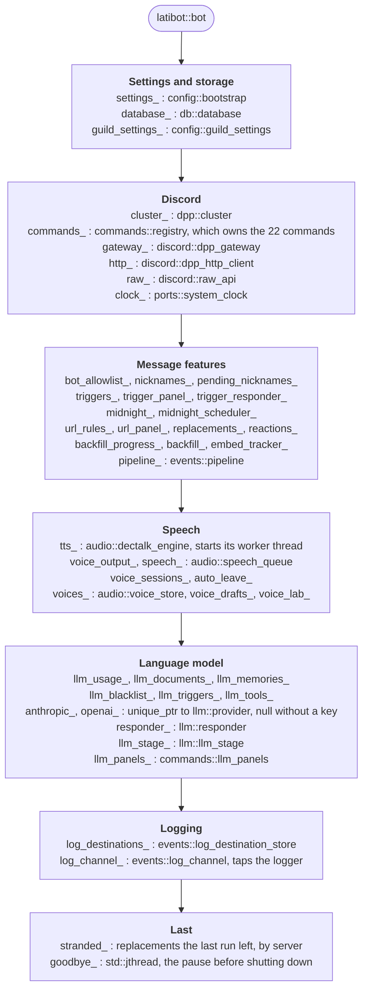

Three consequences of the order are worth knowing:

- `goodbye_` is last, so it is destroyed first. Its thread is joined while
  the cluster it shuts down still exists.
- `log_channel_` is destroyed before the features. It unhooks itself from
  the logger as it goes, so anything logged during shutdown goes to the
  console only.
- `tts_` is declared after `cluster_`, so the speech engine's worker thread
  is stopped before the cluster is destroyed.

## 2. Ports and what implements them

`src/core/ports/`, `src/core/discord/`, `tests/mocks/`

A *port* is an interface for talking to something outside the bot. The bot
gets an implementation that uses DPP, and a test gets a mock that records
what it was asked and answers what the test told it to. A feature only ever
holds the interface, so it cannot tell which one it has. `llm::provider` is
a port too, for the model APIs.

The dotted line with a hollow triangle means **implements**.

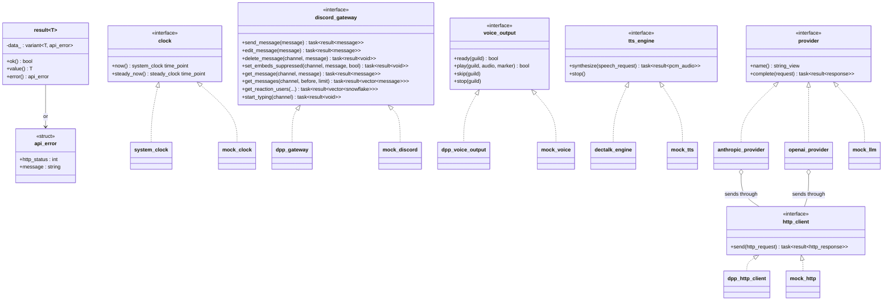

Everything a port returns is a `dpp::task`, a coroutine the caller
`co_await`s, holding a `result<T>`: either the value or an `api_error`,
never an exception. The adapters in `discord/` wrap DPP's own coroutine
calls (`co_message_create` and so on). `dectalk_engine` is ours: it queues
the job for its worker thread and resumes the caller when that thread
fulfils a promise (see [Execution_Flow.md §9](Execution_Flow.md#9-speech)).

`discord::raw_api` is not a port. It calls Discord endpoints that DPP has no
function for, and only `/chat` uses it, to send a voice message.

## 3. The database and the stores

`src/core/db/`, `src/core/config/guild_settings.hpp`, and each feature's store

Every table belongs to one *store*. A store holds a pointer to the
`database`, and turns rows into structs and structs into rows. Nothing
outside the stores writes SQL.

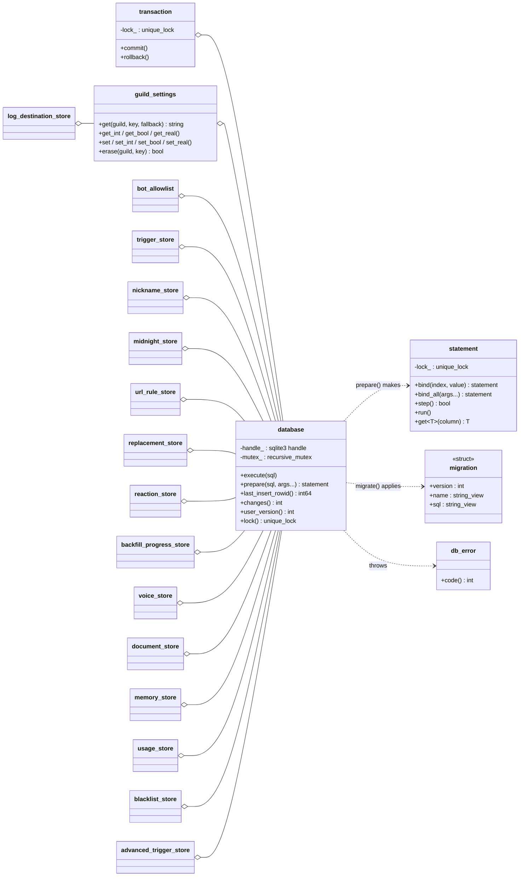

How it fits together:

- **One connection, one lock.** `database` holds one SQLite connection and
  one `recursive_mutex`. A `statement` locks the mutex when it is prepared
  and unlocks it when it is destroyed. A `transaction` locks it too, so a
  store can run several statements as one.
- **Typed binding.** `bind` and `get<T>` convert the types the bot uses:
  `dpp::snowflake`, `std::chrono` times, `std::optional` (as NULL), strings,
  numbers and blobs.
- **Migrations.** `db::migrate` runs at startup and applies every migration
  newer than the file's `user_version`. Shipped migrations are never
  edited; a change is a new one.
- **Settings.** `guild_settings` is the key/value table, for features that
  need a single value per server rather than a table of their own.
  `config::bot_wide` (server id 0) is the key for values that apply to the
  whole bot, such as `/status`.

## 4. Slash commands

`src/core/commands/registry.hpp` and one header per command

Every slash command is a class derived from `command`. The `registry` owns
them, builds their Discord definitions when the bot connects, and sends each
invocation to the right one.

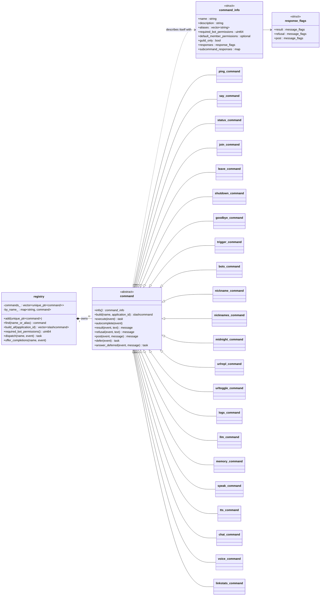

A command answers in one of three ways, and `command_info.responses` says
which Discord flags each gets: a `result` (usually only the invoker sees
it), a `refusal` (always private), or a `post` (seen by everyone). Commands
that take longer than Discord's 3 seconds call `defer` first, then
`answer_deferred`.

What each command is handed when `bot::register_commands` builds it:

| Command | Class | Handed | Opens a panel |
| --- | --- | --- | --- |
| `/ping` | `ping_command` | clock | |
| `/say` | `say_command` | `dpp::cluster` | |
| `/status` | `status_command` | `dpp::cluster`, guild_settings | |
| `/join`, `/leave` | `join_command`, `leave_command` | nothing | |
| `/shutdown` | `shutdown_command` | a function that shuts the cluster down | |
| `/goodbye` | `goodbye_command` | guild_settings | |
| `/trigger` | `trigger_command` | trigger_store | trigger panel |
| `/bots` | `bots_command` | bot_allowlist | |
| `/nickname` | `nickname_command` | nickname_store, pending_nicknames, clock, `dpp::cluster` | |
| `/nicknames` | `nicknames_command` | nickname_store | nickname history pages |
| `/midnight` | `midnight_command` | midnight_store, clock | |
| `/urlrepl` | `urlrepl_command` | url_rule_store | URL panel |
| `/urltoggle` | `urltoggle_command` | url_rule_store | |
| `/logs` | `logs_command` | bootstrap, log_destination_store, log_channel, discord_gateway | |
| `/llm` | `llm_command` | `llm_command_services` | settings panel, document forms |
| `/memory` | `memory_command` | `llm_command_services` | memory list pages |
| `/speak` | `speak_command` | `speech_services` | |
| `/tts` | `tts_command` | `speech_services` | |
| `/chat` | `chat_command` | `speech_services`, raw_api | |
| `/voice` | `voice_command` | voice_sessions, guild_settings, voice_store, voice_lab | voice lab |
| `/linkstats` | `linkstats_command` | reaction_store, `recompute_support` | leaderboard pages |

`speech_services`, `llm_command_services` and `recompute_support` are
structs of pointers, so a command that needs many things takes one argument
and a test can fill in only the fields it uses.

## 5. Panels: buttons, menus and forms

`src/core/ui/`, `src/core/commands/{trigger,urlrepl,voice_lab,llm}.hpp`

A panel is a message with buttons and menus that edits itself when used.
Nothing about an open panel is kept in memory. Everything a button needs is
written into its `custom_id` as `view:page:argument`. For example, `trigedit:0:42` is "edit
trigger 42, from the first page". That is why panels still
work after a restart.

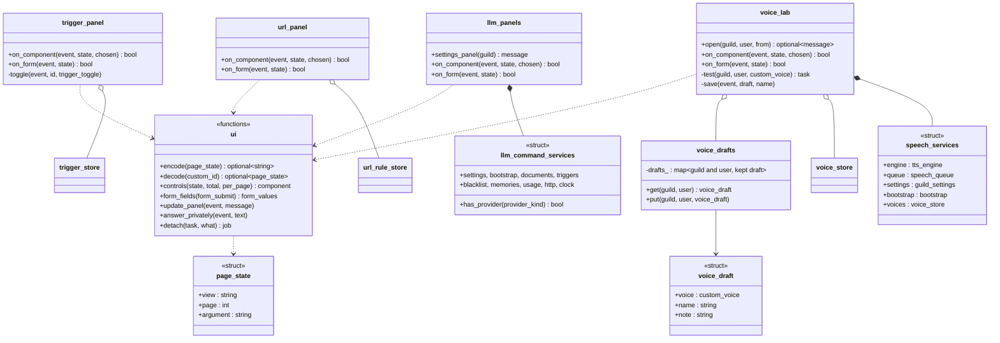

`bot::route_component` offers each button or menu press to the routers in
turn, and the first whose `on_component` returns `true` has handled it.
`bot::on_form` does the same for forms. The views each one claims:

| Router | Views (the first part of the `custom_id`) |
| --- | --- |
| `bot` itself | `nicks` (nickname history pages), `urlretry` (Retry on a replacement) |
| `trigger_panel` | `triggers`, `trigpanel`, `trigpick`, `trigedit`, `trigdel`, `trigyes`, `trigadd`, `trigonoff`, `trigbots`, `trigsilent`, `trigprev`; form `trigform` |
| `url_panel` | `urllist`, `urlpanel`, `urlpick`, `urledit`, `urldel`, `urlyes`, `urladd`, `urlswitch`; form `urlform` |
| `voice_lab` | `vlabedit`, `vlabbase`, `vlabtest`, `vlabsave`, `vlabreset`, `vlabopen`; forms `vlabform`, `vlabname` |
| `llm_panels` | `memlist`, `llmset`, `llmsetpick`, `llmswitch`; forms `llmsetform`, `llmdoc` |
| `on_linkstats_component` | `linkboard` (board pages), `linkdupes`, `linkkeep`, `linkmerge` (`/linkstats duplicates`) |

The voice lab is the one panel that keeps state in memory. A voice being
edited has too many numbers to fit in a 100-character `custom_id`, so
`voice_drafts` keeps each person's draft per server for 30 minutes.

## 6. The message pipeline

`src/core/events/message_pipeline.hpp`, and the stages in `goodbye.hpp`,
`url_replacer.hpp`, `triggers.hpp` and `llm/stage.hpp`

Every message goes through the same list of *stages*. A stage looks at an
`incoming_message` and returns a `stage_result`: the actions it wants, and
whether the message is used up (*consumed*), which stops the stages after
it. A stage never sends anything itself.

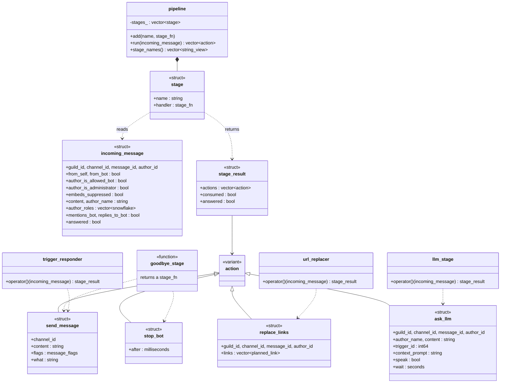

The four stages are added in this order in `bot::register_stages`:
**goodbye**, **url replacement**, **triggers**, **language model**. The
triangles from `action` stand for "is one of the variant's alternatives",
not inheritance. Each stage is stored as a `std::function`: a lambda
returned by `goodbye_stage`, a copy of `url_replacer`, and lambdas that call
the `trigger_responder` and `llm_stage` members of `bot`.

`answered` passes from stage to stage. When a trigger has already replied, the
language model's advanced triggers stay quiet (plan §14.3).

## 7. Link replacement

`src/core/events/{url_rules,url_replacer,embed_watch,replacements}.hpp`

A link to a site with a rule is reposted through a *mirror* that gives a
better preview. The bot then watches its repost until Discord adds the
preview, trying the next mirror if none arrives.

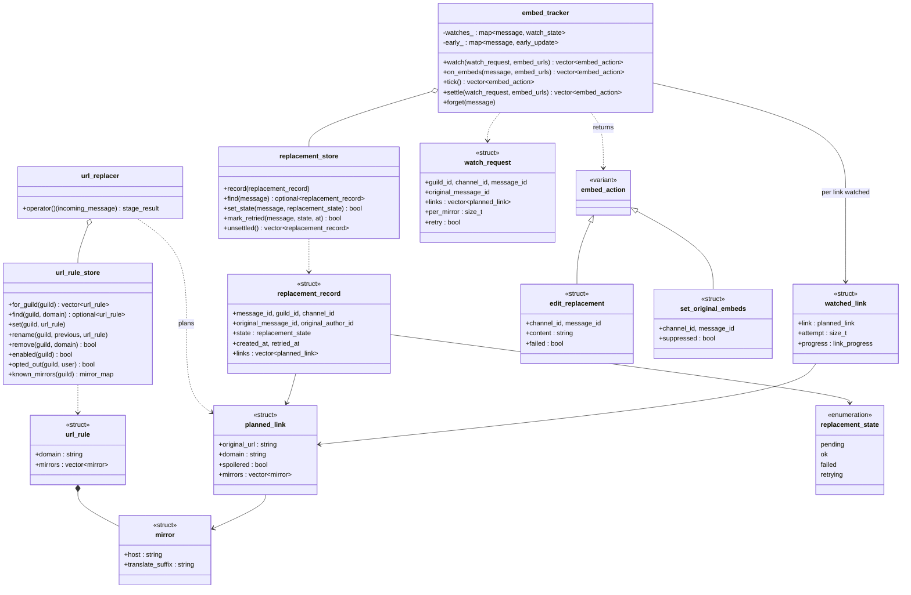

The functions that join these up are free functions in `url_replacer.hpp`,
all coroutines over the `discord_gateway` port:

- `post_replacement` posts the repost, records it, hides the original's
  preview, and starts watching.
- `carry_out_embed_actions` performs what the tracker returned.
- `settle_stranded` finishes the ones the last run left mid-watch.
- `plan_retry` works out what the Retry button should try.

`embed_tracker` never talks to Discord. It is told about message edits and
clock ticks, and answers with `embed_action`s. Tests can therefore replay
any order of edits and timeouts without a connection.

## 8. Link stats and the recompute

`src/core/events/{reactions,backfill,legacy_replacements}.hpp`,
`src/core/commands/linkstats.hpp`

Reactions to the bot's reposts are counted, for `/linkstats`.
`/linkstats recompute` rebuilds those counts, and the record of which
reposts were whose, from channel history. That history includes years of
reposts made by the Java bot.

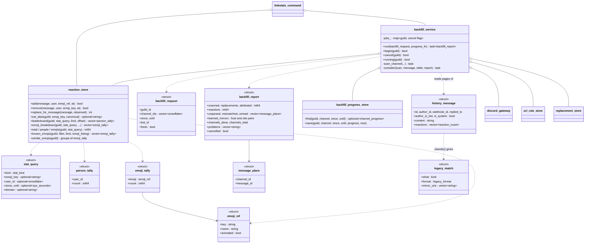

The recompute reads each channel a page at a time, newest first, through
`discord_gateway::get_messages`. For each message:

1. `describe_history` reduces it to a `history_message`.
2. `classify` decides whether it is one of the bot's reposts, in any of the
   formats the Java bot or this one ever used. A link to a mirror some rule
   once named settles it. Without one, the masked `[.](link)` shapes still
   do, and a copy of a message is `unconfirmed` until step 3 finds the link
   it replaced.
3. `attribute` works out whose message it replaced, and `replaced_links`
   which of its links stood in for which. A mirror no rule named is learned
   from that, and remembered in `known_mirrors`.

What went wrong is kept as `message_place`s, so the report and the reply
that follows it link to each message. See
[docs/features/Link_Stats.md](../features/Link_Stats.md) for the whole
feature.

`backfill_progress_store` remembers how far each channel got, so a cancelled
or crashed recompute picks up where it stopped.

## 9. Speech

`src/core/audio/`, `src/core/events/voice_sessions.hpp`,
`src/core/discord/dpp_voice_output.hpp`

Text becomes audio in `dectalk_engine`, on one worker thread of its own.
DECtalk's API blocks while it works and reports back through a callback that
can find only one utterance at a time, so the worker makes them one after
another. Synthesis is fast, hundreds of times real time, so each request is
answered with the whole utterance at once. The audio then waits in a
per-server `speech_queue` until the voice connection is ready, and plays in
order.

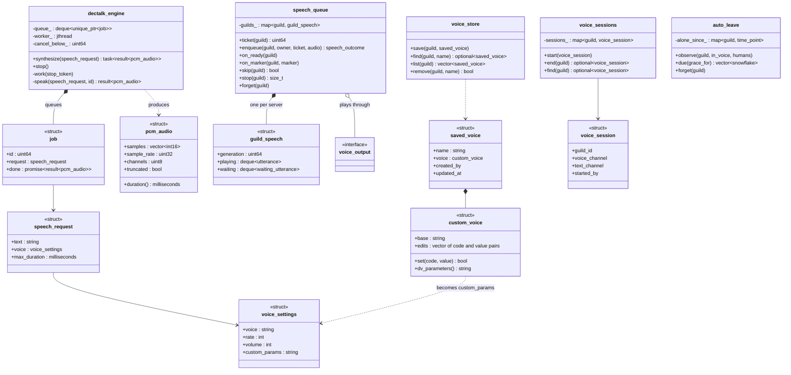

How the pieces are used:

- **Tickets.** `speech_queue::ticket` is taken before synthesis starts. If
  `/tts stop` runs while the audio is still being made, the ticket is out
  of date by the time `enqueue` is called, and the audio is dropped rather
  than played after the stop.
- **Markers.** `dpp_voice_output::play` sends the audio with a *marker*.
  DPP reports each marker as it is reached, which is how `on_marker` knows
  an utterance finished.
- **Custom voices.** A `custom_voice` is a built-in voice plus DECtalk `[:dv]`
  parameter edits. `voice_preamble` turns it into the command text put in
  front of what is spoken.
- **Voice sessions.** A `voice_session` (`/voice start`) is what makes the
  language model speak its replies aloud.

## 10. The language model: deciding to answer

`src/core/llm/{stage,guards,advanced_triggers,settings,spend}.hpp`

`llm_stage` is the pipeline's last stage. It answers with an `ask_llm` action
when someone addresses the bot, or when an *advanced trigger* fires. Before
that, the checks it owns have to pass.

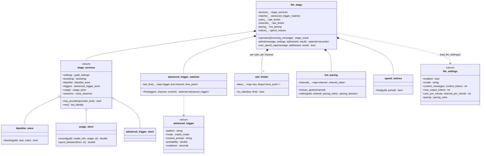

The checks, in order, are drawn as a flowchart in
[Execution_Flow.md §5](Execution_Flow.md#5-inside-the-four-stages).
`llm_settings` is read from `guild_settings` for every message rather than
cached, so a change in `/llm settings` applies to the next message.

## 11. The language model: answering

`src/core/llm/{responder,provider,tools,prompt,documents,memory,models}.hpp`

`responder` turns an `ask_llm` into a reply. It gathers recent messages, the
server's documents and relevant memories, sends them to the model, runs any
tools the model asks for, and posts the result.

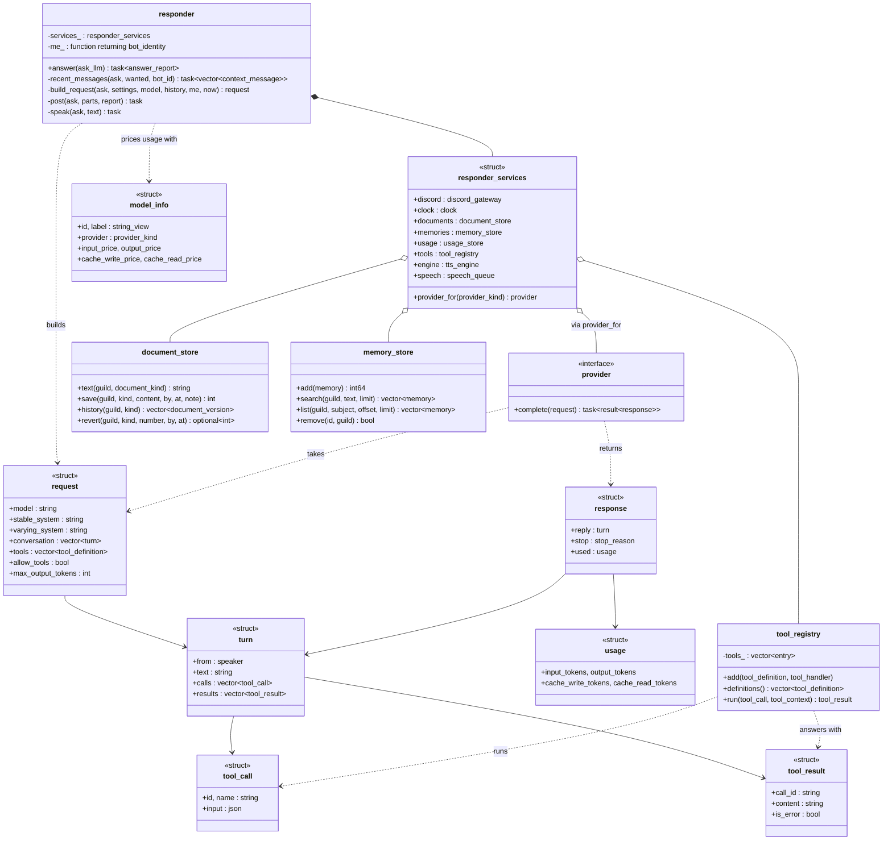

A few things that are easy to miss:

- **The tool loop.** `run_tool_loop` (in `tools.hpp`) calls
  `provider::complete` repeatedly. Each time the model stops to use tools,
  the loop runs them through `tool_registry::run`, adds a `turn` with the
  results, and asks again, up to `llm_tool_rounds` times.
- **Tools.** The only tools are the model's memory: `remember`, `recall` and
  `forget`, added by `add_memory_tools` at startup.
- **Prompt caching.** The system prompt is in two parts. `stable_system`
  (the system document, personality and trigger style) is the same from call
  to call, which lets the APIs cache it. `varying_system` holds the
  memories and the date.
- **Providers.** `anthropic_provider` and `openai_provider` each translate
  `request` and `response` to and from their API's JSON (`anthropic_body`,
  `read_anthropic_reply` and so on), and send it through `http_client`.

## 12. Triggers, nicknames and midnight messages

`src/core/events/{triggers,nicknames,midnight,bot_allowlist}.hpp`

Three smaller features, each a store plus one class that does the work.

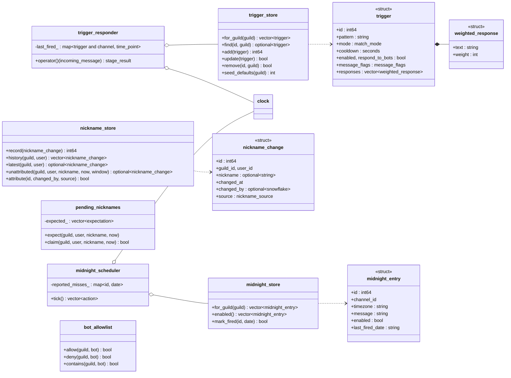

- **Triggers.** A trigger's cooldown is kept per channel, in memory, so a
  restart forgets it.
- **Nicknames.** When `/nickname` changes a nickname, it tells
  `pending_nicknames` to expect the gateway event that follows. When that
  event arrives it is recognised as the bot's own change, rather than
  recorded a second time without saying who asked.
- **Midnight messages.** `midnight_scheduler` compares each entry's local
  date in its own time zone with `last_fired_date`. It posts once per day,
  and never catches up on a day missed while the bot was off.
- **Allowed bots.** `bot_allowlist` has no class that does the work: `bot`
  asks it about every message's author in `describe()`.

## 13. Configuration and logging

`src/core/config/bootstrap.hpp`, `src/core/util/log.hpp`,
`src/core/events/log_channel.hpp`

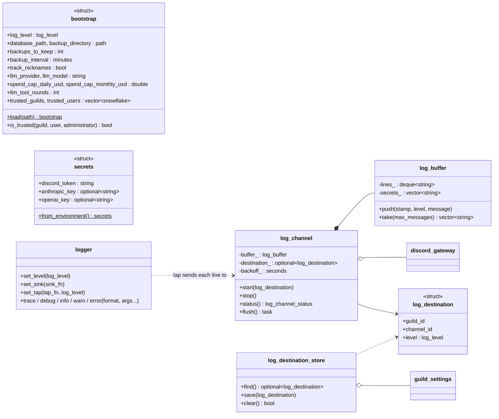

- **`bootstrap`** is `config.json`: whatever cannot change while the bot runs.
  Settings a server can change live are in `guild_settings` instead.
- **`secrets`** only ever come from the environment, or a `.env` file that
  sets it.
- **`logger`** is the one global, reached through `util::log()`. It writes
  every line to the console. When `/logs` has set a channel, `log_channel`
  also installs a *tap* that copies each line into its `log_buffer`. The
  2-second timer then posts the buffer through the gateway. Before a line is
  posted, `log_buffer` masks anything that matches a secret.
