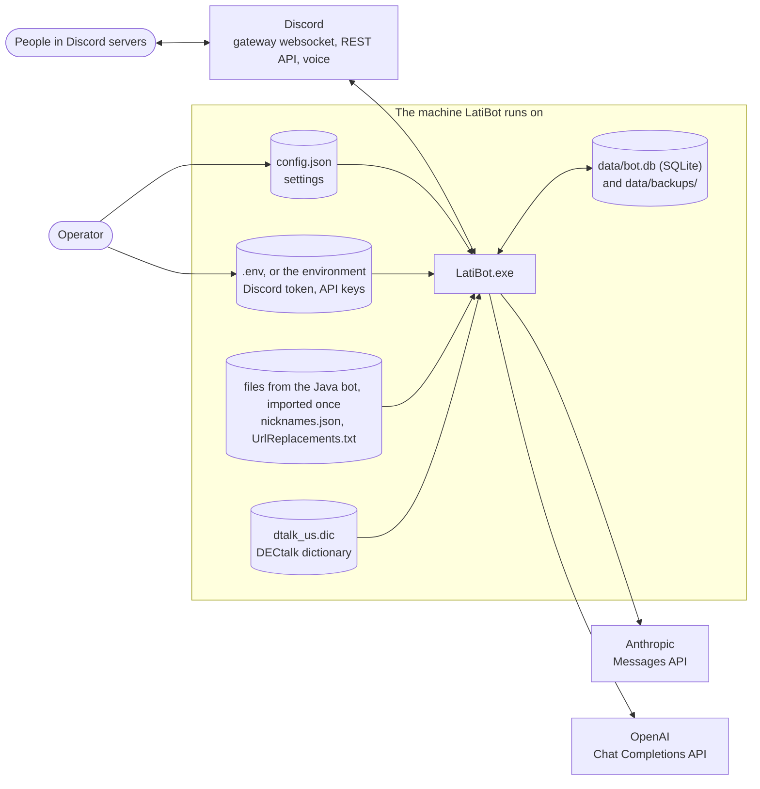
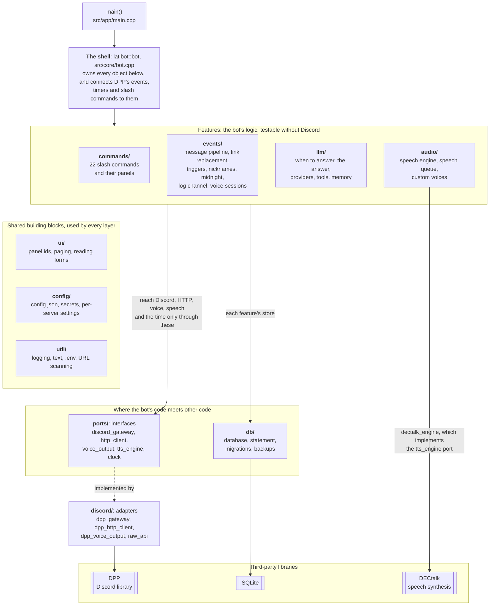
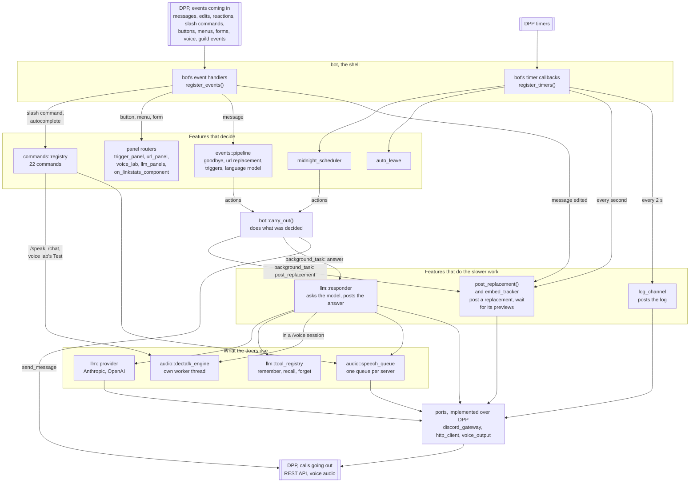
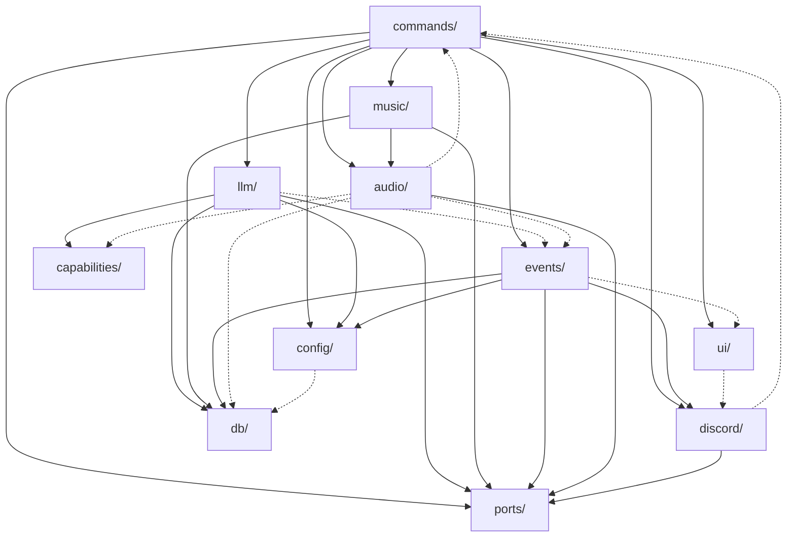

# Components

The bot at the highest level: what it talks to, the layers it is built in,
and which parts talk to which while it runs. [README.md](README.md) explains
the notation.

- [1. What the bot talks to](#1-what-the-bot-talks-to)
- [2. The layers](#2-the-layers)
- [3. The components at run time](#3-the-components-at-run-time)
- [4. Which folder includes which](#4-which-folder-includes-which)
- [5. The features, what starts them, and where they keep things](#5-the-features-what-starts-them-and-where-they-keep-things)

## 1. What the bot talks to

One process, `LatiBot.exe`. It holds one connection to Discord, calls the
language model APIs over HTTPS, and keeps everything it remembers in one
SQLite file.

Everything goes through Discord except the model calls. That includes the
voice audio: DPP sends it over Discord's voice connection.

## 2. The layers

The code is the static library `latibot_core` (everything in `src/core/`)
and one library per module (`src/modules/<name>/`, docs/modules/). `src/app/main.cpp`
is linked against them as `LatiBot.exe`, with the module list CMake writes,
and `tests/` as `latibot_tests.exe`. Inside the library the code is layered:

What each layer is for:

- **The shell** (`bot`) is the only class that knows the whole bot. It owns
  one of everything and tells DPP which function to call for each event. It
  makes almost no decisions itself (plan §17.3).
- **Features** decide what to do. A message stage returns a list of
  *actions* instead of sending anything itself. A store turns rows into
  structs. A `render_*` function builds a message without posting it. This
  is what lets most of the 726 tests run without Discord.
- **Ports** are the interfaces a feature talks to the outside world through.
  In the bot an *adapter* in `discord/` implements each one over DPP. In the
  tests a mock in `tests/mocks/` implements it instead, and records what it
  was asked. This pattern is called *ports and adapters*.
- **Shared building blocks** are used by all of the above. `util/log` is the
  one logger everything writes to.

Features still use DPP's data types (`dpp::snowflake`, `dpp::message`,
`dpp::task`) and the slash-command event objects, since those are just
data. A few commands call DPP directly, where a port would add nothing:
`/say`, `/status`, `/nickname`, and `/join` / `/speak` connecting to voice.

## 3. The components at run time

The same code seen as the objects that exist while the bot runs, and what
passes between them. The arrows show who calls whom. DPP is drawn twice:
events and timer ticks come in at the top, and everything the bot sends
leaves at the bottom. Two things are left out to keep it readable:

- **Stores.** Nearly every box reads or writes its feature's store, and
  through it the database.
- **The auto-leave.** `auto_leave` only says which servers to leave; the
  timer callback then disconnects from voice itself.

The pattern to notice is the split between **deciding** and **doing**:

1. DPP calls a handler in `bot`.
2. The handler asks a feature what should happen. The pipeline and the
   midnight scheduler answer with plain structs called *actions*
   (`send_message`, `stop_bot`, and `background_task`, which is how the URL replacer's `replace_links` and the model's `ask_llm` are carried out), and the embed
   tracker with `embed_action`s.
3. `carry_out` does them, often as a detached coroutine so the handler
   returns at once.

Commands and panels are the exception: they get the interaction itself and
answer it directly, because Discord wants that answer within 3 seconds.

## 4. Which folder includes which

Every arrow below is at least one `#include` from one folder of `src/core/`
into another, counted from the source (`bot.cpp` left out, since it includes
everything). Dotted arrows are a single include. Every folder also includes
`util/`, which is not drawn.

Almost everything points downwards, from features to building blocks to
ports and the database. The single includes that point elsewhere, and why:

- `audio/dectalk_speech.cpp` → `commands/speak.hpp` and
  `events/voice_sessions.hpp`: DECtalk's implementation of the `speech`
  capability follows `/speak`'s limits, and speaks in the voice session's
  channel. All three end up in the dectalk and voice modules
  (docs/modules/Module_Plan_Final.md).
- `discord/unregister_commands.cpp` → `commands/unregister.hpp`: the
  `--unregister-commands` switch is the command logic, run without a
  gateway.
- `events/embed_watch.cpp` → `ui/paginator.hpp`: the Retry button on a
  failed replacement is a panel id like any other.

`llm/` reaches no other feature: the model speaks through
`capabilities/speech.hpp`, which `audio/dectalk_speech` implements, and its
trigger matching is in `util/match`. Nothing in `config/` knows the models;
`llm::check_config` does.

`commands/` ↔ `audio/` is the only cycle, and both sides are DECtalk's: the
`/speak` commands and its speech capability. It is between `.cpp` files
only, so no header includes another in a circle.

## 5. The features, what starts them, and where they keep things

Each feature reacts to some mix of slash commands, messages, panel buttons,
Discord events and timers. The **started by** column lists what, the
**objects** column the main ones behind it (drawn in [Classes.md](Classes.md)),
and the last column the tables it keeps in `bot.db`.

| Feature | Started by | Main objects | Tables |
| --- | --- | --- | --- |
| Basics | `/ping` `/say` `/status` `/join` `/leave` `/shutdown` `/goodbye`; the goodbye phrase (message stage); connecting (`on_ready` puts `/status` back) | `commands::*_command`, `goodbye_stage` | `guild_settings` |
| Triggers | message stage; `/trigger` and its panel | `trigger_store`, `trigger_responder`, `trigger_panel` | `triggers`, `trigger_responses` |
| Link replacement | message stage; message edits (previews); the 1 s tick; the Retry button; `/links`, `/urltoggle` and the panel; joining a server (settles last run's, imports the Java rules) | `url_rule_store`, `url_replacer`, `embed_tracker`, `replacement_store`, `url_panel` | `url_rules`, `known_mirrors`, `url_opt_outs`, `replacement_messages`, `replacement_links` |
| Link stats | reactions added and removed; images and videos posted, where counted; `/linkstats` and its board pages; `/linkstats recompute`; a timer for emoji copies | `reaction_store`, `backfill_service`, `media_tracker`, `emoji_copier` | `reactions`, `reaction_log`, `emojis`, `emoji_aliases`, `backfill_progress`, `emoji_images`, `emoji_copies` |
| Nicknames | member updates; audit log entries; joining a server (the offline sweep); `/nickname`, `/nicknames`; startup (imports the Java file) | `nickname_store`, `pending_nicknames` | `nickname_history` |
| Midnight messages | the 30 s tick; `/midnight` | `midnight_store`, `midnight_scheduler` | `midnight_messages` |
| Allowed bots | every message (`describe()` asks); `/bots` | `bot_allowlist` | `allowed_bots` |
| Log channel | every log line; the 2 s tick; `/logs` | `log_channel`, `log_buffer`, `log_destination_store` | `guild_settings` |
| Speech | `/speak`, `/tts`, `/chat`, `/voice`; the voice lab panel; voice events; the 5 s auto-leave tick | `dectalk_engine`, `speech_queue`, `voice_sessions`, `auto_leave`, `voice_store`, `voice_lab` | `tts_voices`, `guild_settings` |
| Language model | message stage; `/llm`, `/memory` and their panels | `llm_stage`, `responder`, providers, `tool_registry`, the `llm` stores | `llm_documents`, `llm_memory`, `llm_memory_search`, `llm_usage`, `llm_blacklist`, `llm_triggers`, `llm_aliases`, `guild_settings` |
| Backups | a timer, every `backup_interval` (6 h by default) | `db::create_backup` | all of them, copied to `data/backups/` |

`guild_settings` is a key/value table that many features share for single
values, such as the goodbye phrase, whether URL replacement is on, the voice
grace period and the model a server uses.
