# Execution flow

What runs, in what order, and on which thread, from `main()` to shutdown.
The flowcharts show decisions. The sequence diagrams show order in time,
where coroutines pause and threads hand work to each other.
[README.md](README.md) explains the notation.

DPP is a closed box throughout. What matters about it is which of our
functions it calls, and on which thread (section 3).

- [1. From `main()` to shutdown](#1-from-main-to-shutdown)
- [2. Building the bot](#2-building-the-bot)
- [3. Threads: who runs what](#3-threads-who-runs-what)
- [4. A message arrives](#4-a-message-arrives)
- [5. Inside the four stages](#5-inside-the-four-stages)
- [6. Link replacement: posting and watching](#6-link-replacement-posting-and-watching)
- [7. The language model answers](#7-the-language-model-answers)
- [8. A slash command](#8-a-slash-command)
- [9. Speech](#9-speech)
- [10. Panels: buttons, menus and forms](#10-panels-buttons-menus-and-forms)
- [11. Connecting, and joining servers](#11-connecting-and-joining-servers)
- [12. Nickname changes](#12-nickname-changes)
- [13. The timers](#13-the-timers)
- [14. Shutting down](#14-shutting-down)

## 1. From `main()` to shutdown

`src/main.cpp`, `bot::run()`

`main()` is short. It reads configuration in a set order, builds one `bot`,
and hands the main thread to DPP until the bot is told to stop. Every
exception anywhere in startup lands in the one `catch` at the end.

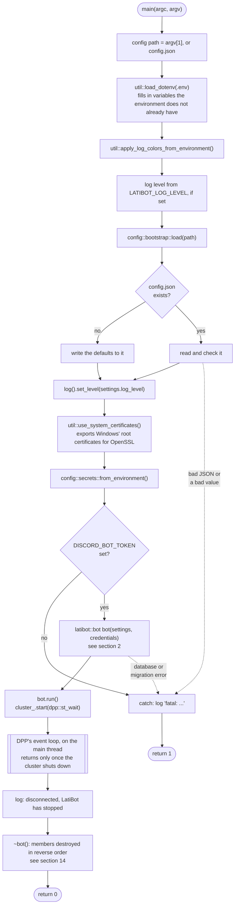

The order matters in two places. The `.env` file is read before anything
looks at the environment. The log level is set before the configuration is
read, so reading it is logged at the level asked for.

## 2. Building the bot

`bot::bot()` in `src/core/bot.cpp`

The constructor has two halves. First the member initialisers build every
object, in the order drawn in [Classes.md §1](Classes.md#1-what-bot-owns).
Then the body prepares the database and connects everything to DPP. Nothing
is sent to Discord until `run()`.

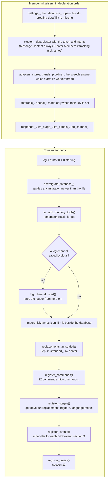

The replacements from the last run are read here, before the connection
starts, for a reason. Anything still `pending` or `retrying` at this point
must have been cut off by the last run, since this one has not posted
anything yet. They are settled once their server connects (section 11).

## 3. Threads: who runs what

Several threads run at once. Knowing which one is running a function
explains the mutexes you see in the code.

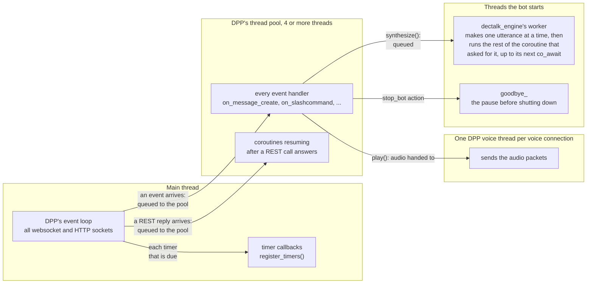

What follows from this:

- **Two events can be handled at once.** A message and a button press, or
  two messages, can arrive together. That is why every object with state
  shared between handlers locks a mutex, for example `trigger_responder`,
  `embed_tracker`, `speech_queue`, `rate_limiter` and `database`.
- **A timer callback must be quick.** It runs on the event loop itself, so
  while it runs, no socket is read. The slow ones hand their work to a
  detached coroutine (`ui::detach`) and return.
- **A coroutine can change threads.** After `co_await` on a REST call, it
  carries on on a pool thread. After `co_await synthesize()`, it carries on
  on the speech worker, until its next `co_await`.
- **Nothing blocks a handler for long.** Slow work is `co_await`ed or
  detached, never waited on.

## 4. A message arrives

`on_message_create` in `bot::register_events`, `bot::describe`,
`pipeline::run`, `bot::carry_out`

Every message in every channel the bot can see comes through here.

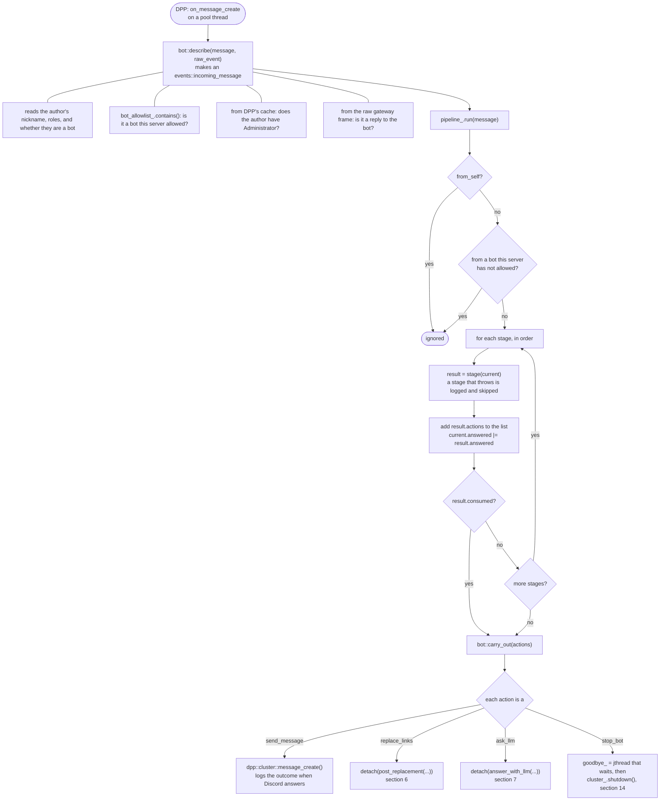

The stages only decide. Everything that talks to Discord happens in
`carry_out`, and apart from `send_message` it happens in a detached
coroutine. So the handler returns in microseconds, however long the model
takes to answer.

After the pipeline, the same handler gives the message to `media_tracker`.
In a server that counts reactions on images, an upload is recorded there and
then, and a message with links waits a minute for the preview that shows
whether it was an image (docs/features/Link_Stats.md §9).

## 5. Inside the four stages

`goodbye.cpp`, `url_replacer.cpp`, `triggers.cpp`, `llm/stage.cpp`

The four stages side by side. Each returns a `stage_result`, and *consumes*
the message when no later stage should see it.

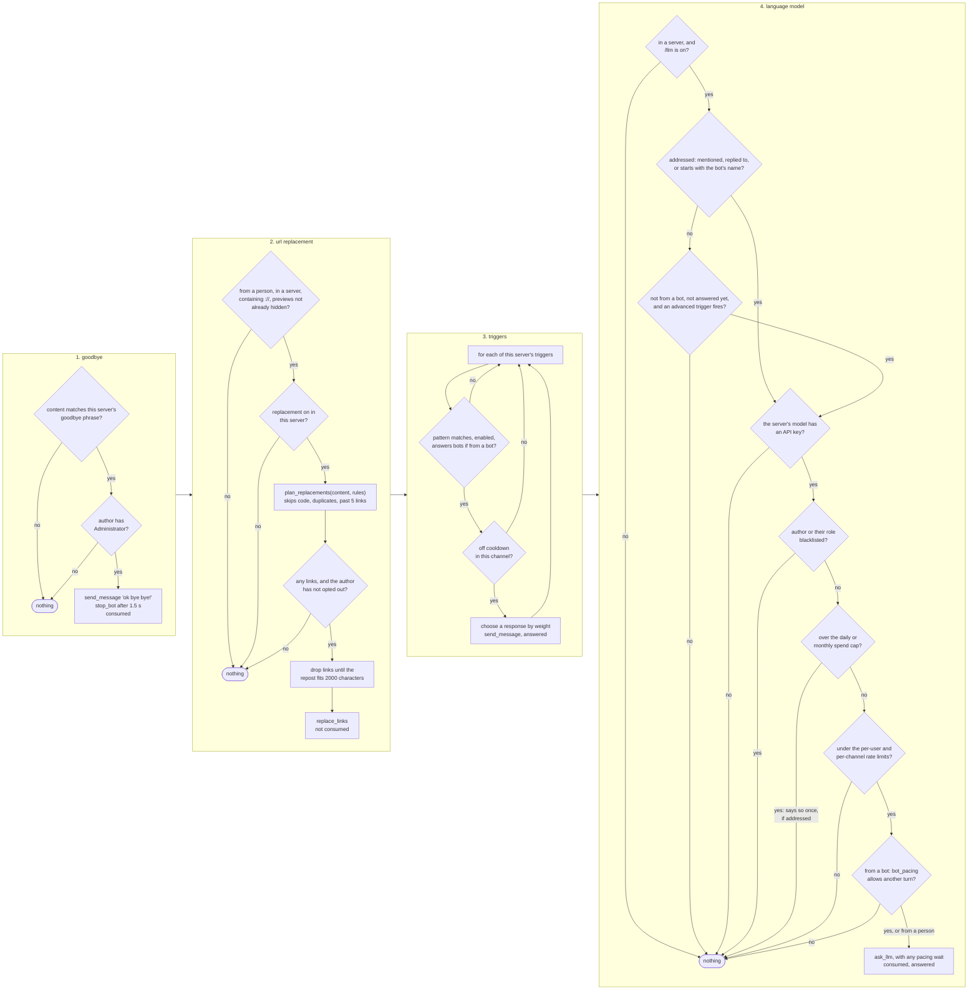

Details the chart leaves out:

- **Triggers.** Every trigger that matches replies, not just the first.
  The cooldown is per trigger and per channel.
- **Addressed messages.** A message that addresses the bot is consumed
  from the moment the model and its key check out, even if a later check
  refuses it. This matters only if a stage is ever added after this one.
- **Pacing between bots.** Replies to another bot are spaced out and capped
  (`pacing_rules`). The wait travels in `ask_llm.wait`, and
  `bot::answer_with_llm` sleeps it off with `co_sleep` before answering.

## 6. Link replacement: posting and watching

`post_replacement` in `url_replacer.cpp`, `embed_tracker` in `embed_watch.cpp`

A repost is only useful if Discord gives it a preview, and Discord adds
previews by editing the message a moment later. So the bot posts, then
watches for that edit. If it doesn't come, the bot edits the repost to the
next mirror, which makes Discord try again.

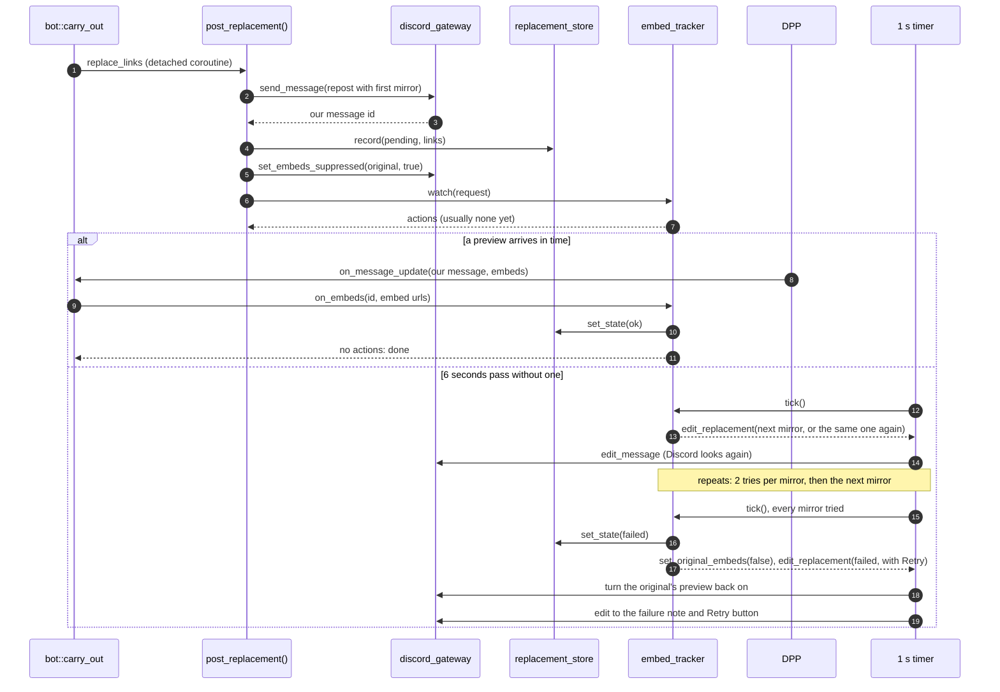

When someone presses **Retry**, `bot::retry_replacement` asks
`plan_retry` what to try. It answers the button press with the first attempt
and watches again, with one try per mirror. `embed_tracker` also keeps
edits that arrive before `watch()` is called (`early_`), since the edit
that adds the preview can overtake the reply to the post that created the
message.

## 7. The language model answers

`bot::answer_with_llm`, `responder::answer`, `run_tool_loop`

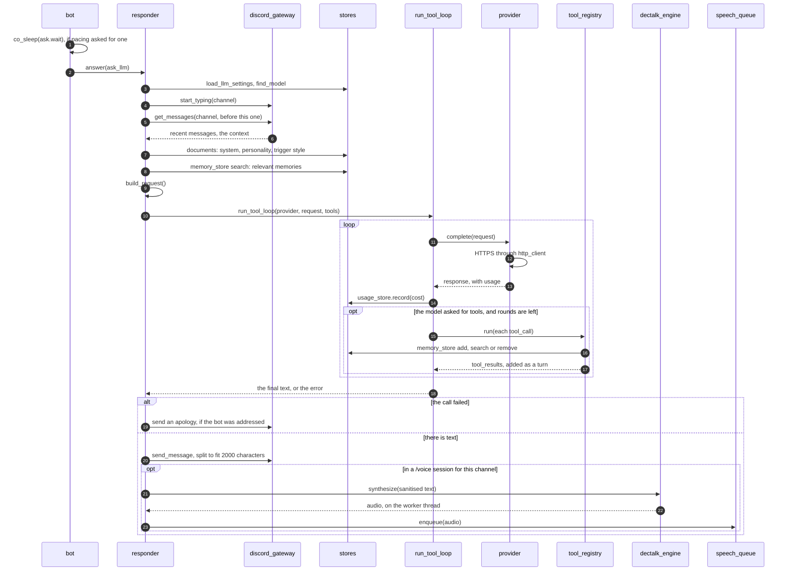

Every call to the model is recorded in `llm_usage` as it happens, not once
at the end, so the spend caps count tool rounds too.

## 8. A slash command

`on_slashcommand` in `bot::register_events`, `registry::dispatch`

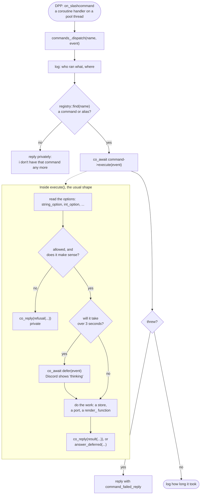

Autocomplete (the suggestions shown while someone types an option) goes the
same way, through `registry::offer_completions` to the command's
`autocomplete()`.

## 9. Speech

`speak_command::execute`, `dectalk_engine`, `speech_queue`, `dpp_voice_output`

`/speak` in full, because it crosses the most threads. `/chat`, the voice
lab's Test button and the model's spoken replies use the same middle part.

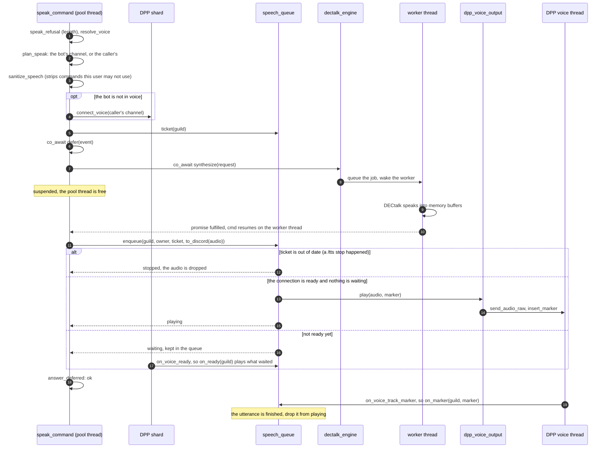

Leaving voice, by `/leave`, `/voice stop`, the auto-leave, or being
disconnected, arrives as the bot's own `on_voice_state_update` with no
channel. `bot::on_voice_state` then ends the `/voice` session and clears
the speech queue and the auto-leave timer for that server.

## 10. Panels: buttons, menus and forms

`bot::on_component`, `bot::route_component`, `bot::on_form`, and the four
panel routers

A panel press arrives as a button or a menu choice. Its `custom_id`,
`view:page:argument`, says what to do. The answer either edits the panel in
place, or opens a form (a *modal*). Submitting the form arrives as a third
kind of event.

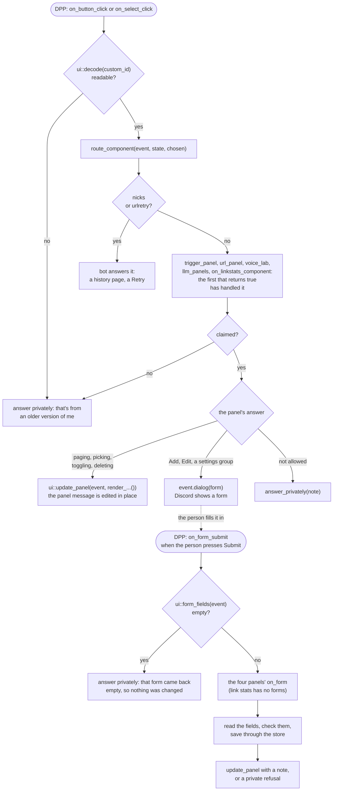

An exception thrown in any panel is caught in `on_component` or `on_form`,
logged, and answered with `command_failed_reply`. It never reaches DPP.

Why the empty-form check exists: DPP 10.1 sends each text field wrapped in a
label, and hands them back unwrapped when the form is submitted.
`ui::form_fields` reads both shapes. A submission with no readable fields
means that reading failed, and saving it would blank what was there (plan
§21.21).

The voice lab is the one panel with state between presses: its
`voice_drafts` holds each person's unsaved voice (see
[Classes.md §5](Classes.md#5-panels-buttons-menus-and-forms)).

## 11. Connecting, and joining servers

`bot::on_ready`, the `on_guild_create` handler

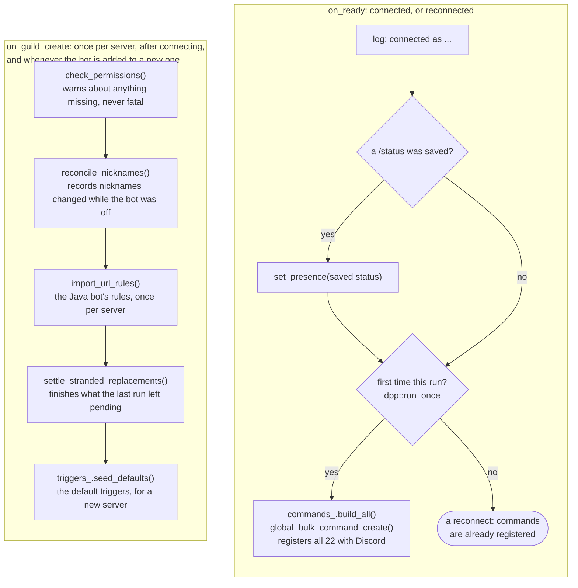

## 12. Nickname changes

`bot::on_member_update`, `bot::on_audit_entry`, `bot::attribute_later`

A nickname change is recorded the moment it is seen. Who made it is filled
in later, when the audit log says, because Discord sends that as a separate
event and sometimes not at all.

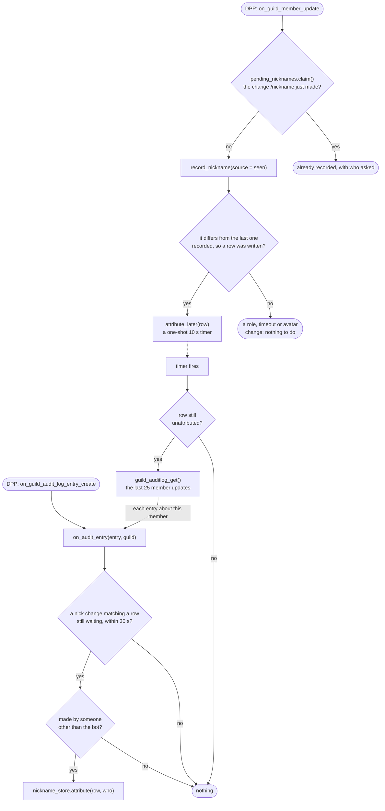

Both DPP handlers are attached only when `track_nicknames` is on, because
the events need the privileged Server Members intent.

## 13. The timers

`bot::register_timers`, `bot::attribute_later`

All timers run on the main thread (section 3). Each is wrapped in
`guarded()`, which logs an exception rather than letting it stop the timer
for good.

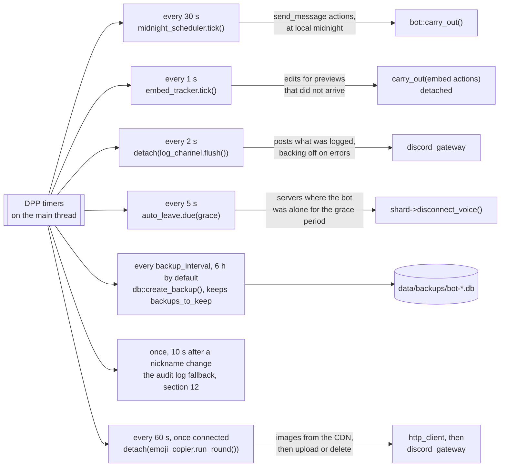

The emoji copier's timer exists only when `emoji_copy_min_uses` is above 0.
A round does at most ten emojis, so a long backlog is worked through a
minute at a time (docs/features/Link_Stats.md §10).

The midnight tick polls the wall clock every 30 seconds instead of sleeping
until midnight. The Java bot worked out a delay from the wall clock and then
slept on a monotonic timer, so after the computer slept it posted at the
wrong time (plan §10).

## 14. Shutting down

`shutdown_command`, the `stop_bot` action, `~bot()`

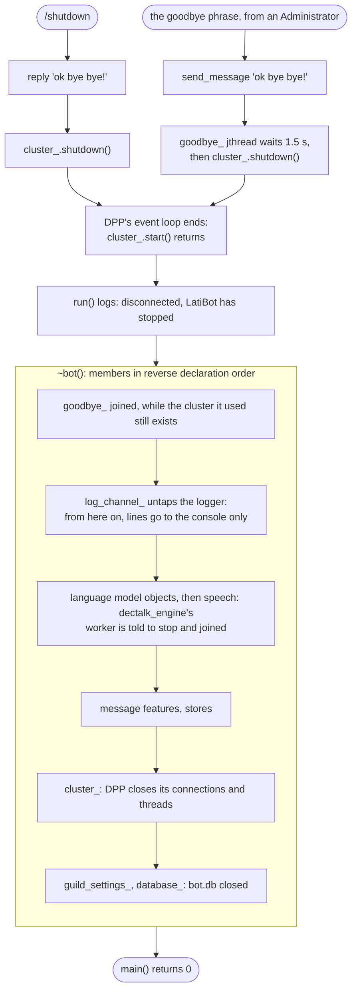

A crash does not go through any of this. That is why replacements left
`pending` are settled on the next start (section 2), rather than on the
way out.
