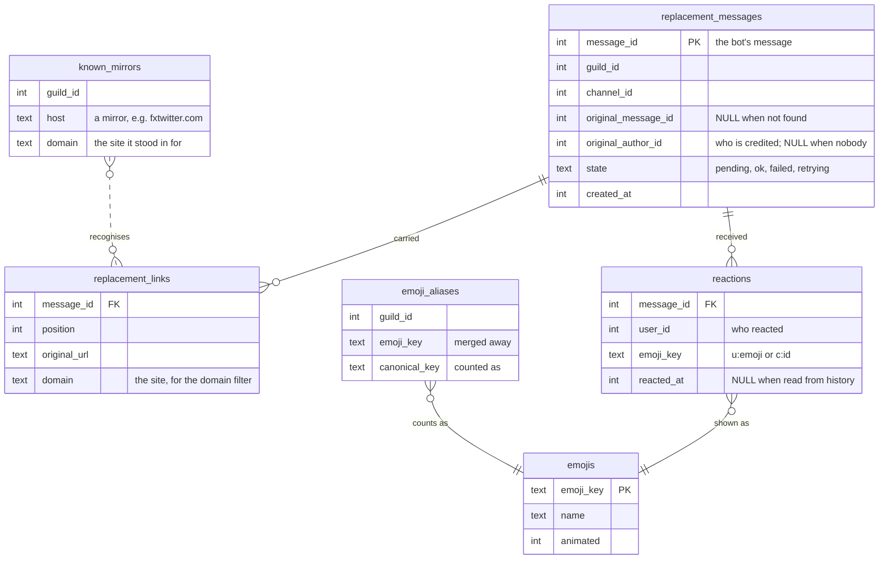

# Link stats

`/linkstats` counts the reactions on the bot's link replacements: who gets the
most, who gives the most, and with which emojis. It can also read years of
channel history back into those counts.

This is the feature's working document. It records how the feature works,
what was decided and why, what has been asked for, and what is still waiting
on a decision. [The user guide](README.md#linkstats) says how to use it;
[Classes.md §8](../architecture/Classes.md#8-link-stats-and-the-recompute)
draws its classes.

| | |
|---|---|
| **Code** | `src/core/commands/linkstats.*`, `src/core/events/{reactions,backfill,legacy_replacements}.*` |
| **Tests** | `tests/unit/linkstats_command_test.cpp`, `tests/unit/legacy_replacements_test.cpp`, `tests/db/reaction_store_test.cpp`, `tests/db/backfill_test.cpp` |
| **Tables** | `replacement_messages`, `replacement_links`, `reactions`, `reaction_log`, `emojis`, `emoji_aliases`, `known_mirrors`, `backfill_progress` |
| **Status** | Built and tested offline. Not yet run against real Discord history. |

## Contents

1. [The commands](#1-the-commands)
2. [What is stored](#2-what-is-stored)
3. [Counting reactions as they happen](#3-counting-reactions-as-they-happen)
4. [The recompute](#4-the-recompute)
5. [Emojis: aliases and duplicates](#5-emojis-aliases-and-duplicates)
6. [Boards and paging](#6-boards-and-paging)
7. [Decisions](#7-decisions)
8. [Requests of 2026-09-30](#8-requests-of-2026-09-30)
9. [Plan: reactions on images](#9-plan-reactions-on-images) — waiting for a decision
10. [Study: the bot's own copies of emojis](#10-study-the-bots-own-copies-of-emojis) — waiting for a decision
11. [Still to check in Discord](#11-still-to-check-in-discord)

## 1. The commands

| Subcommand | What it shows or does | Who | Answer |
|---|---|---|---|
| `top` | A leaderboard of people: reactions received, given, or on their own links; or of emojis | everyone | public, paged |
| `user` | One person's received, given and self counts, with their top three emojis each way | everyone | public |
| `reactions` | Every emoji and how often, for everyone or one person, received or given | everyone | public, paged |
| `duplicates` | Custom emojis with names alike, a group at a time, with menus to merge them | everyone looks; Manage Server merges | private, paged |
| `alias add` / `remove` / `list` | Count one emoji as another, in all history | Manage Server for add and remove | private (`list` public) |
| `recompute start` / `cancel` | Read channel history back into the counts | Manage Server | private, then posts in the channel |

`top`, `user` and `reactions` take the same filters: `since` and `until`
(inclusive, `YYYY-MM-DD`, UTC) and `domain` (only replacements of links to one
site).

## 2. What is stored



- One row in `reactions` answers both "who received" (the message's
  `original_author_id`) and "who gave" (`user_id`). A reaction to your own
  link is **self**: counted on its own, and in neither of the other two.
- Aliases are applied **when statistics are read**, never written into
  `reactions`. Adding one changes all of history at once, and removing it puts
  history back.
- `known_mirrors` is every mirror host any rule has named, plus those the
  recompute has learned (§4.2). It is never pruned.
- `reaction_log` keeps every add and remove seen live, for questions nobody
  has asked yet. `backfill_progress` is how far a recompute got per channel.

## 3. Counting reactions as they happen

Every reaction in every channel reaches the bot. `reaction_store::add` records
one only when its message is in `replacement_messages`, and asks that in the
same `INSERT`, so a reaction on any other message costs one statement and
leaves nothing behind. Removals, and a moderator clearing one emoji or all of
them, remove rows the same way. Emoji keys drop U+FE0F, so `❤` and `❤️` are
the same heart whichever keyboard typed it.

## 4. The recompute

`/linkstats recompute start since:YYYY-MM-DD` walks each text channel
backwards a page (100 messages) at a time. For each of the bot's replacements
it finds whose link it was, then rebuilds that message's reactions to match
what Discord shows now. Rebuilding, rather than adding, is what makes it safe
to run again. Progress is saved per channel after every page, so a run that
was cancelled or cut off by a restart carries on where it stopped;
`fresh:true` starts every channel over.

### 4.1 Is this message a replacement?

The bot's replacements have had six shapes over the years (`legacy_format`):
a copy of the original as a reply, webhook mode, a plain copy, `[.](link)`,
`🔗 [.](link)`, and today's `🔗 [_](link)`.


A link to a mirror some rule has named settles it. **Today's rules are not
enough on their own**: embed fixers for Twitter, TikTok and Instagram have
come and gone, and broken ones were dropped, many before this database
existed. So without a known mirror:

- The masked shapes (`[.](link)`, `🔗 [.](link)`, `🔗 [_](link)`) count
  whatever the mirror. The bot writes them for nothing else.
- A copy of a message, as a reply or not, is **unconfirmed**. It counts only
  when it answered somebody's link: one of its links has the same path as a
  link in the original, on another host (`replaced_links`). That is what
  tells a replacement from the bot saying something with a link in it — a
  trigger's GIF, a language model answer.

A shape with a known mirror that matches none of these is **reported with a
link to it, never guessed at**. The same shape with no known mirror is left
alone: nothing says it was a replacement.

### 4.2 Whose link was it?

- A reply names its original. When the original is older than the pages in
  hand, it is fetched.
- Anything else answered the nearest earlier message with a link whose path
  matches, on another host, among the last ten people's messages with links
  in them. Bots, the bot itself and webhooks are skipped. When there were
  links but none matched, the replacement is **left unattributed and
  reported**, rather than credited to whoever happened to post just before.
  Its reactions still count as given.
- A replacement the bot recorded as it posted it already knows, and is never
  attributed again.

A match also says which site each mirror stood in for: the host of the link
it replaced. A mirror no rule knew is **learned**: remembered in
`known_mirrors` under that site, listed in the report as an "old mirror
recognised", and from then on recognised like any other. Its replacements
are filed under that site, so the `domain` filter finds them.

### 4.3 The report, and the reply

The progress message is edited every 500 messages. When the run is over it
becomes the report: channels, messages scanned, replacements found and how
many were credited, webhook replacements skipped, reactions recorded, old
mirrors recognised, and channels it could not read. Messages worth a look are
**linked** (`https://discord.com/channels/<guild>/<channel>/<message>`), up
to three of each kind:

| Kind | Meaning |
|---|---|
| Not understood | the bot's, with a known mirror, in no shape it ever wrote |
| Not credited | after links that were not the one it replaced |
| Reactions not read | Discord refused the reactions; the old counts are kept |

Then the bot **replies to the report and pings whoever started it**. By then
the report is far up the channel, under everything posted while it ran. The
reply mentions only them, is not silent (the progress messages are), and
carries `recompute-issues.txt` with a link to every message of every kind
when there are any. The log has them all too.

## 5. Emojis: aliases and duplicates

An **alias** counts one emoji as another. Discord gives a re-uploaded emote,
or the same emote on another server, a new id, so without aliases one emote's
reactions are split across several.

- Chains are flattened when written: an alias of an alias points at the end.
- An alias that would make two emojis count as each other is refused.
- An emoji that is **already an alias** is refused ("x is already aliased to
  y"), rather than moved, since moving it would quietly undo the first merge.
  Remove it first.
- Autocomplete offers `alias add` and `top`'s `emoji` only emojis that count
  as themselves, with the merged ones' reactions in their counts. `alias
  remove` is offered only aliases.

`/linkstats duplicates` finds candidates. Two custom emojis look alike
(`names_look_alike`) when their names are the same ignoring case, or a letter
or two apart by edit distance. How many letters is scaled to the shorter
name, since two letters of a three-letter name is most of it:

| Shorter name | Letters allowed to differ | Alike | Not alike |
|---|---|---|---|
| 1–3 letters | 0 | `ok` / `OK` | `ok` / `no`, `cat` / `bat` |
| 4–5 | 1 | `kekw` / `kekl` | `kekw` / `kewl` |
| 6+ | 2 | `pepe_sad` / `pepesad2` | `happycat` / `happydog` |

Groups are joined through any pair, so `kekw`, `KEKW` and `kekw2` are one
group. Emojis already merged count as their keeper, so a group disappears once
merged. Groups come most-reacted first, one a page, at most 25 emojis each
(Discord's limit on a menu).

For somebody with Manage Server the page has two menus: **Keep which one?**,
then **Merge into …** with each of the others and "All of the others". The
keeper rides in the second menu's `custom_id`, since a menu only sends back
its own choice. Manage Server is checked again when a menu is used.

## 6. Boards and paging

A board's filters are packed into its ◀ / ▶ buttons' `custom_id`, so a page
reached by paging is the same board, even after a restart:

```
linkboard:<page>:<board>;<emoji>;<site>;<since>;<until>;<user>
```

`<board>` is `r`, `g`, `s` (people received, given, self) or `e`, `f` (emojis
received, given). Dates are days since 1970. Buttons sent before `<user>`
existed have five fields and still work. The `custom_id` holds 100
characters, which is why `domain` is capped at 40.

## 7. Decisions

| Date | Decision | Why |
|---|---|---|
| plan v4 | Aliases are applied when read, not written | One change fixes all history, and removing it undoes it |
| plan v4 | Self-reactions are their own count, left out of received and given | Reacting to your own post says nothing about it |
| plan v4 | An unmatched replacement is reported, not credited to the nearest link | A wrong credit is worse than none, and invisible |
| plan v4 | Reactions from history have no time; they are dated by the message | Discord never says when someone reacted |
| 2026-09-30 | Recognise old replacements by shape and by what they answered, not only by mirrors in rules | Old fixers were dropped from the rules, many before this database |
| 2026-09-30 | Learned mirrors are written to `known_mirrors` | So the next run, and the `domain` filter, know them; and the report names each one, so a wrong one is seen |
| 2026-09-30 | A replaced link must be on another host, not just the same path | That is all that separates a replacement from the bot repeating a link |
| 2026-09-30 | Problem messages are linked; all of them go in a file on the reply | A message holds 2,000 characters, about 20 links |
| 2026-09-30 | The done reply is not silent, and pings only whoever started it | Telling them is its whole point |
| 2026-09-30 | An emoji already aliased is refused, not moved | Moving it undoes a merge without anyone asking |
| 2026-09-30 | `/linkstats emojis` replaced by `duplicates`, with near names and merging | The old name did not say what it did, and exact names missed `kekw2` |
| 2026-09-30 | Names alike: 0 / 1 / 2 letters by length | A flat two letters groups most short names with each other |
| 2026-09-30 | `/linkstats reactions` added, with `user` and `side` | `top by:emoji` was the only emoji list, hard to find and never one person's |
| 2026-09-30 | Emoji lists page 20 at a time; people 10 | Emoji lines are short and a server has many |

## 8. Requests of 2026-09-30

| # | Request | Status |
|---|---|---|
| 1 | Link to messages with issues instead of giving ids | **Done.** §4.3 |
| 2 | Reply to the report when done, pinging who ran it | **Done.** §4.3 |
| 3 | A paged view of every reaction on one person's links | **Done.** `/linkstats reactions user:` |
| 4 | A paged total of every emoji, for everyone | **Done.** `/linkstats reactions` (the same list as `top by:emoji`) |
| 5 | Stop depending on the current URL rules to find old replacements | **Done.** §4.1, §4.2 |
| 6 | Count reactions on images people post | **Planned, waiting for a decision.** §9 |
| 7 | List emojis with the same or similar names, and alias from the list | **Done.** `/linkstats duplicates`, §5 |
| 8 | A clearer description for `/linkstats emojis` | **Done.** Replaced by `duplicates`: "Custom emojis with the same or nearly the same name, to merge into one." |
| 9 | Keep the bot's own copy of every emoji it sees | **Studied, waiting for a decision.** §10 |
| 10 | Offer only masters in `alias add`'s `as`; refuse aliasing an alias | **Done.** §5 |

## 9. Plan: reactions on images

> **Waiting for a decision.** Nothing here is built. It changes the database,
> so it needs agreement first. The questions are at the end of this section.

**The ask.** Many of the reactions worth counting are on images people post
themselves, not on links the bot replaced. These are both uploads and direct
image links that Discord shows as an image. The bot never replaces these, so
today nothing counts them.

### 9.1 What would count as an image post

A message from a person, not a bot or webhook, with at least one of:

- an **attachment** whose `content_type` is `image/*` (PNG, JPEG, GIF, WebP);
- an **embed** of type `image`: a direct link to an image that Discord shows
  as one.

**Questions:**

- Should videos count: attachments of type `video/*`, and `video` embeds?
- Should `gifv` embeds count? Those are Tenor and Giphy GIFs, and links that
  Discord plays as a looping video.

The author is credited, exactly as the poster of a replaced link is. Someone
reacting to their own image is a self-reaction.

### 9.2 Storing them

The recommendation is to reuse the tables rather than add parallel ones.
`reactions.message_id` references `replacement_messages`. Every statistic
already joins through that table, so an image post becomes one more row
there:

```sql
-- migration 12
ALTER TABLE replacement_messages ADD COLUMN kind TEXT NOT NULL DEFAULT 'link';  -- link | image
CREATE INDEX replacement_messages_by_kind ON replacement_messages (guild_id, kind);
```

An image row looks like this:

- `message_id` is the person's own message;
- `original_message_id` is the same id;
- `original_author_id` is the poster;
- `state` is `ok`;
- it has no `replacement_links`.

Existing rows become `link`. Nothing else changes shape. Retry and the embed
tracker only look at `pending` and `retrying` rows, so they never see an
image row. This needs checking again when it is built.

The alternative is separate `image_posts` and `image_reactions` tables. That
keeps the name `replacement_messages` honest, but every statistic would then
need a `UNION` of both, or two queries. The table could also be renamed to
`tracked_messages`: SQLite renames the foreign keys with it. That is extra
churn for a name.

### 9.3 Counting them as they happen

Uploads are known when the message arrives, so `on_message_create` records
those at once. A direct image link is harder. Discord adds its preview a
moment later, in a message update, and that update often arrives without the
author (see `bot.cpp`). So the bot would keep a short list of messages
waiting for a preview, from `on_message_create`, with their authors. An
update that shows an `image` embed turns one of those into an image post.
The list could live in memory with a one-minute expiry, the way the embed
tracker waits for previews now.

Reactions then count through the same `reaction_store::add` as today, with
no change: the message is in the table.

### 9.4 The recompute

`describe_history` would also note whether a message has an image, from its
attachments and embeds. History messages carry both. `consider` records each
image post it finds and rebuilds its reactions, exactly as for a replacement.
The report would gain "Images found" and count their reactions too.

**Cost.** Reading reactions is one API call for each emoji on each message,
more for 100+ reactors. Images are likely a large share of reacted messages,
so a recompute could take several times as long. It stays safe to cancel
and run again.

### 9.5 The commands

A `source` option on `top`, `user` and `reactions`: **Links**, **Images** or
**Both**, with Both the default. It would also go in the board's
`custom_id`, one letter. Titles would change from "on replaced links" to
"on links and images", "on images", or "on replaced links". `domain` only
means anything for links: with it set, images are left out.

### 9.6 Questions to answer before building

1. Videos and `gifv`: count them, or images only? (§9.1)
2. **On everywhere, or per server?** Counting every image post in every
   channel of every server the bot is in is a bigger step than counting its
   own replacements. The recommendation is off until a server turns it on,
   with `/linkstats images on|off` and Manage Server, like `/urlrepl enable`.
3. Default `source` for the boards: Both, as recommended, or Links, so
   today's boards read the same until someone asks for images?
4. Keep the table name `replacement_messages` with a `kind` column, as
   recommended, or rename it?

## 10. Study: the bot's own copies of emojis

> **Waiting for a decision.** This is a feasibility study; nothing is built.

**The ask.** Upload every custom emoji the bot sees to the bot's own emoji
store, so the statistics can still show an emote after its server deletes it.
Aliases should share one copy.

### 10.1 Can a bot do this?

**Yes.** Discord has *application emojis*: emojis owned by the bot's
application rather than a server. From Discord's documentation (to check
again when building):

- up to **2,000** per application;
- uploaded with `POST /applications/{application.id}/emojis`, with a name of
  2–32 letters, digits and underscores, and the image as a data URI of at
  most **256 KiB**;
- the bot can use them in any message and any component, in any server,
  without being in a server that has them. People cannot use them.

DPP 10.1.6, vendored here, already has `application_emoji_create`, `_get`,
`_edit` and `_delete` (`cluster.h`), so no library change is needed. The
images come from Discord's CDN, `https://cdn.discordapp.com/emojis/<id>.png`
(`.gif` for animated ones), which needs no authentication. A server emoji is
itself capped at 256 KiB, so the original should always fit.

### 10.2 How it would work

- **When.** The first time an emoji is recorded (live, or by a recompute),
  queue it. A background job uploads at a gentle pace, since the emoji
  routes are rate-limited. A command such as `/linkstats emojis copy`
  (owner only) would run the queue for everything already known, with
  progress like a recompute.
- **One copy per image.** Hash the downloaded bytes (SHA-256; OpenSSL is
  already linked). Identical images, such as the same emote on two servers,
  share one application emoji, even before anyone aliases them. Aliases then
  cover what differs in bytes but is the same emote.
- **Storage.** A new table:

  ```sql
  CREATE TABLE emoji_copies (
      emoji_key    TEXT PRIMARY KEY,  -- c:<original id>
      image_sha256 TEXT,              -- NULL when the image could not be had
      copy_id      INTEGER,           -- the application emoji; NULL until uploaded
      state        TEXT NOT NULL,     -- queued | copied | lost | failed | skipped
      updated_at   INTEGER NOT NULL
  );
  ```

- **Showing one.** `display_emoji` would prefer the copy:
  `<:name:copy_id>`. When the emoji itself has no copy, it would use the copy
  of whatever the emoji counts as, or of any emoji merged into it, since
  those are the same emote. Only if there is none would it show the original
  id. The menus in `duplicates` could then show each emote's picture, which
  they cannot now.
- **Names.** Application emoji names are unique per application, and servers
  reuse names (`kekw` twice). The copy keeps the name, with `_2`, `_3` added
  when taken. The name only shows on hover.

### 10.3 What makes it harder than it looks

- **Already lost.** An emote whose server deleted it before the bot copied
  it may already be gone from the CDN. A 404 marks it `lost`, and it shows as
  today. The CDN is known to keep serving some deleted emojis for a long
  time, so some "lost" ones may still be recoverable. That is worth trying
  first on real data.
- **The 2,000 cap is shared.** It covers every server the bot is in. When
  more than 2,000 distinct images are known, the most-reacted are copied
  first and the rest are `skipped`. How many distinct custom emojis the
  statistics hold now is not known; a count from the database would settle
  whether the cap matters.
- **Rate limits.** Uploads are slow and rate-limited. A first run over a
  large backlog could take hours in the background. It resumes from the
  queue after a restart.
- **The port.** `discord_gateway` would gain two methods, to upload and to
  delete an application emoji, plus a mock for the tests. The download goes
  through the existing `http_client` port.
- **Whose emotes.** The copies are other servers' artwork, stored in the
  bot's application. The only place they are visible is the Developer Portal
  and the bot's own messages. That is probably fine for a private bot, but
  it is a choice to make knowingly.

### 10.4 Recommendation

It is feasible and worth doing, since the loss it prevents cannot be undone
later. Build it after the image decision, because images would add more
emojis to copy. Start with a one-off count of distinct custom emojis and a
trial of the CDN on a few known-deleted ones.

**Questions:**

1. Copy every custom emoji seen, or only those used at least N times?
2. The owner-only command to start the backlog, or copy everything
   automatically from the start?
3. Is copying other servers' emotes into the bot's application acceptable?

## 11. Still to check in Discord

None of this has met real Discord history yet:

- a recompute over a channel with the Java bot's old replacements, looking at
  the "old mirrors recognised" line for anything wrong;
- that the done reply pings, jumps to the report, and carries the file;
- that the jump links open the right messages;
- `/linkstats duplicates` merging on a real server, and the menus as Discord
  draws them;
- that autocomplete in `alias add` no longer offers merged emojis.
