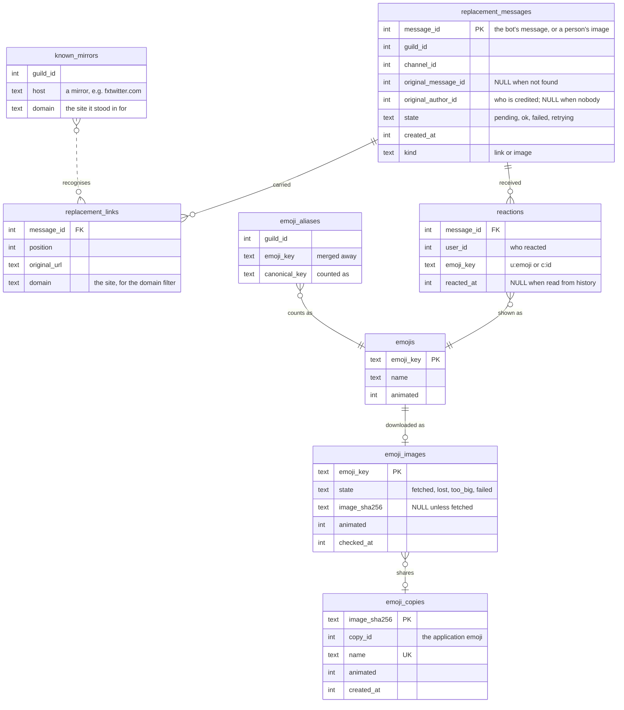
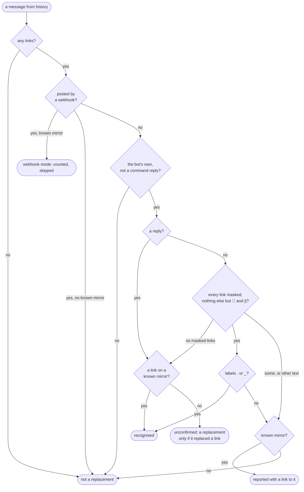

# Link stats

`/linkstats` counts the reactions on the bot's link replacements, and in a
server that turns it on, on the images and videos people post: who gets the
most, who gives the most, and with which emojis. It can also read years of
channel history back into those counts, and it keeps its own copy of every
custom emoji it counts.

This is the feature's working document. It records how the feature works,
what was decided and why, and what has been asked for. [The user guide](README.md#linkstats) says how to use it;
[Classes.md §8](../architecture/Classes.md#8-link-stats-and-the-recompute)
draws its classes.

| | |
|---|---|
| **Code** | `src/core/commands/linkstats.*`, `src/core/events/{reactions,backfill,legacy_replacements,media_posts,emoji_copies}.*` |
| **Tests** | `tests/unit/linkstats_command_test.cpp`, `tests/unit/legacy_replacements_test.cpp`, `tests/db/{reaction_store,backfill,media_posts,emoji_copies}_test.cpp` |
| **Tables** | `replacement_messages`, `replacement_links`, `reactions`, `reaction_log`, `emojis`, `emoji_aliases`, `known_mirrors`, `backfill_progress`, `emoji_images`, `emoji_copies` |
| **Config** | `emoji_copy_min_uses` in `config.json`; `linkstats_images` per server in `guild_settings` |
| **Status** | Built and tested offline. Not yet run against real Discord. |

## Contents

1. [The commands](#1-the-commands)
2. [What is stored](#2-what-is-stored)
3. [Counting reactions as they happen](#3-counting-reactions-as-they-happen)
4. [The recompute](#4-the-recompute)
5. [Emojis: aliases and duplicates](#5-emojis-aliases-and-duplicates)
6. [Boards and paging](#6-boards-and-paging)
7. [Decisions](#7-decisions)
8. [Requests of 2026-09-30](#8-requests-of-2026-09-30)
9. [Reactions on images](#9-reactions-on-images)
10. [The bot's own copies of emojis](#10-the-bots-own-copies-of-emojis)
11. [Still to check in Discord](#11-still-to-check-in-discord)

## 1. The commands

| Subcommand | What it shows or does | Who | Answer |
|---|---|---|---|
| `top` | A leaderboard of people: reactions received, given, or on their own links; or of emojis | everyone | public, paged |
| `user` | One person's received, given and self counts, with their top three emojis each way | everyone | public |
| `reactions` | Every emoji and how often, for everyone or one person, received or given | everyone | public, paged |
| `duplicates` | Custom emojis with names alike, a group at a time, with menus to merge them | everyone looks; Manage Server merges | private, paged |
| `alias add` / `remove` / `list` | Count one emoji as another, in all history | Manage Server for add and remove | private (`list` public) |
| `recompute start` / `cancel` | Read channel history back into the counts | Manage Server | private, then posts in the channel |
| `images on` / `off` | Count reactions on the images and videos people post here, or stop | Manage Server | private |

`top`, `user` and `reactions` take the same filters: `since` and `until`
(inclusive, `YYYY-MM-DD`, UTC), `domain` (only replacements of links to one
site) and `source` (links, images, or both; §9.4).

## 2. What is stored



- One row in `reactions` answers both "who received" (the message's
  `original_author_id`) and "who gave" (`user_id`). A reaction to your own
  link is **self**: counted on its own, and in neither of the other two.
- Aliases are applied **when statistics are read**, never written into
  `reactions`. Adding one changes all of history at once, and removing it puts
  history back.
- `known_mirrors` is every mirror host any rule has named, plus those the
  recompute has learned (§4.2). It is never pruned.
- `reaction_log` keeps every add and remove seen live, for questions nobody
  has asked yet. `backfill_progress` is how far a recompute got per channel.
- An image post is a row in `replacement_messages` with `kind = 'image'`
  (§9). `emoji_images` and `emoji_copies` are the bot's copies of emojis
  (§10).

## 3. Counting reactions as they happen

Every reaction in every channel reaches the bot. `reaction_store::add` records
one only when its message is in `replacement_messages` (a replacement, or an
image post, §9), and asks that in the
same `INSERT`, so a reaction on any other message costs one statement and
leaves nothing behind. Removals, and a moderator clearing one emoji or all of
them, remove rows the same way. Emoji keys drop U+FE0F, so `❤` and `❤️` are
the same heart whichever keyboard typed it.

## 4. The recompute

`/linkstats recompute start since:YYYY-MM-DD` walks each text channel
backwards a page (100 messages) at a time. For each of the bot's replacements
it finds whose link it was, then rebuilds that message's reactions to match
what Discord shows now. Rebuilding, rather than adding, is what makes it safe
to run again. Progress is saved per channel after every page, so a run that
was cancelled or cut off by a restart carries on where it stopped;
`fresh:true` starts every channel over.

### 4.1 Is this message a replacement?

The bot's replacements have had six shapes over the years (`legacy_format`):
a copy of the original as a reply, webhook mode, a plain copy, `[.](link)`,
`🔗 [.](link)`, and today's `🔗 [_](link)`.



A link to a mirror some rule has named settles it. **Today's rules are not
enough on their own**: embed fixers for Twitter, TikTok and Instagram have
come and gone, and broken ones were dropped, many before this database
existed. So without a known mirror:

- The masked shapes (`[.](link)`, `🔗 [.](link)`, `🔗 [_](link)`) count
  whatever the mirror. The bot writes them for nothing else.
- A copy of a message, as a reply or not, is **unconfirmed**. It counts only
  when it answered somebody's link: one of its links has the same path as a
  link in the original, on another host (`replaced_links`). That is what
  tells a replacement from the bot saying something with a link in it — a
  trigger's GIF, a language model answer.

A shape with a known mirror that matches none of these is **reported with a
link to it, never guessed at**. The same shape with no known mirror is left
alone: nothing says it was a replacement.

### 4.2 Whose link was it?

- A reply names its original. When the original is older than the pages in
  hand, it is fetched.
- Anything else answered the nearest earlier message with a link whose path
  matches, on another host, among the last ten people's messages with links
  in them. Bots, the bot itself and webhooks are skipped. When there were
  links but none matched, the replacement is **left unattributed and
  reported**, rather than credited to whoever happened to post just before.
  Its reactions still count as given.
- A replacement the bot recorded as it posted it already knows, and is never
  attributed again.

A match also says which site each mirror stood in for: the host of the link
it replaced. A mirror no rule knew is **learned**: remembered in
`known_mirrors` under that site, listed in the report as an "old mirror
recognised", and from then on recognised like any other. Its replacements
are filed under that site, so the `domain` filter finds them.

### 4.3 The report, and the reply

The progress message is edited every 500 messages. When the run is over it
becomes the report: channels, messages scanned, replacements found and how
many were credited, webhook replacements skipped, reactions recorded, old
mirrors recognised, and channels it could not read. Messages worth a look are
**linked** (`https://discord.com/channels/<guild>/<channel>/<message>`), up
to three of each kind:

| Kind | Meaning |
|---|---|
| Not understood | the bot's, with a known mirror, in no shape it ever wrote |
| Not credited | after links that were not the one it replaced |
| Reactions not read | Discord refused the reactions; the old counts are kept |

Then the bot **replies to the report and pings whoever started it**. By then
the report is far up the channel, under everything posted while it ran. The
reply mentions only them, is not silent (the progress messages are), and
carries `recompute-issues.txt` with a link to every message of every kind
when there are any. The log has them all too.

## 5. Emojis: aliases and duplicates

An **alias** counts one emoji as another. Discord gives a re-uploaded emote,
or the same emote on another server, a new id, so without aliases one emote's
reactions are split across several.

- Chains are flattened when written: an alias of an alias points at the end.
- An alias that would make two emojis count as each other is refused.
- An emoji that is **already an alias** is refused ("x is already aliased to
  y"), rather than moved, since moving it would quietly undo the first merge.
  Remove it first.
- Autocomplete offers `alias add` and `top`'s `emoji` only emojis that count
  as themselves, with the merged ones' reactions in their counts. `alias
  remove` is offered only aliases.

`/linkstats duplicates` finds candidates. Two custom emojis look alike
(`names_look_alike`) when their names are the same ignoring case, or a letter
or two apart by edit distance. How many letters is scaled to the shorter
name, since two letters of a three-letter name is most of it:

| Shorter name | Letters allowed to differ | Alike | Not alike |
|---|---|---|---|
| 1–3 letters | 0 | `ok` / `OK` | `ok` / `no`, `cat` / `bat` |
| 4–5 | 1 | `kekw` / `kekl` | `kekw` / `kewl` |
| 6+ | 2 | `pepe_sad` / `pepesad2` | `happycat` / `happydog` |

Groups are joined through any pair, so `kekw`, `KEKW` and `kekw2` are one
group. Emojis already merged count as their keeper, so a group disappears once
merged. Groups come most-reacted first, one a page, at most 25 emojis each
(Discord's limit on a menu).

For somebody with Manage Server the page has two menus: **Keep which one?**,
then **Merge into …** with each of the others and "All of the others". The
keeper rides in the second menu's `custom_id`, since a menu only sends back
its own choice. Manage Server is checked again when a menu is used.

## 6. Boards and paging

A board's filters are packed into its ◀ / ▶ buttons' `custom_id`, so a page
reached by paging is the same board, even after a restart:

```
linkboard:<page>:<board>;<emoji>;<site>;<since>;<until>;<user>;<source>
```

`<board>` is `r`, `g`, `s` (people received, given, self) or `e`, `f` (emojis
received, given). Dates are days since 1970. `<source>` is `b`, `l` or `i`:
both, links, images. Buttons sent before `<user>` or `<source>` existed have
five or six fields and still work, counting links, which is all there was. The `custom_id` holds 100
characters, which is why `domain` is capped at 40.

## 7. Decisions

| Date | Decision | Why |
|---|---|---|
| plan v4 | Aliases are applied when read, not written | One change fixes all history, and removing it undoes it |
| plan v4 | Self-reactions are their own count, left out of received and given | Reacting to your own post says nothing about it |
| plan v4 | An unmatched replacement is reported, not credited to the nearest link | A wrong credit is worse than none, and invisible |
| plan v4 | Reactions from history have no time; they are dated by the message | Discord never says when someone reacted |
| 2026-09-30 | Recognise old replacements by shape and by what they answered, not only by mirrors in rules | Old fixers were dropped from the rules, many before this database |
| 2026-09-30 | Learned mirrors are written to `known_mirrors` | So the next run, and the `domain` filter, know them; and the report names each one, so a wrong one is seen |
| 2026-09-30 | A replaced link must be on another host, not just the same path | That is all that separates a replacement from the bot repeating a link |
| 2026-09-30 | Problem messages are linked; all of them go in a file on the reply | A message holds 2,000 characters, about 20 links |
| 2026-09-30 | The done reply is not silent, and pings only whoever started it | Telling them is its whole point |
| 2026-09-30 | An emoji already aliased is refused, not moved | Moving it undoes a merge without anyone asking |
| 2026-09-30 | `/linkstats emojis` replaced by `duplicates`, with near names and merging | The old name did not say what it did, and exact names missed `kekw2` |
| 2026-09-30 | Names alike: 0 / 1 / 2 letters by length | A flat two letters groups most short names with each other |
| 2026-09-30 | `/linkstats reactions` added, with `user` and `side` | `top by:emoji` was the only emoji list, hard to find and never one person's |
| 2026-09-30 | Emoji lists page 20 at a time; people 10 | Emoji lines are short and a server has many |
| 2026-09-30 | Image posts count images and videos, uploaded or linked straight to the file; not `gifv` (Tenor, Giphy) or a site's preview | The owner's answer. A preview of a page is the site's, not somebody's post |
| 2026-09-30 | Image posts are rows in `replacement_messages` with a `kind` column | The owner's answer: every statistic already reads that table, so none needed a second query |
| 2026-09-30 | Counting images is per server, off until `/linkstats images on` | The owner's answer. It counts every image in every channel |
| 2026-09-30 | `source` defaults to both where images are counted, links elsewhere | The owner's answer. A server that never turned images on reads as before |
| 2026-09-30 | The bot copies every emote used at least `emoji_copy_min_uses` times (1 to start); raising it deletes copies | The owner's answer. Their first recompute found 182 custom emojis, far under Discord's 2,000 |
| 2026-09-30 | Copying starts on its own, a round a minute | The owner's answer. A recompute run again fills in what it finds |
| 2026-09-30 | One copy per image, by SHA-256, and one per emote, by alias | Two servers' copies of one emote, or a re-upload, need no second copy |
| 2026-09-30 | Lost images are tried again weekly, on two hosts | The owner wants as many lost emotes back as can be had |

## 8. Requests of 2026-09-30

| # | Request | Status |
|---|---|---|
| 1 | Link to messages with issues instead of giving ids | **Done.** §4.3 |
| 2 | Reply to the report when done, pinging who ran it | **Done.** §4.3 |
| 3 | A paged view of every reaction on one person's links | **Done.** `/linkstats reactions user:` |
| 4 | A paged total of every emoji, for everyone | **Done.** `/linkstats reactions` (the same list as `top by:emoji`) |
| 5 | Stop depending on the current URL rules to find old replacements | **Done.** §4.1, §4.2 |
| 6 | Count reactions on images people post | **Done.** §9 |
| 7 | List emojis with the same or similar names, and alias from the list | **Done.** `/linkstats duplicates`, §5 |
| 8 | A clearer description for `/linkstats emojis` | **Done.** Replaced by `duplicates`: "Custom emojis with the same or nearly the same name, to merge into one." |
| 9 | Keep the bot's own copy of every emoji it sees | **Done.** §10 |
| 10 | Offer only masters in `alias add`'s `as`; refuse aliasing an alias | **Done.** §5 |

## 9. Reactions on images

Many of the reactions worth counting are on images people post themselves,
not on links the bot replaced. In a server that has run `/linkstats images
on`, those are counted too, credited to whoever posted them, and a reaction
to your own image is a self-reaction, as for links.

### 9.1 What counts

A message from a person, not a bot or a webhook, with at least one of
(`has_media`):

- an **attachment** whose type is `image/*` or `video/*`, or with no type
  given, a picture or video file's extension;
- an **embed** of type `image` or `video` with no provider: a link straight to
  a file, which Discord shows in place of the link.

A site's preview names its provider, so YouTube's player, whose embed is a
`video`, does not count. `gifv` embeds, Tenor and Giphy's looping GIFs, are
left out on purpose.

### 9.2 Stored as

A row in `replacement_messages` with `kind = 'image'` (migration 12): the
person's own message, with `original_message_id` itself,
`original_author_id` the poster, state `ok`, and no links
(`replacement_store::record_image_post`). Every other row is `link`. Retry,
the preview tracker and settling after a restart only ever look at `pending`
and `retrying` rows, so an image row is invisible to them.

### 9.3 As it happens

`media_tracker`, called from `on_message_create` and `on_message_update`,
only in a server that counts images:

- An **upload** is recorded when the message arrives.
- A message with **links** waits, author and all, for up to a minute
  (`media_preview_wait`). Discord adds the preview a moment later, in an
  update that often has no author, and one that shows a picture or video
  records it. An update without one leaves it waiting, since a message can
  be updated more than once.

From then on, reactions on it are counted by the same `reaction_store::add`
as a replacement's.

### 9.4 Reading them

`stat_query::source` is `links`, `images` or `both`, and every statistic
filters `m.kind` by it. `top`, `user` and `reactions` take it as `source`;
left out, it is both where images are counted and links alone where they are
not. Titles say which: "on replaced links", "on images", "on links and
images", and "their own images" for self-reactions. A `domain` means links
alone, since an image has no site.

### 9.5 The recompute

In a server that counts images (`backfill_request::images`), the recompute
records each image post it passes, whether or not anybody has reacted yet,
and rebuilds its reactions like a replacement's. The progress message, the
report ("Images and videos found: 7, with 30 reactions") and the done reply
count them. Reading reactions costs an API call per emoji per message, so a
recompute with images takes longer; it stays safe to cancel and run again.

## 10. The bot's own copies of emojis

A custom emoji belongs to a server. When the server deletes it, statistics
that show it get a broken image. So the bot copies every custom emoji it
counts into its own **application emojis**, which it can use in any message
and menu in any server, and shows the copy from then on.

### 10.1 What Discord allows

Application emojis are owned by the bot's application, not a server: up to
2,000 per application, each named with 2–32 letters, digits and
underscores, and an image of at most 256 KiB. People cannot use them. DPP
10.1.6 has the calls (`application_emoji_create`, `_delete`), behind
`discord_gateway::create_application_emoji` and `delete_application_emoji`.

### 10.2 What is copied

`emoji_copy_store::plan` decides, each round:

- An **emote** is an emoji and every emoji merged into it by an alias. Its
  uses are all their reactions together, in every server.
- Each emote used at least `emoji_copy_min_uses` times (1 by default) gets
  **one copy**: of the one kept, or when that one's image is lost, of the
  next of its emojis, most used first.
- Emojis with the **same image** share a copy, by the SHA-256 of the file,
  even without an alias: the same emote on two servers is copied once.
- Copies nothing wants any more are **deleted**: after the threshold is
  raised, or when an alias merges two copied emotes. Deleting waits until
  nothing is left to download, since an image not yet downloaded may be one
  of them.

`emoji_copy_min_uses` of 0 turns copying off and leaves the copies alone.

### 10.3 How

`emoji_copier::run_round` runs every minute once the bot is connected, and
does at most ten emojis (`copies_per_round`), which keeps well inside
Discord's limits on making emojis. For each emoji:

1. **Download** from `cdn.discordapp.com/emojis/<id>`, then from
   `media.discordapp.net`, the media proxy, which has served images the CDN
   no longer would. A `.gif` first, kept only if it has more than one frame,
   so an animated emoji keeps moving; then a `.png`. An image over 256 KiB
   is asked for again at `?size=96`.
2. Nothing on either host is **lost**, tried again weekly in case it comes
   back. Too big even when smaller is `too_big`, weekly too. A network error
   or a refused upload is `failed`, tried again the next day.
3. An image already copied is **shared**. Otherwise it is **uploaded**,
   named after the original, with `_2`, `_3` added when the name is taken.

`display_emoji` shows the copy (`reaction_store::copy_of`): the emoji's own,
or failing that, one of an emoji it is merged with. The menus in `duplicates`
draw the copies as well, which they cannot do with other servers' emojis.

## 11. Still to check in Discord

None of this has met real Discord history yet:

- a recompute over a channel with the Java bot's old replacements, looking at
  the "old mirrors recognised" line for anything wrong;
- that the done reply pings, jumps to the report, and carries the file;
- that the jump links open the right messages;
- `/linkstats duplicates` merging on a real server, and the menus as Discord
  draws them;
- that autocomplete in `alias add` no longer offers merged emojis;
- `/linkstats images on`, then an upload, a link to an image, a YouTube link
  and a Tenor GIF: the first two counted, the others not;
- a recompute with images on, and its report;
- the first rounds of emoji copies: uploads, a GIF that still moves, the log's
  "lost" count, and the copies showing in a board and in the duplicates menus;
- raising `emoji_copy_min_uses` and seeing copies deleted.
