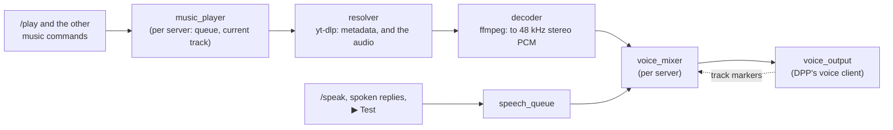

# Music

The bot plays music in a voice channel: `/play` a link (or, if §9 says so,
a search), and it joins, queues the track, and plays the queue in order,
with the usual skip, pause, repeat, shuffle and clear. Speech keeps working
alongside it: when the bot has something to say, the music **pauses**, the
speech plays, and the music **resumes where it stopped**.

This is the feature's spec: what it is for, how it should behave, how it is
to be built, and what has been decided and why. It is a **draft for review**:
nothing here is built yet, and §9 lists the questions to answer before it
is. What it builds on is in [Voice_Channels.md](Voice_Channels.md) (joining,
leaving, the speech queue) and [Speech.md](Speech.md).

| | |
|---|---|
| **Code** (planned) | `src/core/audio/voice_mixer.*`, `src/core/music/{track,music_queue,music_player,resolver,decoder}.*`, `src/core/commands/music.*`, `src/core/ports/{media_resolver,pcm_stream}.hpp`, `src/core/util/process.*` |
| **Tests** (planned) | `tests/unit/{voice_mixer,music_queue,music_player,music_command,resolver}_test.cpp`, `tests/mocks/{mock_resolver,mock_pcm_stream}.hpp`, `[live]` tests against real yt-dlp and ffmpeg |
| **Tables** | none planned: the queue lives in memory (§9, Q7); per-server settings as `music_*` rows in `guild_settings` |
| **Config** (proposed) | `ytdlp_path`, `ffmpeg_path` in `config.json` |
| **Runtime** | `yt-dlp.exe` and `ffmpeg.exe`, beside the bot or on `PATH` |
| **Plan** | Replaces plan §15, and the mixer half of §13 |
| **Status** | **Designed, not built.** Draft of 2026-09-30, waiting on the owner's review |

## Contents

1. [Intent](#1-intent)
2. [The Java bot's music, and what went wrong](#2-the-java-bots-music-and-what-went-wrong)
3. [Behaviour](#3-behaviour)
4. [How it works](#4-how-it-works)
5. [Dependencies and running it](#5-dependencies-and-running-it)
6. [Security](#6-security)
7. [Testing](#7-testing)
8. [Decisions](#8-decisions)
9. [Open questions](#9-open-questions)
10. [Build order](#10-build-order)
11. [What changes elsewhere](#11-what-changes-elsewhere)

## 1. Intent

The Java bot was a music bot as much as anything, through LavaPlayer, and
the owner wants that back. It is not the most important feature, which is
why it waited until everything else was built. It has to be a **redesign,
not a port**, for two reasons:

- **LavaPlayer has no C++ equivalent.** It resolved YouTube and other
  links, demuxed and decoded them, and encoded Opus, all inside the JVM. The
  owner chose **yt-dlp** to resolve and fetch, and **ffmpeg** to decode, as
  external programs.
- **The Java track handling "is not very good"**, in the owner's words: it
  was written to get something working and never cleaned up (§2).

One requirement shapes the rest: **music and speech stay separate
features**. Speech is going to do much more than music, and the two must not
collide. There is only one voice connection per server, so something has
to decide who is heard. That is the **mixer** (§4.2): music and speech each
talk to it, and neither knows about the other.

## 2. The Java bot's music, and what went wrong

The Java bot had these commands, all Speak by default:

| Command | Did |
|---|---|
| `/play link [type: play next \| play now] [silent]` | Joined your channel if not in one, then queued the link. A playlist queued every track |
| `/queue` (alias `/q`) | The current track and the queue, split over as many messages as it took |
| `/nowplaying` (alias `/np`) | The current track and who queued it |
| `/pause` | Toggled pause |
| `/skip` | Stopped the current track, so the next began |
| `/repeat` | Toggled repeating the current track |
| `/shuffle` | Shuffled the queue |
| `/clear` | Emptied the queue, leaving the current track playing |

Every reply was deleted after 10 seconds (60 for `/queue` and errors), and
`silent` made `/play`'s reply ephemeral. The sources were LavaPlayer's
remote ones: YouTube, SoundCloud, Bandcamp, Vimeo, Twitch, and direct HTTP
links. There was no search: text that was not a link found nothing.

What went wrong, from `TrackManager.java` and the commands:

| Problem | Why |
|---|---|
| **One queue for the whole bot** | The player and the `TrackManager` were statics on `LatiBot`, so two servers shared one queue and one player |
| **Speech threw away the current song** | `/speak` used `queueNow`, which pushed the speech to the front and *skipped* the song. It never came back |
| **`play now` lost the current song too** | The same `queueNow`: the interrupted track was skipped, not resumed |
| **`play next` with a playlist reversed it** | Each track went in with `addFirst`, so the last track ended up first |
| **`/skip` did nothing with repeat on** | A skip ends the track as `STOPPED`, and with repeat on, the end handler replays the current track |
| **A broken track with repeat on looped for ever** | `LOAD_FAILED` was handled like `FINISHED`, so repeat retried it endlessly |
| **`/queue` hid the current track when nothing was queued after it** | It checked for an empty queue before showing the current track |
| **The queue outlived leaving** | The `TrackManager` was never reset, so the next `/play` added to an old queue |
| **Replies vanished** | Everything was deleted after 10 seconds, including errors worth reading |
| **No limits** | Any length, any playlist size, any number of tracks |

## 3. Behaviour

What follows is the **proposal**. Command names, option names and replies
are open until §9 is answered; where a choice is still open, the proposal
states it and marks it with the question number.

### 3.1 The commands

The Java names are kept for muscle memory (Q1), as top-level commands, and
two are added. All need **Speak** by default, as in Java, and all are for
servers only.

| Command | Does |
|---|---|
| `/play query [position]` | Queues a link, or with Q3 a search, and starts playing if nothing is. `position` is **end** (the default), **next**, or **now**. The bot joins your channel first if it is not in one |
| `/queue` (alias `/q`) | What is playing, with the time into it, then the queue, ten a page with ◀ / ▶, and the total time |
| `/nowplaying` (alias `/np`) | The current track: title, link, time into it and length, who queued it, and whether repeat is on |
| `/pause` | Pauses, or resumes if paused |
| `/skip` | Skips the current track, **even with repeat on** |
| `/repeat [mode]` | **off**, **track** or **queue** (Q6); without `mode`, cycles through them |
| `/shuffle` | Shuffles what is queued, never the current track |
| `/clear` | Empties the queue. The current track keeps playing; `/stop` ends that too |
| `/stop` | *New.* Stops the music and empties the queue, staying in the channel |
| `/remove position` | *New.* Takes one track out of the queue, by its number in `/queue` |

**Who may use them.** Anyone with Speak, as in Java. The controls that
change what everyone hears (`skip`, `pause`, `stop`, `clear`, `shuffle`,
`remove`, and `play now`) also need the caller to be **in the bot's voice
channel**, or to have Manage Server (Q5).

**Replies** are public and silent for what the room hears: queued, skipped,
paused, stopped. Refusals are private. Nothing is deleted after a delay, and
the `silent` option goes (Q8).

### 3.2 Playing

- **Where.** In the channel the bot is in, whether it got there by `/join`,
  `/voice start` or `/play`. If it is in no channel, `/play` joins yours.
  If you are in none, `/play` is refused.
- **Order.** `end` adds to the back. `next` puts the track straight after
  the current one; a playlist added with `next` keeps its own order. `now`
  puts the track next and skips to it, and the interrupted track goes back
  to the **front of the queue, at the point it was stopped** (Q4).
- **Playlists.** A playlist link queues its tracks in order, up to a limit
  (Q9). The reply says how many were queued, and how many were left out.
- **Metadata.** Each track keeps its title, length, link, uploader and who
  queued it. Titles are taken as given, with mentions and markdown made
  harmless before they are shown.
- **A track that fails** (removed, private, region-locked, a download that
  breaks mid-way) is skipped with a note in the channel, and the next one
  plays. It never repeats, even with repeat on.
- **Resolved when played, not when queued.** Stream URLs expire (YouTube's
  after a few hours), so queueing only reads the metadata, and the audio is
  fetched when the track's turn comes. A track that was fine when queued can
  still fail then.
- **Live streams** (Q10) play until skipped, and show *live* in place of a
  length.

### 3.3 Speech and music together

Speech always wins, and music loses nothing by it:

1. The bot has something to say: `/speak`, a spoken model reply, the voice
   lab's ▶ Test.
2. The music **stops at once**, where it is. It is not faded out, and it
   does not play out what had been buffered first.
3. The speech plays, all of it, including speech queued after it.
4. The music **resumes from where it stopped**.

`/tts stop` and `/tts skip` stop speech only; the music then resumes.
`/pause`, `/skip` and `/stop` act on music only. Ducking (music quieter
under speech) and playing over it are possible later, as a per-server
choice, since the mixer handles the samples itself (§4.2). Pausing was
chosen to start with, in plan v1.

### 3.4 Leaving

The music stops and the queue is **cleared** whenever the bot leaves the
channel: `/leave`, `/voice stop`, being disconnected, or leaving because it
was alone ([Voice_Channels.md §2.3](Voice_Channels.md#23-leaving-an-empty-channel)).
Auto-leave works as it does now: music does not keep the bot in an empty
channel. Moving to another channel with `/join` keeps the queue, and the
current track carries on from where it was.

### 3.5 Limits

| Limit | Proposed | Why |
|---|---|---|
| Tracks in a server's queue | 500 | A queue past that is a mistake |
| Tracks added from one playlist | 100 | Fetching a playlist's metadata takes time; a huge one should not hold `/play` up |
| Longest track | none, or a per-server cap (Q10) | |
| Resolving a link | 30 s, then refused | yt-dlp can hang on an unreachable site |
| Volume | 50 % by default, 0–200 %, per server (Q11) | Music at full scale drowns speech |

## 4. How it works

### 4.1 The shape



- **`music_player`** holds each server's queue and current track, and
  decides what plays next: the plain-data logic, tested without any process
  or connection.
- **`resolver`** runs yt-dlp. **`decoder`** runs ffmpeg on what yt-dlp
  fetches. Both sit behind ports (`media_resolver`, `pcm_stream`), so the
  player is tested against mocks.
- **`voice_mixer`** is the only thing that writes to a server's voice
  connection. Speech and music are its two sources.

### 4.2 The mixer, and why `pause_audio` cannot do this

The plans said music would pause for speech with DPP's `pause_audio` and
track markers. **Reading DPP 10.1.6 shows that cannot work**:

- A `discord_voice_client` has **one** outgoing buffer, `outbuf`, played in
  order. Speech and music would both be in it.
- `pause_audio(true)` pauses the **whole** buffer, so speech queued behind
  paused music would wait with it.
- `stop_audio()` clears the **whole** buffer, speech included.
- `skip_to_next_marker()` drops everything up to the next marker, whatever
  it belongs to.

So DPP's buffer can only ever hold one thing at a time. The mixer keeps
music **out** of it except for a short **lookahead**, and speech goes
straight in:

- **Music is fed a little at a time.** The mixer keeps about **two
  seconds** of music queued in DPP's buffer (`get_secs_remaining`), topping
  it up from the decoder on a short timer. That is enough to ride out timer
  jitter, and small enough to hold little in memory. A track is never
  queued whole: four minutes is 46 MB of PCM.
- **The mixer remembers what it sent.** It keeps the last lookahead's worth
  of music samples it queued. DPP's buffer holds 20 ms packets, so the
  number of seconds remaining says exactly which samples have not been
  heard yet.
- **When speech arrives**, the mixer:
  1. reads how much music is still unplayed;
  2. calls `stop_audio()`, which leaves the buffer empty;
  3. keeps the unplayed samples to replay first;
  4. queues the speech, whole, with its markers, as the speech queue does
     today.

  The speech starts within one 20 ms packet.
- **When the last speech marker passes**, the mixer feeds the kept samples,
  then the decoder again. Nothing is lost, and nothing plays twice.
- **Music commands** act on the mixer, not DPP. `/pause` stops feeding and
  clears the lookahead, keeping it, so the pause is immediate and resuming
  loses nothing. `/skip` clears the lookahead and moves to the next track.
- **The same rewind handles a move.** Changing channel sets the voice
  connection up again, and DPP's buffer is not expected to survive that (to
  confirm when built). Either way, the mixer replays its kept samples once
  the connection is ready.

The mixer implements `ports::voice_output` towards the speech queue, which
therefore does not change, and uses a `voice_output` of its own, extended
with `remaining`, towards DPP. Since the mixer holds the samples before DPP
sees them, a later **duck** or **overlay** mode is sample arithmetic on the
lookahead, with no change to the design.

### 4.3 Tracks and markers

The plans wanted DPP's track markers to own the playback position, instead
of the Java `SongQueue`'s bookkeeping. In the lookahead design:

- The mixer inserts a marker **after the last packet of each track**, named
  `music:<track id>`. Speech markers keep their own prefix, so each source
  sees only its own.
- `on_voice_track_marker` for a music marker means the track **finished
  playing**, not merely finished decoding. That is when the player moves on
  and repeat is applied. The decoder may have finished seconds earlier.
- **Time into the track** is the samples fed, minus what DPP has not played
  yet. It needs no clock, and it stays right across pauses and speech.

The queue itself is plain data: a `std::deque<track>` per server with the
current track separate, the operations of §3.1, and every rule of §2
written as a test first.

### 4.4 Resolving: yt-dlp

yt-dlp is run once to **read** a link, and once more to **fetch** a track
when its turn comes:

- **Reading** (at `/play`):
  `yt-dlp --ignore-config --no-warnings --flat-playlist --dump-single-json -- <link>`
  gives a single track's metadata, or a playlist's entries without fetching
  each one. With Q3, text that is not a link becomes `ytsearch1:<text>`.
- **Fetching** (at play time): `yt-dlp --ignore-config --no-playlist
  -f bestaudio/best -o - -- <link>` writes the audio to stdout, which is
  connected straight to ffmpeg's stdin.

Piping yt-dlp into ffmpeg, rather than handing ffmpeg a URL, leaves yt-dlp
to deal with what sites need: signed URLs, headers, fragmented streams,
cookies. ffmpeg only ever reads a pipe.

### 4.5 Decoding: ffmpeg

```
ffmpeg -hide_banner -loglevel error -i pipe:0 -f s16le -ar 48000 -ac 2 pipe:1
```

The decoder reads its stdout into 20 ms frames of 48 kHz stereo 16-bit
samples, which is what DPP takes, and applies the server's volume in
software, as `/speak` does. Speech needs no ffmpeg at all; it is a
music-only dependency, as plan v1 found.

Loudness varies from track to track. ffmpeg's `loudnorm` filter can even
it out in one pass (Q11).

### 4.6 Running programs

Nothing in the bot runs another program yet. Windows needs `CreateProcess`
with pipes for stdin, stdout and stderr, and a way to kill the process tree
on `/skip`. That goes behind a small port (`util/process`, or a library,
Q2), so tests never start a process:

- **Arguments are passed as a list**, never through a shell, so nothing in a
  link is ever interpreted by one.
- **stderr is drained** on its own thread and logged at `debug`, since a
  full stderr pipe blocks the process.
- **Every process is killed** when its track ends, is skipped or stopped,
  or the bot leaves. A server holds at most one fetch and one decode at a
  time, plus a read while `/play` runs.
- **Timeouts:** reading a link gives up after 30 s. Fetching has no
  overall limit, since a track plays for as long as it plays, but a decoder
  that produces nothing for 30 s is treated as a failed track.

### 4.7 Threads

- The decoder reads on a thread per playing server.
- Topping up DPP's buffer runs on a cluster timer, about every 200 ms, as
  the other timers do, and never blocks: it takes what the decoder has.
- `send_audio_raw` Opus-encodes on the calling thread, so 200 ms of audio is
  encoded per top-up, per server: small.
- The player and the mixer are called from commands, voice events and
  timers, so both lock, as the speech queue does.

### 4.8 Storage

The queue is memory only (Q7). Per-server settings are `guild_settings`
rows: `music_volume`, and later the mixing mode. No migration is needed
unless Q7 asks for the queue to survive a restart.

## 5. Dependencies and running it

- **yt-dlp** and **ffmpeg** are external executables, not linked libraries.
  A release gains two files beside the four it has, or they are found on
  `PATH`. `config.json` gains `ytdlp_path` and `ffmpeg_path`, empty by
  default, meaning "beside the bot, then `PATH`".
- **The bot starts without them.** Startup logs a warning naming what is
  missing, and the music commands say so. Nothing else is affected.
- **yt-dlp needs updating often.** Sites change, and an old yt-dlp stops
  working with them, YouTube especially. The log should say which version
  was found, and a failed read suggests `yt-dlp -U`. Recent yt-dlp may need
  a JavaScript runtime for YouTube; check the current requirement when this
  is built.
- **Conan's `ffmpeg` package** (libav\*) was the alternative: native, with no
  extra executable, but a much larger build for no practical gain here, and
  yt-dlp is external either way (Q2).
- **CI** has neither program. The unit tests use mocks; tests against the
  real programs are `[live]` (§7).

## 6. Security

People type the links, so everything passed to yt-dlp is untrusted:

- **Option injection.** A "link" of `--exec calc` must not become an option.
  Every link goes after `--`, and a link must be `http://` or `https://`
  (or a search, with Q3).
- **Local files.** yt-dlp refuses `file://` unless told otherwise, which it
  never is. ffmpeg only reads a pipe, so it cannot be pointed at a file.
- **Config and plugins.** `--ignore-config` on every call, so a
  `yt-dlp.conf` on the host changes nothing. No `--exec`, no cookies, and
  no output written to disk.
- **The local network.** yt-dlp's generic extractor fetches any URL, so a
  link to `http://192.168.1.1/` makes the host fetch from its own network
  (SSRF). Refusing private and loopback addresses before resolving is
  cheap, and so is an allowlist of sites (Q12).
- **Titles** come from the site, and are shown with mentions and markdown
  made harmless.

## 7. Testing

- **The queue and the player**, as plain data: every §3.1 operation, with
  the Java bugs of §2 written as tests first. Among them: a playlist `next`
  keeps its order, skip works with repeat on, a failed track never
  repeats, `now` resumes the interrupted track at its point.
- **The mixer**, against a `mock_voice` extended with `remaining`:
  - speech interrupts within one packet, and music resumes at exactly the
    first unplayed sample;
  - pause and resume lose nothing;
  - a move replays the kept samples on the new connection;
  - markers route to the right source;
  - the lookahead never passes its size.
- **The resolver**, against recorded yt-dlp JSON: a track, a playlist, a
  search, a live stream, errors, and the argument list, including `--` and
  `--ignore-config`, for links that try to be options.
- **The decoder and the process port**, against a stand-in program the
  tests build, which writes known samples and can hang or die on request.
- **`[live]`**: real yt-dlp and ffmpeg on a known, stable, freely licensed
  track. Excluded by every preset, like the other live tests.
- **Commands**: the panel harness for `/queue`'s pages, and the permission
  checks as pure functions.

## 8. Decisions

| Date | Decision | Why |
|---|---|---|
| initial analysis | Keep music, but last | The owner wants it back; it is not the most important feature |
| initial analysis | yt-dlp to resolve, ffmpeg to decode | The owner's choice; the common approach for native bots, and no media pipeline to write |
| initial analysis | Redesign the queue, don't port it | The Java `TrackManager` "is not very good" (§2) |
| initial analysis | Keep speech and music separate | Speech will do much more, and must not collide with music |
| plan v1 | One mixer per server owns the connection; speech preempts, music pauses and resumes | One voice connection per server; the owner wants pause first, configurable later |
| plan v1 | Build on DPP's track markers | They report playback passing a point, which the Java queue did by hand |
| plan v1 | Don't register music commands until they work | No dead commands in the slash menu |
| plan v1 | ffmpeg is for music only | Speech is PCM in memory, and needs only resampling |
| plan v2 | Pause now; duck or overlay as a per-server setting later | Keep it simple to start |
| 2026-09-30 | The mixer feeds music a short lookahead and rewinds on interruption, rather than using `pause_audio` | DPP's one buffer makes `pause_audio` and `stop_audio` act on speech too (§4.2) |
| 2026-09-30 | Tracks are fetched when played, not when queued | Stream URLs expire |
| 2026-09-30 | yt-dlp pipes into ffmpeg; ffmpeg never takes a URL | yt-dlp handles what sites need, and ffmpeg can never be pointed at a file |
| 2026-09-30 | A music marker means the track finished playing | Decoding ends seconds before playback does |

## 9. Open questions

For the owner. Each has a recommendation, which is what §3 assumes;
answering inline under each works, as it did for link stats.

**Q1. Command names.** Keep the Java top-level commands (`/play`, `/queue`,
`/np`, `/skip` …), or group them as `/music play`, `/music skip`, and so on?
Top-level names are quicker to type and familiar. A group keeps the slash
menu tidy, and cannot collide with anything later.
*Recommended:* top-level, as in Java, with `/q` and `/np` kept.

> Answer:

**Q2. How to run yt-dlp and ffmpeg.** (a) The executables, with a small
Win32 process wrapper of our own. (b) The executables, through a library
such as `reproc` from Conan. (c) libav\* through Conan's `ffmpeg`, with
yt-dlp still an executable.
*Recommended:* (a). It is about 200 lines, and the bot needs nothing a
library would add.

> Answer:

**Q3. Search.** Should `/play` take plain text and play the first YouTube
result, or links only, as in Java?
*Recommended:* search, since it is the most common way people use music
bots. The reply names what was found, so a wrong match is obvious.

> Answer:

**Q4. `play now`.** When it interrupts a track, should the interrupted
track come back afterwards, at the point it was stopped, or be dropped as
in Java?
*Recommended:* come back, at its point.

> Answer:

**Q5. Who controls the music.** Anyone with Speak, as in Java? Only people
in the bot's voice channel? A vote to skip?
*Recommended:* anyone with Speak who is in the bot's voice channel, or
anyone with Manage Server. No votes.

> Answer:

**Q6. Repeat.** Java repeated the current track only. Add repeating the
whole queue?
*Recommended:* off, track and queue.

> Answer:

**Q7. The queue across restarts.** Memory only, lost on restart, as in
Java? Or stored, so a restart picks up where it was?
*Recommended:* memory only. A restart also leaves the voice channel, and
the queue goes when the bot leaves (§3.4).

> Answer:

**Q8. Replies.** Public and silent for what the room hears, private
refusals, nothing deleted after a delay, and no `silent` option? And
should the bot post "now playing" in the channel each time a track starts?
*Recommended:* yes to the first; no automatic "now playing" posts, since
`/np` answers that on request and a post per track is noise.

> Answer:

**Q9. Limits.** 500 tracks in a queue and 100 from one playlist?
*Recommended:* those.

> Answer:

**Q10. Long tracks and live streams.** Allow any length, and live streams
until skipped? Or cap a track's length per server?
*Recommended:* allow both, with no cap to start. `/skip` ends either.

> Answer:

**Q11. Volume.** A per-server `/volume` (0–200 %, 50 by default)?
Loudness evened out between tracks with ffmpeg's `loudnorm`?
*Recommended:* both. Music at full scale drowns the speech it pauses for.

> Answer:

**Q12. Which sites.** Anything yt-dlp supports (well over a thousand
sites), or a list (YouTube, SoundCloud, Bandcamp, direct audio links)?
Either way, private and loopback addresses are refused (§6).
*Recommended:* anything yt-dlp supports, apart from those addresses.

> Answer:

## 10. Build order

Each step ends with its tests passing, as the phases did.

1. **The process port** and a stand-in program for its tests.
2. **The resolver** and **the decoder**, with a `[live]` test against the
   real programs.
3. **The mixer**, with speech moved onto it. Speech must behave exactly as
   it does now, which the existing speech tests check. Nothing new is
   registered yet.
4. **The queue and the player**, with every §2 bug as a test.
5. **The commands**, registered only once steps 1–4 work in Discord.
6. **Docs**: this spec as built, the user guide's sections, and §11's
   updates elsewhere.

## 11. What changes elsewhere

When it is built:

- **[Voice_Channels.md](Voice_Channels.md)**: the mixer sits between the
  speech queue and DPP, and leaving clears the music queue.
- **[Speech.md](Speech.md)**: speech pauses music, and `/tts stop` stops
  speech only.
- **[Operations.md](Operations.md)**: the two executables, their
  `config.json` keys, and the startup warning.
- **[Planned.md](Planned.md)**: music leaves it.
- **The user guide**: the commands, in place of "What is coming".
- **The root README**: the release files, and the permission list.
