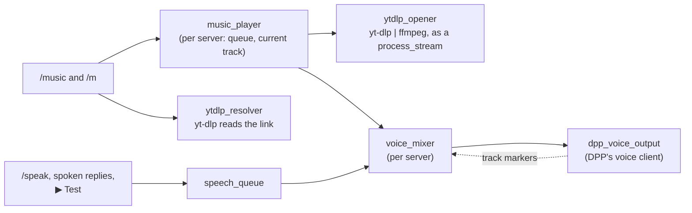

# Music

The bot plays music in a voice channel. `/music play` takes a link, the bot
joins, queues the track, and plays the queue in order, with skip, pause,
repeat, shuffle, remove, clear and stop. `/m` is the same command, for
short. Speech keeps working alongside it: when the bot has something to say,
the music **pauses at once**, the speech plays, and the music **resumes
from exactly where it stopped**.

This is the feature's spec: what it is for, how it behaves, how it is
built, and what was decided and why. [The user guide](README.md#music) has
the subcommands and replies. What it builds on is in
[Voice_Channels.md](Voice_Channels.md) (joining, leaving, the speech queue)
and [Speech.md](Speech.md).

| | |
|---|---|
| **Code** | `src/core/audio/voice_mixer.*`, `src/core/music/{music_queue,music_player,yt_dlp,links,cookies}.*`, `src/core/commands/music.*`, `src/core/ports/media.hpp`, `src/core/util/process.*` |
| **Tests** | `tests/unit/{voice_mixer,music_queue,music_player,music_command,music_links,music_cookies,yt_dlp,yt_dlp_live,process}_test.cpp`, `tests/mocks/{mock_media,mock_voice}.hpp`, `tests/support/test_child.cpp` |
| **Tables** | none: the queue lives in memory. `music_volume` and `music_track_limit_minutes` per server in `guild_settings` |
| **Config** | `ytdlp_path`, `ffmpeg_path` in `config.json`; `LATIBOT_YTDLP_COOKIES` in the environment, to sign in to YouTube (§4.9) |
| **Runtime** | `yt-dlp.exe` and `ffmpeg.exe`, beside the bot or on `PATH` |
| **Plan** | Replaces plan §15, and the mixer half of §13 |
| **Status** | Built on 2026-09-30. **Not yet run in Discord, or against the real yt-dlp and ffmpeg**: see §7 |

## Contents

1. [Intent](#1-intent)
2. [The Java bot's music, and what went wrong](#2-the-java-bots-music-and-what-went-wrong)
3. [Behaviour](#3-behaviour)
4. [How it works](#4-how-it-works)
5. [Dependencies and running it](#5-dependencies-and-running-it)
6. [Security](#6-security)
7. [Testing](#7-testing)
8. [Decisions](#8-decisions)
9. [The owner's answers](#9-the-owners-answers)
10. [Build order](#10-build-order)
11. [What changed elsewhere](#11-what-changed-elsewhere)

## 1. Intent

The Java bot was a music bot as much as anything, through LavaPlayer, and
the owner wanted that back. It is not the most important feature, which is
why it waited until everything else was built. It had to be a **redesign,
not a port**, for two reasons:

- **LavaPlayer has no C++ equivalent.** It resolved YouTube and other
  links, demuxed and decoded them, and encoded Opus, all inside the JVM. The
  owner chose **yt-dlp** to resolve and fetch, and **ffmpeg** to decode, as
  external programs.
- **The Java track handling "is not very good"**, in the owner's words: it
  was written to get something working and never cleaned up (§2).

One requirement shapes the rest: **music and speech stay separate
features**. Speech is going to do much more than music, and the two must not
collide. There is only one voice connection per server, so something has
to decide who is heard. That is the **mixer** (§4.2): music and speech each
talk to it, and neither knows about the other.

## 2. The Java bot's music, and what went wrong

The Java bot had these commands, all Speak by default:

| Command | Did |
|---|---|
| `/play link [type: play next \| play now] [silent]` | Joined your channel if not in one, then queued the link. A playlist queued every track |
| `/queue` (alias `/q`) | The current track and the queue, split over as many messages as it took |
| `/nowplaying` (alias `/np`) | The current track and who queued it |
| `/pause` | Toggled pause |
| `/skip` | Stopped the current track, so the next began |
| `/repeat` | Toggled repeating the current track |
| `/shuffle` | Shuffled the queue |
| `/clear` | Emptied the queue, leaving the current track playing |

Every reply was deleted after 10 seconds (60 for `/queue` and errors), and
`silent` made `/play`'s reply ephemeral. The sources were LavaPlayer's
remote ones: YouTube, SoundCloud, Bandcamp, Vimeo, Twitch, and direct HTTP
links. There was no search: text that was not a link found nothing.

What went wrong, from `TrackManager.java` and the commands. Each of these
has a test now (§7):

| Problem | Why | Now |
|---|---|---|
| **One queue for the whole bot** | The player and the `TrackManager` were statics on `LatiBot` | A queue per server |
| **Speech threw away the current song** | `/speak` used `queueNow`, which *skipped* the song | Speech pauses music, which resumes where it was |
| **`play now` lost the current song too** | The same `queueNow` | The interrupted track comes back after, from its start |
| **`play next` with a playlist reversed it** | Each track went in with `addFirst` | A playlist keeps its order |
| **`/skip` did nothing with repeat on** | The end handler replayed a stopped track | Skip always moves on |
| **A broken track with repeat on looped for ever** | `LOAD_FAILED` was handled like `FINISHED` | A failed track never repeats |
| **`/queue` hid the current track when nothing was queued after it** | It checked for an empty queue first | The current track is always shown |
| **The queue outlived leaving** | The `TrackManager` was never reset | Leaving empties it |
| **Replies vanished** | Everything was deleted after 10 seconds | Nothing is deleted |
| **No limits** | Any length, any playlist size | 500 in a queue, 100 from a playlist, an hour a track |

## 3. Behaviour

### 3.1 The commands

`/music`, or `/m`, with a subcommand. All need **Speak** by default, as in
Java, and all are for servers only.

| Subcommand | Does |
|---|---|
| `play link [position]` | Queues a link, and starts playing if nothing is. `position` is **At the end** (the default), **Next**, or **Now**. The bot joins your channel first if it is in none |
| `queue` | What is playing and how far in, then the queue, ten a page with ◀ / ▶, and its total time |
| `nowplaying` | The current track: title, link, how far in and how long, who queued it, whether paused or repeating, and what is next |
| `pause` | Pauses, or resumes if paused |
| `skip` | Skips the current track, **even with repeat on**, and says what plays now |
| `repeat [mode]` | **Off**, **This track** or **The whole queue**; without `mode`, the next of those in turn |
| `shuffle` | Shuffles what is queued, never the current track |
| `clear` | Empties the queue. The current track plays on; `stop` ends that too |
| `stop` | Stops the music and empties the queue, staying in the channel |
| `remove position` | Takes one track out of the queue, by its number in `queue` |
| `volume [percent]` | Shows the music's volume, or with **Manage Server**, sets it: 0–200 %, 50 by default |
| `limit [minutes]` | Shows the longest a track may play, or with **Manage Server**, sets it: 60 by default, 0 for none |

**Who may use them.** Anyone with Speak, **from anywhere in the server**:
queueing a song into a channel you are not in is allowed on purpose. There
are no votes. Only the two settings that stay, volume and the track limit,
need Manage Server to change.

**Replies** are public and silent: what the room hears, the room is told,
without a ping. Refusals are private. Nothing is deleted after a delay, and
no "now playing" message is posted when a track starts; `nowplaying` answers
that on request. Titles come from the site, and are shown with markdown
escaped and mentions broken, so a title can neither format a reply nor
ping anyone.

### 3.2 Playing

- **What.** A link, `http://` or `https://`, to anything yt-dlp can play:
  well over a thousand sites. Plain text is refused ("i only play links for
  now"): there is no search. A link into a private or loopback network is
  refused (§6).
- **Where.** In the channel the bot is in, however it got there. If it is in
  none, `play` joins yours. If you are in none either, `play` is refused.
- **Order.** **At the end** adds to the back. **Next** puts the tracks
  straight after the current one, a playlist in its own order. **Now** puts
  them first and plays at once; the interrupted track goes back into the
  queue straight after them and **starts over** when it plays again.
- **Playlists.** A playlist link queues its first 100 tracks, in order. The
  reply says how many were queued, and how many were left out and why.
- **A track that fails** (removed, private, region-locked, a download that
  breaks mid-way) is skipped with a note in the channel it was queued from,
  and the next one plays. It never repeats, whatever repeat says. What had
  already been heard of it stays heard.
- **Fetched when played, not when queued.** Stream URLs expire (YouTube's
  after a few hours), so queueing only reads the details. The audio is
  fetched when the track's turn comes: in fact a few seconds before, while
  the one before it finishes, so the next track starts without a wait.
- **Live streams** play until skipped, and show *live* in place of a
  length.
- **The track limit.** A track known to be longer than the server's limit is
  left out when queued, with a note in the reply. One whose length the site
  did not give is cut off at the limit, with a note. Live streams have no
  limit.
- **Loudness** is evened out between tracks, and the server's volume is
  applied on top.

### 3.3 Speech and music together

Speech always wins, and music loses nothing by it:

1. The bot has something to say: `/speak`, a spoken model reply, the voice
   lab's ▶ Test.
2. The music **stops at once**, where it is. It is not faded out, and what
   had been queued of it does not play out first.
3. The speech plays, all of it, including speech queued after it.
4. The music **resumes from exactly where it stopped**.

`/tts stop` and `/tts skip` stop speech only; the music then resumes, and
with no speech playing they leave the music alone. `pause`, `skip` and
`stop` act on music only. Ducking (music quieter under speech) and playing
over it are possible later, as a per-server choice, since the mixer holds
the samples itself (§4.2).

### 3.4 Leaving

The music stops and the queue is **emptied** whenever the bot leaves the
channel: `/leave`, `/voice stop`, being disconnected, or leaving because it
was alone ([Voice_Channels.md §2.3](Voice_Channels.md#23-leaving-an-empty-channel)).
Music does not keep the bot in an empty channel. Moving to another channel
with `/join` keeps the queue; the current track carries on, less up to three
seconds that were queued on the old connection (§4.2).

### 3.5 Limits

| Limit | Value | Why |
|---|---|---|
| Tracks in a server's queue | 500, the one playing included | A queue past that is a mistake |
| Tracks added from one playlist | 100 | Reading a playlist's details takes time |
| Longest track | 60 minutes by default, per server, 0 for none; live streams never | The owner's choice |
| Reading a link | 30 s, then refused | yt-dlp can hang on an unreachable site |
| A track producing no audio | 30 s, then it has failed | A fetch that stalls should not hold the queue |
| Volume | 50 % by default, 0–200 %, per server | Music at full scale drowns speech |

## 4. How it works

### 4.1 The shape



- **`music_queue`** is the queue's rules as plain functions over a
  `guild_queue`: add, advance, peek, shuffle, remove, clear. The Java bugs of
  §2 are tests of these.
- **`music_player`** holds each server's queue, the current track's stream,
  and the next track's, fetched ahead. It is the mixer's **music source**.
- **`ytdlp_resolver`** reads links with yt-dlp, and **`ytdlp_opener`** starts
  `yt-dlp | ffmpeg` for a track. Both sit behind `ports::media_resolver` and
  `ports::stream_opener`, with mocks in the tests.
- **`voice_mixer`** is the only thing that writes to a server's voice
  connection.

### 4.2 The mixer, and why `pause_audio` cannot do this

The plans said music would pause for speech with DPP's `pause_audio`.
**DPP 10.1.6 shows that cannot work**: a `discord_voice_client` has **one**
outgoing queue, played in order. `pause_audio` pauses all of it,
`stop_audio` clears all of it, and `skip_to_next_marker` drops everything up
to the next marker, speech or music.

So the connection only ever holds one of the two:

- **Music is fed a little at a time.** The mixer keeps **three seconds** of
  music queued (`voice_output::remaining`, DPP's `get_secs_remaining`), in
  whole 20 ms packets, topped up by a one-second cluster timer: DPP's timers
  tick in whole seconds, so three seconds leaves two in hand. A track is
  never queued whole; four minutes is 46 MB of samples.
- **It remembers what it sent**: the last six seconds of music, packet by
  packet, with the markers among them.
- **When speech arrives** (`play`, from the speech queue), the mixer works
  out from the connection's queued time exactly which samples have not been
  heard, takes them back, clears the connection with `stop_audio`, and
  queues the speech. The speech starts within a packet.
- **When the last speech marker passes**, the music taken back is queued
  first, then the player is read again. Nothing is lost and nothing plays
  twice. `/tts skip` and `/tts stop` end speech the same way, and do
  nothing to the connection when no speech is queued.
- **`pause`** takes the music back the same way and stops feeding;
  resuming feeds it again. **`skip`** and **`stop`** drop it
  (`drop_music`), clearing the connection only when it holds music.
- **A new connection** (a move, or a reconnect) has lost what the old one
  queued. Speech waiting is queued again by the speech queue. A track's end
  marker that was still due is sent again, so the player still moves on; the
  up to three seconds of music queued before it are lost.

Towards the speech queue the mixer is a `ports::voice_output`, so speech
did not change. Since the mixer holds the samples before DPP sees them, a
later **duck** or **overlay** mode is arithmetic on the samples, with no
change to the design.

### 4.3 Tracks and markers

- The mixer queues a marker **after the last packet of each track**, named
  `music:<playback>`, where the playback number is new every time a track
  starts, a repeat included. Speech markers start `tts:`, so each source
  sees only its own. A track's last packet is padded with silence, at most
  20 ms.
- `on_voice_track_marker` for a music marker means the track **finished
  playing**, not merely finished decoding. That is when the player moves on
  and repeat is applied. A marker from a playback since skipped or
  restarted is ignored.
- **Fetching ahead.** When the current track has finished decoding, the
  player opens the stream of whatever plays next (`peek_next`), so its audio
  is ready when the marker comes; the mixer feeds it straight away. A change
  to the queue before then (shuffle, remove, repeat) re-picks it.
- **Time into the track** is the samples the player handed over, less what
  the mixer says is not heard yet. It needs no clock, and stays right
  across pauses and speech.

### 4.4 Resolving: yt-dlp

`ytdlp_resolver` runs yt-dlp on two worker threads of its own, completing a
DPP promise, since a read takes seconds:

```
yt-dlp --ignore-config --no-warnings --no-playlist --flat-playlist
       --dump-single-json --playlist-end 100 --encoding utf-8 -- <link>
```

- `--no-playlist` makes a video link that also names a playlist the video; a
  playlist link is still the playlist.
- `--flat-playlist` lists a playlist's entries without fetching each one.
- `parse_lookup` reads the JSON: title, the page to fetch from, uploader,
  length, and whether it is live. Entries with no usable link, and upcoming
  streams, are left out. yt-dlp's `ERROR:` line becomes the reply when it
  fails.

**Fetching**, when a track plays, writes the audio to stdout, which is
connected straight to ffmpeg's stdin:

```
yt-dlp --ignore-config --no-warnings --no-playlist --quiet --no-progress
       --no-part -f bestaudio/best -o - [--ffmpeg-location <ffmpeg>] -- <link>
```

Piping yt-dlp into ffmpeg, rather than handing ffmpeg a URL, leaves yt-dlp
to deal with what sites need: signed URLs, headers, fragmented streams. It
is also given ffmpeg's location, since it uses ffmpeg itself for live
streams and some sites.

When the owner has signed music in to an account (§4.9), a run that fails
because yt-dlp must sign in is run again with `--cookies` and a copy of the
cookies, straight after `--ignore-config`.

### 4.5 Decoding: ffmpeg

```
ffmpeg -hide_banner -loglevel error -i pipe:0 -vn
       -af loudnorm=I=-16:TP=-1.5:LRA=11 -f s16le -ar 48000 -ac 2 pipe:1
```

- **`loudnorm`** evens loudness out in one pass, as the audio arrives, at
  -16 LUFS.
- **`process_stream`** reads the output on a thread of its own into a
  buffer of ten seconds, and waits when it is full, so the programs never run
  further ahead than that.
- **The volume** is applied by the player in software, as `/speak` does, and
  a change applies at once.
- **A failure** is the first program in the pipe to exit non-zero, and its
  last stderr line is the reason given: yt-dlp failing leaves ffmpeg with
  nothing, and it fails too.

Speech needs no ffmpeg at all; it is a music-only dependency, as plan v1
found.

### 4.6 Running programs

`util::process` is a small Win32 wrapper:

- **Arguments are a list**, quoted with `quote_argument` so that
  `CommandLineToArgvW` reads back exactly what was given, and never pass
  through a shell.
- **One job object per pipeline**, with kill-on-close. Every process is
  started suspended, put in the job, then resumed, so nothing it starts can
  escape. Killing the pipeline (a skip, a stop, leaving) ends yt-dlp,
  ffmpeg, and anything yt-dlp started.
- **Inherited handles are listed explicitly**
  (`PROC_THREAD_ATTRIBUTE_HANDLE_LIST`). Another server's music may be
  starting at the same moment, and a pipe end leaking into the wrong process
  would keep that pipe open after its owner finished.
- **stderr is drained** line by line on a thread per program, and logged at
  `debug`, since a full stderr pipe stops a program.
- **`run`** runs one program to its end with a watchdog, for reading links
  and asking versions. **`pipeline`** chains them for fetching.
- `locate_program` finds each program: the `config.json` path if given,
  else beside the bot's executable, else on `PATH`.

### 4.7 Threads

- **The feeding timer** runs on DPP's timer thread once a second, and never
  waits: it takes what the streams have.
- **Each stream** reads on a thread of its own; **each program** in it has a
  stderr reader; **the resolver** has two workers.
- `send_audio_raw` Opus-encodes on the calling thread: at most three seconds
  a tick per playing server.
- **Locks.** The mixer calls the player (`read`) with its own lock held, so
  the player never calls the mixer with the player's lock held. A skip is
  two halves: the player marks itself switching, the mixer drops what it
  had, then the player moves on. Nothing is read in between, so the next
  track's start is never dropped with the old one's end.

### 4.8 Storage

The queue is memory only, and leaves with the bot. Per server,
`guild_settings` keeps `music_volume` and `music_track_limit_minutes`. No
migration was needed.

### 4.9 Signing in to YouTube

YouTube plays an age-restricted video only to an account that is signed in
and old enough. yt-dlp cannot sign in to YouTube with a password, so it is
given the cookies of a browser that is signed in, as a `cookies.txt` file.
Added on 2026-10-01, for the owner's instance; an instance without it works
as before, signed out.

**Setting it up**, with an account kept for the bot:

1. **Check the account.** Signed in as it in a browser, an age-restricted
   video should play without asking for an age. If YouTube asks to verify
   it, do that there first.
2. **Export from a private window.** Open a new private window, sign in to
   YouTube, and in that same tab go to `https://www.youtube.com/robots.txt`.
   Export the cookies for youtube.com in the Netscape `cookies.txt` format,
   with a browser extension that is allowed to run in private windows. Then
   close the private window **without signing out**.

   YouTube rotates the cookies of a session that stays open in a browser,
   which signs out every copy exported before; a session nobody opens again
   stays as it was exported. Signing out ends it everywhere, the bot's copy
   included.
3. **Put the file where the bot runs**, in `data/`, which git ignores: say
   `data/youtube-cookies.txt`. Add `LATIBOT_YTDLP_COOKIES=data/youtube-cookies.txt`
   to `.env`; a relative path is from the bot's working directory. Restart
   the bot.
4. **Read the startup log.** It says how many cookies it found, and how
   many for youtube.com, never what they are. A file it cannot read, a JSON
   export, or one with no cookies in it is a warning, and music fetches
   signed out; one with no youtube.com cookies is a warning too. So is one
   with no youtube.com `SAPISID` or `__Secure-3PAPISID` cookie: yt-dlp only
   signs in with one of those, and a file without them was exported
   signed out.

**When it does not work.** An age-restricted video still refused with "Sign
in to confirm your age" means YouTube saw yt-dlp as signed out. When the
signed-in try fails, the log has a warning, `yt-dlp could not read ...
signed in either`, with everything yt-dlp said. Signed-in runs keep yt-dlp's
own warnings, which signed-out runs leave out, so that warning shows why:

- **"The provided YouTube account cookies are no longer valid"**: the
  session was rotated, usually because it was used in a browser after the
  export, or exported from an ordinary window. Export again, as in step 2.
- **No such warning**, and the startup log warned about `SAPISID`: the file
  was exported signed out. Export again while signed in.
- **A warning that no JavaScript runtime was found**: recent yt-dlp wants
  one, such as Deno, for YouTube (§5). Install it where the bot runs.

When age-restricted videos that played stop playing, the session has
ended: export a fresh file the same way.

**Only when it is needed.** yt-dlp always tries signed out first. When it
fails, and what it says is that it must sign in (`needs_sign_in`: "Sign in
to confirm your age", "not a bot", a private video, or "use `--cookies`"),
it tries again at once, signed in, and nobody is told: only a failure of
that second try is the reply. Any other failure is told as it was, with no
second try.

- **Reading a link** (`ytdlp_resolver`) retries this way. A link read
  signed in is remembered, with every track it gave, so those tracks are
  fetched signed in straight away rather than refused first. The bot
  remembers up to 1,000 links until it restarts.
- **Fetching a track** (`sign_in_retry`) retries this way too, since a
  playlist is read without opening each video, and its age-restricted ones
  are only refused when they are fetched. A track is only fetched again if
  it was refused before any of it played.

The cost is one refused run, a second or two, the first time an
age-restricted link is read or played.

**The copies** (`music::cookie_source`). Every signed-in run of yt-dlp gets a
copy of the file of its own, in `data/yt-dlp-runs/`, removed once that run
has ended. yt-dlp writes its
cookies back to the file it was given as it ends, truncating and rewriting
it, and up to four run at once: one rewriting a shared file while another
reads it would leave that one signed out, or the file spoilt. Copies left
behind by a crash are removed at the next start. The owner's file is never
written to.

**What it means.**

- Everyone who can use `/music` fetches as that account whenever YouTube
  will not play a video signed out. Those videos are in its YouTube history,
  and anything it can see can be queued by link, its private playlists
  included.
- The file is a sign-in. Whoever has it is signed in as the account until
  the session ends, so it stays in `data/` beside the database, and is never
  logged.
- YouTube may limit or suspend an account used through yt-dlp, which yt-dlp's
  own documentation warns of. Use an account that can be lost.
- Signed in, yt-dlp asks YouTube for videos in other ways than signed out.
  If age-restricted videos still fail once the cookies are added, update
  yt-dlp first (`yt-dlp -U`), and see its wiki's pages on YouTube. Other
  videos are fetched signed out, as before.

## 5. Dependencies and running it

- **yt-dlp** and **ffmpeg** are external executables, not linked libraries.
  A release gains two files beside the four it has, or they are found on
  `PATH`. `config.json` has `ytdlp_path` and `ffmpeg_path`, empty by
  default, meaning "beside the bot, then `PATH`".
- **The bot starts without them.** Startup warns, naming what is missing,
  and `/music play` says the same. Nothing else is affected.
- **Startup logs the versions**, asked on a thread of its own so startup
  does not wait: an old yt-dlp is the usual reason a site stops working, and
  `yt-dlp -U` updates it. Recent yt-dlp may also need a JavaScript runtime
  (such as Deno) for YouTube; check when installing.
- **Conan's `ffmpeg` package** (libav\*) was the alternative: native, with no
  extra executable, but a much larger build for no practical gain, and
  yt-dlp is external either way.
- **CI** has neither program, and needs neither: the tests use a stand-in
  (§7).
- **An account**, for age-restricted videos, is optional: a cookies file
  named by `LATIBOT_YTDLP_COOKIES` (§4.9).

## 6. Security

People type the links, so everything passed to yt-dlp is untrusted:

- **Option injection.** Every link goes after `--`, and a link must be
  `http://` or `https://`, so `--exec calc` is refused before yt-dlp ever
  runs, and could not be an option if it were not.
- **Local files.** yt-dlp refuses `file://` unless told otherwise, which it
  never is. ffmpeg only reads a pipe.
- **Config.** `--ignore-config` on every call, so a `yt-dlp.conf` on the host
  changes nothing. No `--exec`, and nothing written to disk but the copies
  of the cookies, when the owner signed music in.
- **The account** (§4.9). Its cookies come only from the file the owner
  names, are never logged, and are copied only into `data/yt-dlp-runs/`,
  for as long as a run lasts. They are used only when yt-dlp says it must
  sign in; then anyone who can queue fetches as that account.
- **The local network.** A link written as a private, loopback, link-local,
  carrier-NAT, multicast or reserved address, IPv4 or IPv6, or as
  `localhost`, is refused when typed. A name is resolved first, by the
  resolver, and refused if any of its addresses is such an address. A site
  that *redirects* into the host's network is not caught: yt-dlp follows it.
- **Titles and errors** come from outside, and are shown with markdown
  escaped and every `@` broken with a zero-width space (`util::plain_text`).

## 7. Testing

- **The queue**, as plain data: every operation, and each Java bug of §2.
  `peek_next` is checked against `advance` for every repeat mode and way a
  track can end.
- **The player**, against scripted tracks (`mock_media.hpp`), a real mixer
  and a mock connection: order, fetching ahead, repeat, skip with repeat on,
  failed tracks before and after audio, `now` and the interrupted track
  starting over, pause, stop, the track limit and live streams, volume,
  separate servers, leaving, and speech pausing the music.
- **The mixer**, against a mock connection that plays its queue forward
  and records every sample heard. Music is a numbered ramp, so "resumed
  exactly where it stopped" is checked sample by sample: speech, several
  utterances, stop and skip, pause and resume, track end markers taken back
  by speech, dropping, a new connection, and whole packets only.
- **yt-dlp**, with a stand-in program (`tests/support/test_child.cpp`)
  that answers as yt-dlp would: tracks, playlists, failures, timeouts, and
  the argument lists, including `--` and `--ignore-config` for links that
  try to be options. The JSON reading is tested on its own.
- **Processes**, with the same stand-in: arguments read back exactly
  (spaces, quotes, backslashes, `%PATH%`, non-ASCII), three-stage pipes,
  stderr, exit codes, timeouts, output limits, and killing a program and
  what it started.
- **The command**: every reply's wording, the queue's pages against
  Discord's limits, the settings, and `/m` registering.
- **The cookies** (`music_cookies_test.cpp`): counting a `cookies.txt`, with
  `#HttpOnly_` lines, CRLF and a byte order mark; JSON and empty files
  refused; a copy per run, removed when the run is done, and leftovers
  cleared at start; `--cookies` before the `--`. The stand-in, given
  `--cookies`, says whether it was signed in and writes the file back as
  yt-dlp does, so the tests check the owner's file is left as exported. It
  refuses a link with "adult" in it unless signed in, as YouTube refuses an
  age-restricted video: an ordinary link is read signed out, a refused one
  read again signed in without a word, a link that needed it before signed
  in at once, other failures told without a retry, and a second refusal
  told. `sign_in_retry` is checked the same way for fetching, and does not
  start over a track that failed partway.
- **`[live]`** (`yt_dlp_live_test.cpp`, hidden with `[.]`): the real yt-dlp
  and ffmpeg read and play Wikimedia Commons' `Example.ogg`. Skipped when
  either is not installed; neither was on the machine this was built on.

**Still to check, with the real programs and in Discord:**

- that yt-dlp's JSON for YouTube, SoundCloud and a direct link reads as
  the tests' does, and that `--playlist-end` and `--no-playlist` behave;
- that `yt-dlp | ffmpeg` plays, including a live stream, and how long a
  YouTube track takes to start;
- that the mixer's timing holds in DPP: no gaps at the one-second tick,
  speech cutting in cleanly, and music resuming without a click;
- what DPP does to its queue on a move with `/join`;
- `/music` registering, and the queue's buttons;
- an age-restricted video playing with the owner's cookies, from a link
  and from a playlist, and the startup log's count of them;
- that `needs_sign_in` matches what YouTube says today, which can change;
- how long an exported session lasts with copies that are never written
  back.

## 8. Decisions

| Date | Decision | Why |
|---|---|---|
| initial analysis | Keep music, but last | The owner wants it back; it is not the most important feature |
| initial analysis | yt-dlp to resolve, ffmpeg to decode | The owner's choice; the common approach for native bots, and no media pipeline to write |
| initial analysis | Redesign the queue, don't port it | The Java `TrackManager` "is not very good" (§2) |
| initial analysis | Keep speech and music separate | Speech will do much more, and must not collide with music |
| plan v1 | One mixer per server owns the connection; speech preempts, music pauses and resumes | One voice connection per server; the owner wants pause first, configurable later |
| plan v1 | Build on DPP's track markers | They report playback passing a point, which the Java queue did by hand |
| plan v1 | ffmpeg is for music only | Speech is PCM in memory, and needs only resampling |
| plan v2 | Pause now; duck or overlay as a per-server setting later | Keep it simple to start |
| 2026-09-30 | The mixer feeds music a short lookahead and rewinds on interruption, rather than using `pause_audio` | DPP's one queue makes `pause_audio` and `stop_audio` act on speech too (§4.2) |
| 2026-09-30 | Three seconds of lookahead, topped up once a second | DPP's timers tick in whole seconds; the rewind means the size costs speech nothing |
| 2026-09-30 | Tracks are fetched when played, and the next one while the current one finishes | Stream URLs expire; fetching ahead keeps the gap between tracks to milliseconds |
| 2026-09-30 | yt-dlp pipes into ffmpeg; ffmpeg never takes a URL | yt-dlp handles what sites need, and ffmpeg can never be pointed at a file |
| 2026-09-30 | A music marker means the track finished playing | Decoding ends seconds before playback does |
| 2026-09-30 | Subcommands of `/music`, with `/m` as its alias | The owner's answer (Q1) |
| 2026-09-30 | Our own Win32 process wrapper, with a job object | The owner's answer (Q2); the job ends what yt-dlp starts |
| 2026-09-30 | Links only, no search | The owner's answer (Q3) |
| 2026-09-30 | `now` keeps the interrupted track, which starts over | The owner's answer (Q4) |
| 2026-09-30 | Anyone with Speak, from anywhere, no votes | The owner's answer (Q5): queueing into a channel you are not in is funny |
| 2026-09-30 | Repeat off, a track, or the queue | The owner's answer (Q6) |
| 2026-09-30 | The queue lives in memory | The owner's answer (Q7) |
| 2026-09-30 | Public silent replies, private refusals, no automatic "now playing" | The owner's answer (Q8) |
| 2026-09-30 | 500 in a queue, 100 from a playlist | The owner's answer (Q9) |
| 2026-09-30 | A per-server track limit, an hour by default, none for live streams, set with Manage Server | The owner's answer (Q10) |
| 2026-09-30 | A per-server volume, 50 % by default, and `loudnorm` | The owner's answer (Q11) |
| 2026-09-30 | Any site yt-dlp supports, but no private or loopback addresses | The owner's answer (Q12) |
| 2026-09-30 | Changing the volume, like the limit, needs Manage Server | Both are settings that stay for the whole server; pausing and skipping are not |
| 2026-09-30 | `[live]` tests are hidden with Catch2's `[.]` as well | The presets filter test names, and a tag is not in the name |
| 2026-10-01 | An account for yt-dlp, as a cookies file named by `LATIBOT_YTDLP_COOKIES` | The owner's request, for age-restricted videos. yt-dlp cannot sign in to YouTube with a password; a cookies file is the way its documentation gives. The file is a sign-in, so it is named where the secrets are, not in `config.json` |
| 2026-10-01 | Exported from a private window, then closed without signing out | A session left open in a browser has its cookies rotated, which signs out the exported copy (yt-dlp's wiki) |
| 2026-10-01 | A file, not `--cookies-from-browser` | The bot runs unattended; a browser on the host would keep rotating the session, and Chromium browsers on Windows encrypt their cookies where yt-dlp often cannot read them |
| 2026-10-01 | Each run of yt-dlp gets a copy of its own, removed when it ends | yt-dlp rewrites its cookie file as it ends, and up to four run at once |
| 2026-10-01 | Signed out first; signed in only when yt-dlp says it must, retried at once without telling anyone, and only the retry's failure told | The owner's request, so the account is used only where it is needed. It replaced signing every run in, built earlier the same day |
| 2026-10-01 | Links read signed in are remembered, with their tracks, until a restart | So a track already known to need it is not refused once more when it plays |
| 2026-10-01 | A track is fetched again only if nothing of it had played | Starting a track over partway would be worse than its failure |
| 2026-10-01 | Signed-in runs keep yt-dlp's warnings; a signed-in failure is a logged warning; startup checks for `SAPISID` | The owner's first try was refused signed in, and `--no-warnings` had hidden yt-dlp's reason |
| 2026-10-01 | A file that cannot be used is a warning, and music fetches signed out | Music, and so its account, is optional (the 2026-09-30 decision in Operations.md) |

## 9. The owner's answers

The draft asked twelve questions; the owner answered them on 2026-09-30,
and §8 records each as a decision.

| # | Question | Answer |
|---|---|---|
| Q1 | Command names | Subcommands of `/music`, aliased as `/m` |
| Q2 | Running yt-dlp and ffmpeg | The executables, through our own process wrapper |
| Q3 | Search | No: direct links only, for now |
| Q4 | `play now` | Keep the interrupted track; it starts over when it plays next |
| Q5 | Who controls the music | Anyone with Speak, even when not in the voice channel; no votes |
| Q6 | Repeat | A track, or the whole queue |
| Q7 | The queue across restarts | Memory only |
| Q8 | Replies | Public and silent; private refusals; no automatic "now playing" |
| Q9 | Limits | 500 in a queue, 100 from a playlist |
| Q10 | Long tracks and live streams | A per-server limit set with Manage Server: an hour by default, none on live streams |
| Q11 | Volume | A per-server volume, 50 % by default, and `loudnorm` |
| Q12 | Which sites | Anything yt-dlp supports, apart from private and loopback addresses |

## 10. Build order

As built, each step with its tests passing:

1. **The process port**, and the stand-in program for its tests.
2. **The resolver** and **the stream**, against the stand-in.
3. **The mixer**, with speech moved onto it. The existing speech tests
   passed unchanged.
4. **The queue and the player**.
5. **The command**, registered now, so it can be tried with a test bot.
6. **Docs**: this spec, the user guide, and §11.

## 11. What changed elsewhere

- **[Voice_Channels.md](Voice_Channels.md)**: the mixer sits between the
  speech queue and DPP, and leaving empties the music queue.
- **[Operations.md §4](Operations.md#4-configuration)** and `.env.example`:
  `LATIBOT_YTDLP_COOKIES`, from 2026-10-01.
- **[Speech.md](Speech.md)**: speech pauses music, and `/tts stop` stops
  speech only.
- **[Operations.md](Operations.md)**: the two executables, their
  `config.json` keys, the startup warning, and the music timer.
- **[Planned.md](Planned.md)**: music left it.
- **The user guide**: `/music`.
- **The root README**: the release files and the configuration keys.
