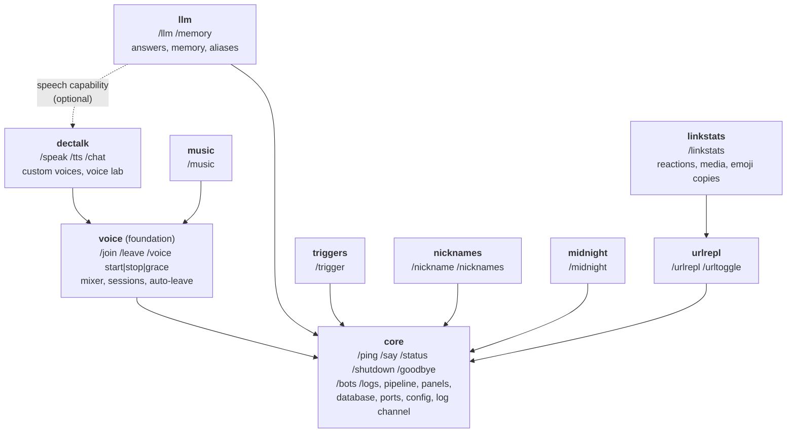

# Splitting LatiBot into a core and feature modules (v1)

A plan to iterate on, not yet a decision. Nothing in the code has changed.

The decisions that need you are numbered **D1–D14**, in §13. Each has a
recommendation, so you can answer one with "D3: B" and leave the rest.
Everything else follows from those answers and can change with them.

---

## Contents

0. [In short](#0-in-short)
1. [What this has to achieve](#1-what-this-has-to-achieve)
2. [Where the code is today](#2-where-the-code-is-today)
3. [The modules](#3-the-modules)
4. [What a module is](#4-what-a-module-is)
5. [Modules using each other](#5-modules-using-each-other)
6. [Folders, headers and CMake](#6-folders-headers-and-cmake)
7. [The database](#7-the-database)
8. [Configuration and secrets](#8-configuration-and-secrets)
9. [Tests](#9-tests)
10. [Docs](#10-docs)
11. [Order of work](#11-order-of-work)
12. [Risks](#12-risks)
13. [Decisions for you](#13-decisions-for-you)
- [Appendix A: every file, and where it goes](#appendix-a-every-file-and-where-it-goes)

---

## 0. In short

- **A core library and nine modules:**
  - the six you named: **llm, music, dectalk, midnight, urlrepl** and
    **nicknames**;
  - **triggers** and **linkstats**, which are features of the same size;
  - **voice**, which DECtalk and music both play through. It is not a
    switch of its own: it is built whenever either of them is (§3).
- **Each module is a static library with a CMake switch**, such as
  `-DLATIBOT_WITH_LLM=OFF`. CMake writes the list of modules that are on
  into one generated file, and `main()` starts those. A module that is off
  isn't compiled, isn't linked, and nothing mentions it (§4.8, §6).
- **A module plugs in through one interface.** It registers its commands,
  message stages, Discord listeners, timers, panels, schema and config
  keys. It gets the database, the Discord ports, the clock and settings
  from the core (§4).
- **Modules reach each other three ways**, in order of preference:
  - Through a small **capability** interface that lives in the core, like
    a port. One module offers it, and others ask for it and get nothing
    when it's absent. The LLM speaks through a `speech` capability that
    dectalk offers, so neither knows the other (§5).
  - By **requiring** another module, which is a hard link: linkstats
    requires urlrepl.
  - Through a **bridge** library, built only when both modules are, for
    anything bigger.
- **The core's public headers live under `include/`, and everything else
  is private.** CMake enforces it, so a module can't include another
  module's private code by accident (§6.2).
- **Existing databases and `config.json` keep working.** Migrations 1–15
  stay as they are and still run in every build, and new tables are
  versioned per module (§7). Old flat config keys are still read (§8).
- **Each module's tests build as their own executable**, and a script
  builds the combinations that matter, to prove each module really is
  optional (§9).
- **The work goes in small steps, with the bot building and every test
  passing after each.** First the cross-feature knots are untied inside
  today's library. Then the module interface is proved on midnight, the
  smallest feature. Then the other modules move over one at a time
  (§11).

---

## 1. What this has to achieve

Your requirements:

| # | Requirement |
|---|---|
| R1 | The bot compiles, and works, with any set of feature modules left out, such as no LLM. |
| R2 | A module registers its own commands. |
| R3 | A module hooks into the core through callbacks where it needs to. |
| R4 | The core offers public headers for modules to use. |
| R5 | When two modules are both present, one can use the other. When either is absent, neither breaks. The example is the LLM speaking through DECtalk. |
| R6 | Additions and their tests are easier to review. |

I've added these constraints:

| # | Constraint |
|---|---|
| N1 | The live `bot.db` keeps working. No shipped migration is edited unless you say so (§7). |
| N2 | The `config.json` on the server keeps working (§8). |
| N3 | Every step lands with the bot building, `ctest --preset asan` passing and clang-tidy clean. |
| N4 | A build with every module on behaves exactly as today: same commands, same pipeline order, and the same answers. |
| N5 | No new runtime dependency: modules are linked in, not loaded as DLLs at run time (§4.8 says why). |

What R6 means in practice: a change to one feature should touch one folder,
its tests should sit beside it, and the folder's README should say
everything the feature owns: commands, tables, settings, config keys,
capabilities offered and used. The core interface should change rarely,
and visibly.

---

## 2. Where the code is today

### 2.1 One library, one shell

Everything is in `latibot_core`, one static library of 197 files under
`src/core/`. The folders are layers, not features:

- `commands/` holds every feature's commands.
- `events/` holds most features' logic.
- `llm/`, `music/` and `audio/` are features in their own right.

`latibot::bot` (`bot.cpp`, 1283 lines) wires all of it. It holds about 65
members, one per store, service and panel, and handles each Discord event
by calling into whichever features care.

Sizes, from counting lines in `src/` and `TEST_CASE`s in `tests/`:

| Area | Source lines | Test cases |
|---|---:|---:|
| llm (`llm/`, `commands/llm`) | 5,156 | 97 |
| util, db, config, ports, ui | 4,837 | ~185 |
| link stats (reactions, media posts, emotes, recompute, emoji copies) | 4,471 | ~125 |
| music (`music/`, `commands/music`) | 2,995 | 102 |
| URL replacement | 2,882 | ~85 |
| DECtalk speech (`audio/` minus the mixer, `/speak`, `/tts`, `/chat`, voice lab) | 2,849 | ~70 |
| the shell (`bot.cpp`, `bot.hpp`, `main.cpp`) | 1,651 | 0 |
| triggers | 1,345 | 51 |
| nicknames | 1,070 | 61 |
| voice (mixer, sessions, auto-leave, pcm, `/join`, `/voice`) | 1,066 | ~30 |
| command plumbing (registry, options, preflight, unregister) | 1,016 | ~45 |
| Discord adapters (`discord/`) | 880 | ~8 |
| `/ping`, `/say`, `/status`, `/shutdown`, `/goodbye` | 758 | 13 |
| midnight | 733 | 34 |
| log channel and `/logs` | 720 | 20 |
| pipeline, `/bots` and the bot allowlist | 524 | 15 |

There are about 940 test cases in one executable.

### 2.2 Where one feature reaches into another

Taken from the `#include` graph. These are the knots to untie before
anything can be switched off:

| # | From | To | Why | What to do |
|---|---|---|---|---|
| K1 | `events/message_pipeline.hpp` | `events/url_rules.hpp` | The action list is a fixed `variant<send_message, stop_bot, replace_links, ask_llm>`, which names URL replacement's and the LLM's actions in the core. | The core's actions become generic (§4.5). |
| K2 | `config/bootstrap.cpp` | `llm/models.hpp` | `llm_model` is checked against the known models while `config.json` is read. | The LLM module reads and checks its own keys (§8). |
| K3 | `llm/advanced_triggers.hpp` | `events/triggers.hpp` | Advanced triggers reuse the simple triggers' `match_mode` and matching. | Matching moves to the core's `util/` (Appendix A). |
| K4 | `llm/responder.cpp` | `commands/speak.hpp`, `audio/dectalk_sanitizer`, `audio/speech_queue`, `audio/pcm`, `ports/tts_engine` | Spoken replies. | The `speech` capability (§5.3). |
| K5 | `llm/prompt.cpp` | `audio/voice_params.hpp` | The prompt lists DECtalk's voices. | The same capability supplies that text. |
| K6 | `llm/stage.cpp` | `events/voice_sessions.hpp` | Whether this channel's replies are spoken. | The same capability answers it. |
| K7 | `commands/music.cpp` | `commands/speak.hpp` | `plan_speak` decides where music plays. | Moves to voice, which music requires. |
| K8 | `commands/voice.cpp` | `commands/basic.hpp`, `commands/voice_lab.hpp` | `/voice` mixes voice sessions (`start`, `stop`, `grace`) with DECtalk's custom voices (`lab`, `list`, `remove`). | Split the command (D4). |
| K9 | `bot::on_voice_state` | speech queue, music player, mixer, auto-leave | Leaving voice tidies four features up in one place. | Voice offers a "left voice" hook (§4.2). |

Everything else already points the right way: features → building blocks
→ ports. The design held up. The coupling that remains is almost entirely
in `bot.cpp`, which is exactly what modules take apart.

### 2.3 What the shell does on each event

This is the list the module interface has to cover. Each row says which
future module needs the event.

| Discord event or moment | Today, in `bot.cpp` | Needed by |
|---|---|---|
| Starting | migrations, legacy imports, log lines, LLM tools, PO token provider | core, nicknames, urlrepl, llm, music |
| Intents | message content always; server members if `track_nicknames` | core, nicknames |
| `on_ready` | restore `/status`, register commands | core |
| `on_guild_create` | permission check, reconcile nicknames, import URL rules, settle stranded replacements | core, nicknames, urlrepl |
| `on_message_create` | pipeline (goodbye → URL → triggers → LLM), media posts, emote messages | core, urlrepl, triggers, llm, linkstats |
| `on_message_update` | preview tracker, media posts, emotes | urlrepl, linkstats |
| `on_message_delete` | preview tracker, emotes | urlrepl, linkstats |
| reaction add, remove, remove emoji, remove all | reaction counts | linkstats |
| `on_guild_member_update`, audit log entry | nickname history and who changed it | nicknames |
| slash command, autocomplete | registry | core |
| button, select menu | panel routing over 8 routers | every module with a panel |
| form submit | panel routing over 4 routers | triggers, urlrepl, dectalk, llm |
| `on_voice_ready`, track marker | mixer, then speech queue | voice, dectalk |
| `on_voice_state_update` | sessions, speech, music, mixer, auto-leave | voice, dectalk, music |
| Timers | midnight (30 s), preview tracker (1 s), mixer (1 s), log channel (2 s), auto-leave (5 s), emoji copies (60 s), backups, audit fallback (10 s, one-shot) | midnight, urlrepl, voice, core, linkstats, nicknames |
| Secrets the log channel masks | Discord token, Anthropic key, OpenAI key | core, llm |
| Passive permissions (`preflight`) | Send Messages, View Audit Log, Embed Links, Manage Messages | core, nicknames, urlrepl |

---

## 3. The modules



Solid arrows are **requires**: built against, linked, and switched on
together. The dotted arrow is an **optional capability**: no build
dependency. It is used when both modules are present, and quietly absent
otherwise.

| Module | Owns | Requires | Uses if present | Lines | Tests |
|---|---|---|---|---:|---:|
| **core** | `/ping` `/say` `/status` `/shutdown` `/goodbye` `/bots` `/logs`; the pipeline and the goodbye phrase; panel routing; permission warnings; the log channel; backups; the module host | — | — | ~9,500 | ~285 |
| **voice** | `/join` `/leave` `/voice start`, `stop`, `grace`; the mixer; voice sessions; auto-leave | core | — | ~1,100 | ~30 |
| **dectalk** | `/speak` `/tts` `/chat`; custom voices and the voice lab; DECtalk itself, which is only built with this module | voice | — | ~2,850 | ~70 |
| **music** | `/music`; yt-dlp, ffmpeg, cookies, the PO token provider | voice | — | ~3,150 | ~100 |
| **llm** | `/llm` `/memory`; answering, advanced triggers, memory, aliases, spend | core | speech | ~5,150 | ~100 |
| **triggers** | `/trigger`; trigger replies | core | — | ~1,350 | ~50 |
| **nicknames** | `/nickname` `/nicknames`; history, audit attribution, the Java import | core | — | ~1,300 | ~60 |
| **midnight** | `/midnight`; the daily message | core | — | ~750 | ~35 |
| **urlrepl** | `/urlrepl` `/urltoggle`; replacing links, watching previews, Retry, the Java rules import | core | — | ~3,100 | ~85 |
| **linkstats** | `/linkstats`; reaction counts, image posts, emote messages, the recompute, emoji copies | urlrepl | — | ~4,600 | ~125 |

The line counts include the code that moves out of `bot.cpp` for each
module. That code is about 600 lines in all, mostly nicknames, urlrepl and
music.

### 3.1 core

The core is what every build has. It is more than plumbing:

- **`/ping` `/say` `/status` `/shutdown` `/goodbye`** are small, and a bot
  without them isn't one you can run.
- **`/bots` and the allowlist** decide whether a bot's message reaches the
  pipeline at all. Every module that reads messages relies on them.
- **The log channel and `/logs`** are how you run the bot. Modules write to
  the log and don't need to know whether it's posted.
- **The pipeline, panels, registry, database, ports and config** are the
  extension points themselves.

`/join` and `/leave` are in `commands/basic` today. They move to voice: with
neither dectalk nor music there is nothing to join for.

### 3.2 voice, the foundation module

The mixer, voice sessions and auto-leave are shared by dectalk and music, and
the LLM uses sessions to decide whether to speak. There were three ways to
place them:

| Option | For | Against |
|---|---|---|
| **A. Its own module, built when dectalk or music is** (recommended) | A text-only build carries no voice code. Later, it could build DPP without voice support or opus at all (§6.4). | One more module, though it has no switch of its own. |
| B. In the core | Simplest. | Every build carries the mixer and `/join`, which do nothing without dectalk or music. |
| C. Merged with dectalk | Fewer modules. | Music would then require DECtalk: no music without speech. |

**D2.**

### 3.3 dectalk, and the `/voice` command

You called it dectalk; the docs call it speech (`Speech.md`). It owns DECtalk
itself, so a build without it skips compiling DECtalk and building its
dictionary.

`/voice` is the only command two modules would share (K8): `start`, `stop`
and `grace` are voice, while `lab`, `list` and `remove` are DECtalk's custom
voices. There are two ways out:

| Option | What changes for users | Cost |
|---|---|---|
| **A. Move the custom voices to `/tts voices lab`, `/tts voices list` and `/tts voices remove`** (recommended) | Three commands change name. | None: one command, one module. |
| B. Let a module add subcommands to another module's command | Nothing. | The registry learns to merge payloads, check permissions per contributor and route subcommands. It's general machinery for one use. |

**D4.**

### 3.4 urlrepl and linkstats

Link stats count reactions on the replacements urlrepl posts. They read
urlrepl's `replacement_store` and `url_rules`, and the recompute recognises
old replacements by the rules. Nothing in urlrepl needs link stats. So:

- **linkstats requires urlrepl.** Link stats without replacing links would
  count only image posts, and would need the replacements table anyway.
- **urlrepl works on its own.** It replaces links, watches previews and
  offers Retry.

The other choice is one `links` module with stats always included. That
gives fewer modules, but 7,600 lines in one place, which works against R6.
**D1.**

### 3.5 triggers

Triggers weren't on your list, but they're a self-contained feature of
1,350 lines, with a command, a panel, a stage and two tables. The LLM's
advanced triggers borrow their text matching (K3). Once matching moves to
`util/`, the two are independent. Recommended as a module. **D1.**

### 3.6 llm, music, nicknames, midnight

Each of these is already one folder of logic plus one command file. The work
is moving their wiring out of `bot.cpp` and, for the LLM, the speech
capability (§5.3).

Nicknames also owns the **Server Members intent**: it asks for it when
`track_nicknames` is on. The LLM's aliases read nicknames from DPP's member
cache, which only fills with that intent, so a build without nicknames gives
the model fewer names to hide. Nothing breaks: names it can't see were never
sent anyway. It's still worth a line in the LLM's README.

---

## 4. What a module is

Sketches, to show the shape. Names are open to change.

### 4.1 The interface

```cpp
// core/include/core/module/module.hpp
namespace latibot::module {

/// One feature module (docs/modules/Module_Plan_v1.md).
class module {
public:
    virtual ~module() = default;

    /// "llm", "music": the name in logs, in schema_versions and in config.json.
    [[nodiscard]] virtual auto name() const -> std::string_view = 0;

    /// Its schema steps, in order, recorded under its name (§7).
    [[nodiscard]] virtual auto migrations() const -> std::span<const db::migration> { return {}; }

    /// Offers capabilities to other modules (§5). Every module has been
    /// constructed by now, but none has started.
    virtual auto offer(capabilities& offered) -> void {}

    /// Registers commands, stages, listeners, timers and panels, and looks
    /// up the capabilities it uses.
    virtual auto start(host& bot) -> void = 0;
};

} // namespace latibot::module
```

Each module has one factory, `auto make_module(host&) -> std::unique_ptr<module>`.
It reads its config section and secrets and builds its stores. The stores are
plain members of the module, the way they are members of `bot` today.

### 4.2 The host: what the core gives a module

| Kind | What | Replaces today |
|---|---|---|
| Services | `database()`, `settings()` (guild settings), `config()` (core keys), `section("llm")` (its own keys), `gateway()`, `http()`, `raw()`, `clock()`, `cluster()`, `me()` | the constructor arguments `bot` hands out |
| Commands | `commands().add(...)` | `register_commands` |
| Message stages | `add_stage(order, name, fn)` (§4.4) | `register_stages` |
| Discord events | `listen(cluster().on_message_create, "linkstats: media posts", fn)` | the lambdas in `register_events` |
| Timers | `every(interval, "name", fn)` and `after(delay, "name", fn)`, both with the `guarded` wrapper | `register_timers` and `attribute_later` |
| Panels | `panels().add(router, {"nicks", ...})`, with the view names it claims; a name claimed twice stops startup | `route_component` and `on_form` |
| Startup checks | `intents(dpp::i_guild_members)`, `permission(p_manage_messages, "turning off the original preview")`, `secret(key)` for the log channel to mask | `intents_for`, `passive_requirements`, `secrets_of` |
| Carrying out | `post(send_message)` and `detach(task, "what")` | `carry_out` |

**Discord events go straight to DPP's own event routers.** DPP already lets
any number of listeners attach to one event (`event_router_t::attach`). The
host's `listen` adds only two things:
- the same exception guard the timers have;
- a name, so startup can log which module listens to what.

The log line is a quick map for review, and it means the host needs no
event types of its own.

**The cluster's intents** are set after modules start and before it
connects: `dpp::cluster::intents` is a public member, read when the
cluster connects.

**Voice's own hooks.** Leaving voice (K9) and voice becoming ready are
voice's business. The voice module offers them to the modules that require
it as plain callbacks, for example `on_left(guild)`. Dectalk and music then
each tidy up their own state, and the "is it the bot that left" logic stays
in one place.

### 4.3 Lifecycle

1. **`main` reads `config.json` and the environment, and builds the host.**
   The database is opened and migrations 1–15 are applied (§7). The cluster
   is created but not connected.
2. **Modules are constructed** in dependency order, from the generated list
   (§4.8).
3. **Each module's migrations run**, under its name.
4. **`offer`**: every module offers its capabilities.
5. **`start`**: every module registers its commands and listeners and looks
   up capabilities. Because every offer came first, the order between
   modules doesn't matter here.
6. **The host sets the intents, logs the module list and who listens to
   what, and connects.**
7. **Shutdown** stops the cluster first, so no DPP callback can reach a
   module mid-destruction. Modules are then destroyed in reverse order.

`bot.hpp` relies on member order for destruction in several places: the
DECtalk worker, the log channel, and the goodbye thread. That reasoning
moves into the host's ordering, written down in one place.

Threading doesn't change. Listeners run on DPP's pool as they do now, and
each module's stores guard themselves as they do now.

### 4.4 Pipeline order

Today the order is a list in one function: goodbye → URL replacement →
triggers → language model (`Message_Pipeline.md` §2.2). With modules
registering their own stages, the order still has to be readable in one
place. So the core defines named positions, and a module picks one:

```cpp
// core/include/core/events/stage_order.hpp
namespace latibot::events::stage_order {
inline constexpr int stop = 100;       // goodbye (core)
inline constexpr int rewrite = 200;    // URL replacement
inline constexpr int reply = 300;      // trigger replies
inline constexpr int model = 400;      // the language model, last: it consumes what it answers
}
```

Two stages claiming the same position stop startup, as two commands with one
name do.

### 4.5 Actions (K1)

Stages return actions, and the shell carries them out. That is what keeps
stages testable, and it stays. What changes is that the core no longer lists
every feature's action:

```cpp
// core: what any stage may ask for
struct send_message { ... };          // as now
struct stop_bot { ... };              // as now
struct background_task {              // new
    std::string what;                 // "answering with the language model", for the log
    std::function<dpp::task<void>()> run;
};
using action = std::variant<send_message, stop_bot, background_task>;
```

The LLM's stage keeps its pure decision, `decide(message) -> std::optional<ask_llm>`,
and its tests keep reading `ask_llm` as they do now. Only the line that
registers the stage wraps the decision into a `background_task`. URL
replacement's `replace_links` works the same way.

### 4.6 Panels

Panels already route by the view name in the custom id. Each panel class
already has `on_component` and `on_form`, which say whether the view was
theirs. The only additions:
- each router declares the view names it owns;
- the host refuses a name claimed twice.

Nothing about the custom ids changes, so buttons on old messages keep
working.

### 4.7 Commands

`commands::registry` and `command` are already the right shape. A module
calls `bot.commands().add(...)` from `start`. A build without a module never
registers its commands, so Discord drops them at the next bulk registration,
as it does for any removed command.

### 4.8 How `main` finds the modules

| Option | How | Verdict |
|---|---|---|
| **A. A generated list** (recommended) | CMake writes `enabled_modules.cpp`, a function that calls each enabled module's factory in dependency order. | Explicit and greppable, and the linker can't drop a module. |
| B. Self-registration | Each module has a static object that registers it before `main`. | With static libraries the linker drops object files nothing refers to, and the module silently vanishes unless every library is linked with `/WHOLEARCHIVE`. Fragile. |
| C. `#if LATIBOT_WITH_LLM` in `main.cpp` | Preprocessor switches. | Works, but the core then names every module, which is the coupling this removes. |
| D. DLL plugins loaded at run time | Each module is a DLL. | C++ types (DPP's, `std::`) across DLL boundaries need matching compilers, runtimes and DPP builds. That is a lot of risk for no gain, when you choose modules at build time anyway. |

**D7.**

---

## 5. Modules using each other

### 5.1 Three kinds of dependency

| Kind | When | Build effect | Example |
|---|---|---|---|
| **Requires** | B makes no sense without A. | B links A and includes A's public headers. CMake refuses B without A. | dectalk and music require voice; linkstats requires urlrepl. |
| **Capability** | A can do more when B is present, through a small, stable interface. | None. The interface lives in the core, B offers it, and A asks and may get null. | The LLM speaks through dectalk. |
| **Bridge** | The integration needs both modules' own types, or is large. | A third small library, built only when both are on, that requires both. | A future LLM tool that queues music (§5.5). |

The rule that keeps this reviewable: **a module includes only the core's
public headers and those of modules it requires.** CMake enforces it with
include directories, so breaking the rule is a compile error rather than a
review comment.

### 5.2 Capabilities

A capability is an interface in `core/include/core/capabilities/`, like the
ports in `ports/`. Ports are how the bot reaches the outside world;
capabilities are how a module reaches another module that may not be there.

```cpp
class capabilities {
public:
    /// Offers an implementation; a second offer of the same interface stops startup.
    template <typename Interface> auto offer(Interface& implementation) -> void;

    /// The implementation, or null when no module built in offers it.
    template <typename Interface> [[nodiscard]] auto find() const -> Interface*;
};
```

Keep them few and small. Each one is a promise the core makes to two
modules. A capability that grows module-specific types should become a
bridge instead.

### 5.3 Worked example: the LLM speaking through DECtalk

Today the responder holds the TTS engine and the speech queue, and calls the
sanitizer, the speech limits and the PCM conversion itself (K4–K6). All of
that is DECtalk's business. The LLM needs four things from it:

```cpp
// core/include/core/capabilities/speech.hpp
namespace latibot::capabilities {

/// Saying text aloud in a server's voice channel. Offered by dectalk.
class speech {
public:
    virtual ~speech() = default;

    /// Whether what is posted in `text_channel` is also spoken: it is the
    /// server's voice session's channel.
    [[nodiscard]] virtual auto speaks_in(dpp::snowflake guild, dpp::snowflake text_channel) const -> bool = 0;

    /// `text` as it will be said, and so posted: inline commands the model
    /// may not use are taken out (Speech.md §2.2, the llm trust level).
    [[nodiscard]] virtual auto prepare_for_model(std::string_view text, dpp::snowflake guild) const -> std::string = 0;

    /// Says it within the server's limits, queued under `for_user` so they
    /// can /tts stop it.
    virtual auto say(dpp::snowflake guild, dpp::snowflake for_user, std::string text) -> dpp::task<void> = 0;

    /// The "## Speaking" section of the model's instructions: the inline
    /// commands and voices it may use.
    [[nodiscard]] virtual auto guide_for_model() const -> std::string = 0;
};

} // namespace latibot::capabilities
```

- **dectalk** implements it with what it has today: the sessions it gets
  from voice, the sanitizer, the limits, `ticket`, `synthesize`, `enqueue`.
- **llm** asks for it once in `start`:
  - The stage sets `speak` only when `speech != nullptr && speech->speaks_in(...)`.
  - The prompt adds `guide_for_model()` when speaking.
  - The responder calls `prepare_for_model` and then `say`.
- **Without dectalk**, `find<speech>()` is null and the LLM never speaks,
  which is exactly today's behaviour in a channel with no voice session.
- **Tests:** the LLM's tests use a `mock_speech` that records what it was
  asked to say. They no longer need the TTS and voice mocks, and
  dectalk's tests cover the implementation.

### 5.4 Every cross-module use today, mapped

| Today | Becomes |
|---|---|
| LLM speaks replies (K4) | `speech::say`, `speech::prepare_for_model` |
| LLM lists DECtalk voices (K5) | `speech::guide_for_model` |
| LLM checks for a voice session (K6) | `speech::speaks_in` |
| Advanced triggers match like triggers (K3) | Matching moves to `util/`, and the two modules share nothing. |
| Music decides where to play (K7) | Moves to voice, which music requires. |
| `/voice` mixes sessions and custom voices (K8) | Split (D4). |
| Leaving voice tidies speech and music (K9) | Voice's `on_left` hook, which dectalk and music subscribe to. |
| Music feeds the mixer (`mixer_.set_music`) | Music registers its source with voice's mixer in `start`. |
| Link stats read replacements | linkstats requires urlrepl and includes its public `replacements.hpp` and `url_rules.hpp`. |
| The trigger reply silences an advanced trigger | Already core: `incoming_message::answered`, plus the stage order. |

### 5.5 A look ahead: an LLM tool from another module

Say you later want the model to be able to queue a song. The tool would be
music's code, registered in the LLM's tool registry. There are two ways:

- **As a capability:** the core would hold a `model_tools` interface. That
  puts the LLM's tool format into the core.
- **As a bridge** (recommended): a small `llm_music` library, built only
  when both modules are on, that requires both and adds the tool. Neither
  module changes, and the bridge's few lines are easy to review alone.

This is why bridges are in the design at all, though none is needed today.

---

## 6. Folders, headers and CMake

### 6.1 Folders

```
src/
  app/
    main.cpp                    LatiBot.exe
  core/
    CMakeLists.txt
    include/core/...            public: what modules may include
    src/...                     private: the shell, the DPP adapters, preflight
    tests/                      the core's tests
  modules/
    voice/
      CMakeLists.txt
      README.md                 what it owns (§10)
      include/voice/...         public: for dectalk and music
      src/...                   private
      tests/
    dectalk/  music/  llm/  triggers/  nicknames/  midnight/  urlrepl/  linkstats/
                                each laid out the same
tests/
  support/  mocks/              shared test helpers, as an INTERFACE library
  fuzz/                         unchanged, with each fuzzer built with its module
```

With this layout, reviewing an LLM change means reading `src/modules/llm/`
and nothing else, unless the diff also touches `src/core/include/`, which
is the signal to look harder. Putting each module's tests beside it, rather
than under `tests/`, is **D6**.

### 6.2 Headers

- **Core public** (`include/core/`): `util/`, `db/database`, `db/statement`,
  `db/migrations` (the struct and the runner), `config/guild_settings`,
  `config/bootstrap` (core keys), `ports/`, `ui/`,
  `commands/{registry,options,message_options}`,
  `events/{message_pipeline,stage_order}`, `discord/{message_flags,raw_api}`,
  `module/`, `capabilities/`.
- **Core private** (`src/`): the shell, the DPP adapters' implementations,
  `preflight`, `unregister`, `command_line`, backups, and the log channel's
  internals.
- **Include paths stay as they are for the core** (`#include
  "core/db/database.hpp"`). Most of today's includes then need no edit, and
  the move commits stay readable. Modules use their own prefix:
  `#include "llm/aliases.hpp"` and `#include "voice/voice_mixer.hpp"`.
  **D5.**

`target_include_directories(latibot_core PUBLIC include PRIVATE src)` is the
whole enforcement. A module that includes `core/src/...` or another module's
private header doesn't compile.

### 6.3 CMake

```cmake
# cmake/modules.cmake (sketch)
#   latibot_module(llm
#       SOURCES  src/aliases.cpp ...
#       REQUIRES core            # or voice, urlrepl
#       LINKS    PRIVATE ...)    # third-party libraries only this module needs
#
# Options: LATIBOT_WITH_<NAME>, ON by default. voice has none; it is on when
# dectalk or music is. A module on whose requirement is off stops the
# configure with a message naming both.
```

- Each module is `latibot_<name>`, a static library. It links `latibot_core`
  publicly and the modules it requires publicly.
- `LatiBot.exe` links every enabled module, plus the generated
  `enabled_modules.cpp` (§4.8).
- **Presets**: today's `msvc`, `asan` and `ninja-tidy` keep everything on.
  A `core-only` preset turns every module off, for the matrix in §9.3.

### 6.4 Third-party libraries per module

| Library | Today | After |
|---|---|---|
| DECtalk (`cmake/dectalk.cmake`) | always built | only with dectalk |
| `ws2_32` (music's private-network check) | core | music |
| `OpenSSL::Crypto` (emoji image hashes) | core | linkstats (DPP still links OpenSSL itself) |
| `crypt32` (CA certificates) | core | core |
| DPP voice support and opus | always on | could follow voice, so a text-only build needs no opus. **Not in this plan**: it touches the Conan file and DPP's flags. Worth doing later. |

---

## 7. The database

The hard part, because of N1. Today:
- one list of 15 migrations, tracked by SQLite's `user_version`;
- shipped migrations are never edited (`Operations.md` §5);
- migration 9 alters two future modules' tables at once (`triggers` and
  `midnight_messages`).

| Option | How | For | Against |
|---|---|---|---|
| **A. A frozen baseline, then per-module versions** (recommended) | Migrations 1–15 stay in the core as they are and still run in every build, as "the baseline". From 16 on, each module has its own list, recorded in a new table `schema_versions(module TEXT PRIMARY KEY, version INTEGER)`. The core's later migrations are recorded there too, as `core`. | Nothing shipped changes, and the live database is untouched: the first run only adds `schema_versions`. It is simple to test. | A build without the LLM still has the LLM's tables from before, empty or holding old data. The core's baseline SQL keeps naming features it no longer has code for. |
| B. Re-home the shipped migrations | Each module gets the shipped SQL for its own tables, copied word for word, and migration 9 is split in two. A one-time adoption step reads `user_version` and fills in `schema_versions`, for example "nicknames is at 1". | Cleanest end state: a module's schema is entirely in its folder. | It breaks the rule that shipped migrations never change, and adoption has to handle every database: one at 15, one at 8, a fresh one. A mistake there lands on the live `bot.db`. |
| C. One list, with version ranges per module | llm uses 1000–1999, and so on. | — | Gaps break the "each version follows the last" check, and the order across modules becomes accidental. Rejected. |

**D3.** If you choose A, B is still possible later as a cleanup, once the
modules have settled.

**A module's data when it's compiled out** stays in the database untouched.
Building it in again picks up where it left off. That falls out of either
option, and it's what you'd want for "try a build without music for a
week". **D11** confirms it.

---

## 8. Configuration and secrets

`config.json` is flat, and an unknown key stops startup
(`bootstrap.cpp`, `reject_unknown_keys`). With modules, the core no longer
knows the LLM's keys, so a build without the LLM would refuse
`"llm_model"`. There are two ways:

| Option | `config.json` | Unknown keys |
|---|---|---|
| **A. A section per module** (recommended) | `{"database_path": ..., "llm": {"model": ..., "spend_cap_daily_usd": ...}, "music": {"ytdlp_path": ...}}` | A section for a module that isn't built: one warning, then ignored. An unknown key inside a built module's section stops startup, as now. Old flat keys are still read, through a short table in the core that maps each to its module and new name. It logs one "please move this" warning per key, and can be dropped in a later version. |
| B. Stay flat, with each module declaring its keys | As now. | A key no built module owns can't be told apart from a typo, unless the core keeps a list of every module's keys, which is the coupling again. |

**D8.**

- **Secrets stay in environment variables.** Each module reads its own:
  `ANTHROPIC_API_KEY` and `OPENAI_API_KEY` are the LLM's;
  `LATIBOT_YTDLP_COOKIES` and `LATIBOT_YTDLP_FIREFOX_PROFILE` are music's;
  `LATIBOT_DEBUG_RECOMPUTE_BOT_ID` is linkstats'. Each module passes its
  secret values to `host.secret()`, so the log channel still masks them.
- **Per-server settings** (`guild_settings`) keep their key names exactly,
  such as `music_volume` and `tts_max_characters`, so nothing stored moves.
  New keys should carry their module's name.

---

## 9. Tests

### 9.1 One executable per module

Today there is one `latibot_tests.exe` of about 940 cases. After the split:

- `latibot_core_tests`, plus one `latibot_<module>_tests` per enabled
  module. A bridge has its own too.
- **`tests/support` and `tests/mocks` become an INTERFACE library**,
  `latibot_test_support`, for every test executable. Mocks of a module's
  own ports move with that module. For example, `mock_media` goes to music
  and `mock_tts` to dectalk. The core's mocks stay shared, and
  `mock_speech` (§5.3) is new.
- **`ctest` runs them all.** Each is registered with `catch_discover_tests`
  as today, so `ctest --preset asan` still runs everything that was built.
- **Tags:** today's component tags follow the layers, not the features.
  `[events]` alone covers replacements, reactions, nicknames and midnight.
  Each test is retagged with its module (`[nicknames]`, `[linkstats]`,
  ...) as its module moves. The test catalog then groups by module.

Why separate executables, rather than one with every module's tests linked
in: a module's tests then can't lean on another module by accident. A test
that only passes with dectalk present fails to link in the LLM's
executable, and that is R5's guarantee tested. **D6.**

### 9.2 What moves where

Most test files belong wholly to one module, and Appendix A lists them.
Four files need splitting or re-pointing:

| File | Why | Becomes |
|---|---|---|
| `llm_answer_test.cpp` | Uses the TTS and voice mocks for spoken replies. | Uses `mock_speech`. |
| `panels_test.cpp` | Covers panels from four features. | One file per module's panels, with the shared harness in `support/`. |
| `command_responses_test.cpp`, `registry_test.cpp` | Build several features' commands to check flags. | Core tests on stand-in commands, plus a short per-module test that its commands pass `registry::add`. |
| `migrations_test.cpp` | Checks the whole schema. | Core: the baseline and `schema_versions`; each module: its own steps. |

### 9.3 Proving R1: the build matrix

A module that is optional in theory but not in practice is easy to break
without noticing. A build with everything on proves nothing about a build
with the LLM off. So:

- `tools/Test-ModuleMatrix.ps1` configures, builds and tests:
  - **all modules on**;
  - **core only**;
  - **each module off, one at a time**: nine builds, though voice can only
    go off with dectalk and music.
- Each build needs its own folder, which means building DPP again each
  time, the slow part of a clean build. Run the full matrix before a commit
  that touches `src/core/include/` or a capability. Otherwise, all-on is
  enough.
- **CI** adds a `core-only` job beside Debug and Release, and maybe a weekly
  run of the full matrix. **D10.**

### 9.4 Fuzzers

| Fuzzer | Belongs to |
|---|---|
| `fuzz_text`, `fuzz_url_scan` | core |
| `fuzz_dectalk_sanitizer` | dectalk |
| `fuzz_legacy_parser` | linkstats |

Each fuzzer is built only when its module is.

---

## 10. Docs

- **Each module gets a `README.md` in its folder, a manifest of what it
  owns:**
  - commands and subcommands;
  - passive behaviour;
  - message stages and their positions;
  - Discord events listened to;
  - timers;
  - tables and their migrations;
  - `guild_settings` keys;
  - `config.json` keys and environment variables;
  - capabilities offered and used;
  - modules required;
  - its feature doc in `docs/features/`.

  This is the page to read first when reviewing a change to the module. A
  test can check its lists against the code, such as the commands
  registered and the view names claimed, so the README can't drift.
  **D12.**
- **`docs/features/` stays** as the behaviour specs. Each gets a line naming
  its module.
- **`docs/architecture/`** is updated at the end: `Components.md` §2 and §4
  are redrawn for modules, and `Execution_Flow.md`'s startup gains the
  module steps.
- **The user guide** (`docs/features/README.md`) marks which module each
  command comes from, so it's clear what a reduced build lacks.
- **This plan** moves to `Module_Plan_Final.md` once the decisions are
  settled, as the porting plan did.

---

## 11. Order of work

Every step is one or a few commits, and ends with N3: building, ASan tests
passing, clang-tidy clean. Nothing is pushed unless you push it.

| Phase | What | Moves files? | Size |
|---|---|---|---|
| **1. Untie the knots** inside today's library | K3: matching to `util/`. K7: `plan_speak` to the voice code. K2: the LLM's config check out of `bootstrap.cpp`. K1: generic actions. K8: split `/voice` (D4). K4–K6: the `speech` interface, with the responder using it and the bot offering DECtalk's implementation. | No | Medium. Every step is testable on its own and changes no behaviour, apart from D4's renamed commands. |
| **2. The module interface** | `module`, `host`, `capabilities`, `stage_order`, `schema_versions` (§7 A), config sections (§8 A). `bot` becomes the host. **midnight** becomes the first module, still in the same library. | No | Medium. This is where the interface gets its first real test; expect to adjust it. |
| **3. Folders and targets** | `src/core/{include,src,tests}`, `src/app`, `cmake/modules.cmake`, generated `enabled_modules.cpp`, `LATIBOT_WITH_*`, per-module test executables, midnight moved to `src/modules/midnight/`. | Yes: core files to `include/` and `src/` | Large but mechanical. Moves go in commits of their own, with content changes kept separate, so Git follows them and review is "same file, new place". |
| **4. The other modules, one per step** | nicknames, then triggers, urlrepl, linkstats, voice, dectalk, music, and llm last. That runs from least to most coupled. Each step: move the folder, move its wiring out of `bot.cpp`, write its README, run its tests and the core-only build. | Yes, one module each | Eight medium steps. `bot.cpp` shrinks with each. |
| **5. Matrix and docs** | `Test-ModuleMatrix.ps1`, the CI job, the test catalog by module, the architecture docs, the user guide's markings. | No | Small. |

When it's done, `bot.cpp` should be a host of a few hundred lines. It should
know no feature by name: modules, the pipeline, panels and timers, and
nothing else.

---

## 12. Risks

| Risk | How it's handled |
|---|---|
| Moving 150 files makes history hard to follow. | Moves in their own commits, with no content changes. `git log --follow` and `git blame -C` then see through them. |
| Something runs in a different order, such as the pipeline or what happens when the bot leaves voice. | Stage positions are explicit (§4.4). Voice's `on_left` keeps today's order: sessions, speech, music, mixer. Phase 1 changes no behaviour, and is tested before anything moves. |
| A DPP callback reaches a module being destroyed. | The cluster stops before any module is destroyed (§4.3). |
| Static libraries drop a module's code. | No self-registration (§4.8 A): `main` calls each factory, so the linker keeps what it needs. |
| The interface grows a hook for every whim. | Hooks are added only when a module moving over needs one. DPP's own routers carry the Discord events, so the host stays small. |
| The build matrix is slow. | Run it before core or capability changes, not every commit (§9.3). |
| clang-tidy and clang-format scripts miss new folders. | Phase 3 points `Invoke-ClangTidy.ps1`, `Invoke-ClangFormat.ps1` and `Update-TestCatalog.ps1` at `src/**`, not `src/core`. |

---

## 13. Decisions for you

| # | Question | Recommended | Alternatives |
|---|---|---|---|
| **D1** | Which modules? | Your six, plus **triggers** and **linkstats** (requiring urlrepl), plus **voice** as a foundation. | Fold linkstats into urlrepl as `links`; leave triggers in the core. |
| **D2** | Where does voice go? | **Its own module, built when dectalk or music is** (§3.2). | In the core; or merged with dectalk, so music requires DECtalk. |
| **D3** | The database? | **A: frozen baseline 1–15, then per-module versions** (§7). | B: re-home the shipped SQL, with an adoption step. |
| **D4** | `/voice lab`, `list`, `remove`? | **Move to `/tts voices ...`** (§3.3). | Let modules add subcommands to each other's commands. |
| **D5** | Include style? | **`core/...` for the core as today; `<module>/...` for modules.** | `latibot/core/...` and `latibot/<module>/...` everywhere, which is more uniform but rewrites every include. |
| **D6** | Where tests live, and how they build? | **Beside each module, one executable per module.** | Under `tests/<module>/`; or one executable with every module's tests. |
| **D7** | How `main` finds modules? | **A generated list** (§4.8). | Self-registration; `#if` switches. |
| **D8** | `config.json`? | **A section per module, with the old flat keys still read for now** (§8). | Stay flat. |
| **D9** | Where should the capability/bridge line be? | **Capabilities for small, stable interfaces (only `speech` today); bridges for anything that needs a module's own types** (§5). | Capabilities only; bridges only. |
| **D10** | How often to run the build matrix? | **Locally before core or capability changes; a core-only CI job on every push.** | Full matrix in CI on every push, which is slow; or never. |
| **D11** | A compiled-out module's data? | **Kept, untouched.** | Offer a command to drop a module's tables. |
| **D12** | Module READMEs checked by a test? | **Yes, for the lists a test can read: commands and view names.** | READMEs by hand only. |
| **D13** | Names? | **Keep yours**: `dectalk`, `urlrepl`, and so on. | `speech` for dectalk, matching `Speech.md`; `links` for urlrepl. |
| **D14** | Should modules also switch on and off per server at run time? | **Not in this plan.** Build-time only, as you asked. Some features already have a per-server switch (`/urlrepl enable`, `/llm on`). | A generic `/modules` command, later. |

> D1: Proposed modules apporved.

> D2: Yes, it can be its own module that gets build if dectalk or music is.

> D3: I would like to bite the bullet flatten all the migrations away. This bot only exists in my private server so once the migrations that exist have been applied, the only existing version of the database (that matters) will have been updated and no longer need the migrations. Keep them for now but mark them for deletion. I will notify when they are safe to delete.

> D4: sure, a /tts command is fine.

> D5: Sure, proposed include style seems fine.

> D6: Proposal approved.

> D7: Proposal approved.

> D8: Yes, sections per module with a warning that will be marked to be removed later.

> D9: Proposal approved.

> D10: proposal approved.

> D11: Keep.

> D12: Sure, test to keep readme in sync would be nice.

> D13: Use dectalk and links, the rest are good.

> D14: Lets stay with compile time. 

---

## Appendix A: every file, and where it goes

Paths are under `src/core/`. Each file goes to one place:
- **pub**: the module's or the core's `include/`;
- **priv**: its `src/`;
- **split**: divided between two modules, as described.

### core

| Files | |
|---|---|
| `util/*` (ca_certificates, env, log, process, text, url_scan) | pub |
| `util/match` (new: `match_mode` and matching, from `events/triggers`) | pub |
| `db/database`, `db/statement`, `db/error`, `db/migrations` | pub (migrations: the struct, the runner, the baseline 1–15) |
| `db/backup` | priv |
| `config/guild_settings` | pub |
| `config/bootstrap` | pub; split: the LLM, music, linkstats and nicknames keys leave |
| `config/command_line` | priv |
| `ports/clock`, `ports/discord_gateway`, `ports/http_client`, `ports/result`, `ports/command_host` | pub |
| `ui/interaction`, `ui/paginator` | pub |
| `commands/registry`, `commands/options`, `commands/message_options` | pub |
| `commands/preflight`, `commands/unregister` | priv |
| `commands/basic` | priv; split: `join` and `leave` go to voice |
| `commands/bots`, `events/bot_allowlist` | priv |
| `commands/logs`, `events/log_channel` | priv |
| `events/message_pipeline` | pub; `replace_links` and `ask_llm` leave (§4.5) |
| `events/goodbye` | priv |
| `discord/message_flags`, `discord/raw_api` | pub |
| `discord/dpp_gateway`, `discord/dpp_http_client`, `discord/dpp_log`, `discord/unregister_commands` | priv |
| `version` | pub |
| `bot` | priv: becomes the host |
| `module/*`, `capabilities/*`, `events/stage_order` (new) | pub |
| `main.cpp` | `src/app/` |

### voice

| Files | |
|---|---|
| `audio/voice_mixer`, `audio/pcm`, `ports/voice_output` | pub |
| `events/voice_sessions` (with `auto_leave`) | pub |
| `discord/voice_state` | pub |
| `discord/dpp_voice_output` | priv |
| `commands/voice` | priv; split: `start`, `stop` and `grace` stay; `lab`, `list` and `remove` go to dectalk (D4) |
| from `commands/basic`: `join`, `leave`, `plan_join` | priv |
| from `commands/speak`: `plan_speak` | pub (music uses it) |
| tests: `voice_mixer`, `voice_sessions`, `pcm`, part of `basic_commands` | |

### dectalk

| Files | |
|---|---|
| `audio/dectalk_engine`, `audio/dectalk_sanitizer`, `audio/speech_queue`, `audio/voice_params`, `audio/voice_store`, `audio/wav`, `ports/tts_engine` | priv |
| `commands/speak` (minus `plan_speak`), `commands/chat`, `commands/voice_lab` | priv |
| the `speech` capability's implementation (new) | priv |
| tests: `dectalk_engine`, `dectalk_golden`, `dectalk_sanitizer`, `speech_queue`, `speak_command`, `chat_command`, `custom_voice`, `voice_lab`, `voice_params`, `wav`, `db/voice_store`; fuzzer `fuzz_dectalk_sanitizer` | |

### music

| Files | |
|---|---|
| `music/*` (cookies, links, music_player, music_queue, pot_provider, yt_dlp), `ports/media`, `commands/music` | priv |
| from `bot.cpp`: `locate_pot_server`, `music_extras`, `log_music_tools`, `log_music_account`, `start_pot_provider`, `music_unavailable` | priv |
| tests: `music_command`, `music_cookies`, `music_links`, `music_player`, `music_queue`, `pot_provider`, `yt_dlp`, `yt_dlp_live` | |

### llm

| Files | |
|---|---|
| `llm/*` (advanced_triggers, aliases, anthropic, documents, guards, json_read, memory, memory_tools, models, openai, prompt, provider, responder, settings, spend, stage, tools), `commands/llm` | priv |
| from `bot.cpp`: `provider_for`, `llm_services`, `answer_with_llm`, the startup log lines, `add_memory_tools` | priv |
| tests: `llm_aliases`, `llm_answer`, `llm_command`, `llm_guards`, `llm_provider`, `llm_tools`, `db/llm_store` | |

### triggers

| Files | |
|---|---|
| `events/triggers` (minus matching, which goes to `util/match`), `commands/trigger` | priv |
| tests: `triggers`, `trigger_command`, `db/trigger_store`, the trigger part of `panels` | |

### nicknames

| Files | |
|---|---|
| `events/nicknames`, `events/nickname_import`, `commands/nickname` | priv |
| from `bot.cpp`: `record_nickname`, `on_member_update`, `on_audit_entry`, `attribute_later`, `reconcile_nicknames`, `guild_of`, `nickname_change_in`, the `nicknames.json` import, the intent | priv |
| tests: `nicknames`, `nickname_command`, `nickname_import`, `db/nickname_store`, `db/nickname_import` | |

### midnight

| Files | |
|---|---|
| `events/midnight`, `commands/midnight` | priv |
| from `bot.cpp`: the midnight timer | priv |
| tests: `midnight`, `midnight_command`, `db/midnight_store` | |

### urlrepl

| Files | |
|---|---|
| `events/url_rules`, `events/replacements` | pub (linkstats uses them) |
| `events/url_replacer`, `events/embed_watch`, `commands/urlrepl` | priv |
| from `bot.cpp`: `import_url_rules`, `retry_replacement`, `settle_stranded_replacements`, the stranded map, the preview tracker's timer and listeners | priv |
| tests: `url_rules`, `urlrepl_command`, `embed_watch`, `db/url_rule_store`, `db/replacement_store`, the URL part of `panels` | |

### linkstats

| Files | |
|---|---|
| `events/reactions`, `events/emote_reactions`, `events/media_posts`, `events/backfill`, `events/emoji_copies`, `events/legacy_replacements`, `commands/linkstats` | priv |
| from `bot.cpp`: the reaction listeners, the media and emote parts of the message listeners, `text_channels`, `copy_emojis` and its timer, `recompute_bot_id` | priv |
| tests: `linkstats_command`, `legacy_replacements`, `reactions`, `db/backfill`, `db/emoji_copies`, `db/emote_reactions`, `db/media_posts`, `db/reaction_store`; fuzzer `fuzz_legacy_parser` | |


> I would also like to take this opportunity to do some cleanup on the build system and change the the cpp standard. I want to play around with c++26 reflection and other new cutting edge features. My understanding is this would require switching to g++. Im ok with switching to that and it would also be a good opportunity to evaluate the build system and make some improvements and etc. Likely could also reevaluate the implementation of all the features against the features offered by c++23 and c++26 and see where imporvements can be made. I dont want to simply replace implementation with new implementation just bc it uses a new feature (yet at least lol). It should have a reasonable benefit to switching to the modern feature. That saying, i do partially want to find a reason to use reflection at least, but i dont just want to shoehorn it in uneccessarily.