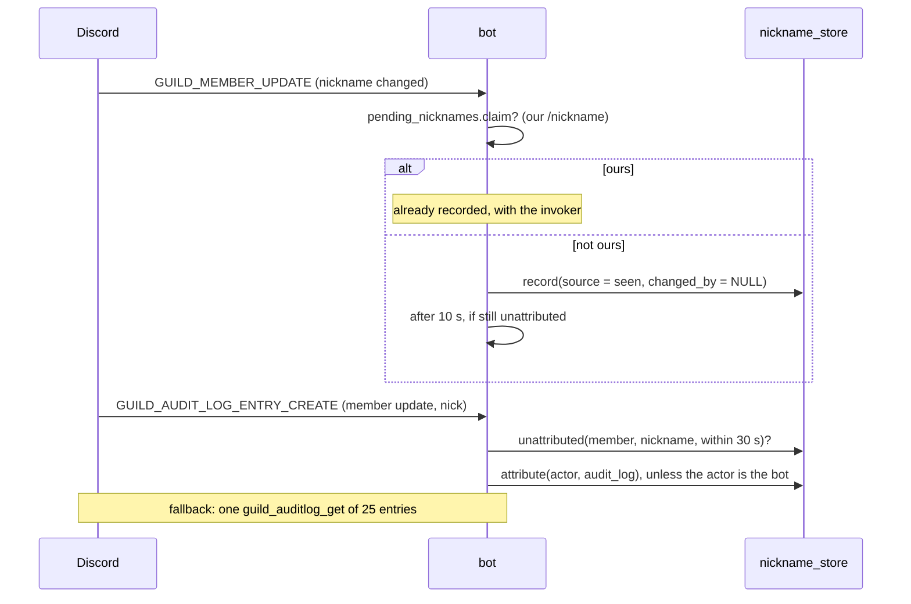

# Nicknames

The bot records every nickname change in a server, and **who made it**,
however it was made. `/nicknames` shows the history, and `/nickname` changes
somebody's nickname with the change on record under whoever ran it. The
Java bot's `nicknames.json` history is imported on startup.

This is the feature's spec: what it is for, how it behaves, how it is built,
and what was decided and why. [The user guide](../../../../docs/User_Guide.md#nickname) has the
commands and replies, and [Nickname tracking](../../../../docs/User_Guide.md#nickname-tracking)
the passive side.

| | |
|---|---|
| **Module** | `nicknames`: [its README](../README.md) lists what it owns |
| **Code** | `src/modules/nicknames/src/`: `nicknames.*`, `nickname_import.*`, `nickname_command.*`, and `module.cpp`, which holds the gateway handlers |
| **Tests** | `src/modules/nicknames/tests/`, built as `latibot_nicknames_tests` |
| **Tables** | `nickname_history`, the module's schema version 1 (was migration 4) |
| **Config** | `track_changes` in the `nicknames` section of `config.json` (on by default; was `track_nicknames`) |
| **Plan** | Replaces plan §8, §21.8 and §21.9 |
| **Status** | Built in phase 2 (2026-09-23). `/nickname` has been deferred since 2026-09-25 and not seen working in Discord since |

## Contents

1. [Intent](#1-intent)
2. [Behaviour](#2-behaviour)
3. [How it works](#3-how-it-works)
4. [Importing the Java history](#4-importing-the-java-history)
5. [Decisions](#5-decisions)
6. [Limits, and what is still to check](#6-limits-and-what-is-still-to-check)

## 1. Intent

A nickname history is something a server reads together, often to embarrass
someone, and the question it answers is as much "who did this" as "what was
it". The Java bot got the second half wrong. Only its own `/nickname` left a
trace it could match, so a moderator renaming somebody through Discord's own
menu was recorded as the member renaming themselves. It also gave up
displaying a history past 2,000 characters, which by now is most of them,
and indexed an empty list for a member with no history.

The owner-confirmation flow, where the Java bot asked the server owner to
approve renaming them, is **dropped**. Discord does not let bots change the
owner's nickname at all, and the owner moved to an alt account, so
`/nickname` just says so.

## 2. Behaviour

### 2.1 What is recorded

Every change, the moment it is seen: through `/nickname`, through Discord's
menu by a moderator, or by the member themselves. Who made it is then filled
in from the best source available:

| Source | Who is recorded | Trust |
|---|---|---|
| `command` | whoever ran `/nickname` | certain |
| `audit_log` | the actor in Discord's audit log | certain |
| `seen` | nobody yet, or nobody ever: **unknown** | — |
| `startup` | nobody: changed while the bot was not running | — |
| `imported` | from the Java file, where it was worth keeping (§4) | as good as the Java bot's own `/nickname` |

- **Recording never waits on attribution.** A change with no name against it
  beats a change that was missed.
- **The bot is never recorded as the actor.** The audit log names the bot
  for everything the bot did, which is how the one certain attribution, the
  person who ran `/nickname`, would be lost.
- **Unattributed stays unknown.** Self-changes *are* audit-logged, so a row
  nothing claims really is unknown. The Java bot guessed "self", and was
  often wrong.
- **Cleared is not empty.** A cleared nickname is stored as NULL and shown as
  *(cleared)*.

### 2.2 `/nickname user [nickname]`

Manage Nicknames, by default. Leaving `nickname` out clears it; at most 32
characters. The bot writes the history row **first**, with the invoker
against it, then asks Discord. If Discord refuses, the row is removed again,
so the history never claims something that did not happen. The server owner
is refused before asking, with the reason. A refusal from Discord says
"they are probably above me in the role list, or i am missing Manage
Nicknames"; any other failure gives Discord's own message. The answer is
deferred, since it waits on Discord.

### 2.3 `/nicknames user`

Public, because a room reads a nickname history together, and anybody can
page through it. Newest first, ten a page. Each line has the nickname, when
(Discord's timestamp markup, so every reader sees their own timezone) and
who: a name, **unknown**, or nothing for an imported row whose author was not
worth keeping. People who have left still appear. Mentions never ping. Past
a hundred entries, the history comes back as a `.txt` file with UTC times
instead of ten pages of buttons.

## 3. How it works

**Attribution**, in the order it happens:

1. `on_guild_member_update` compares the member's nickname with the **last
   one recorded** (`is_new_nickname`). DPP updates its cached member before
   calling the handler, so the old nickname is only knowable from our own
   history. A change is recorded at once, with nobody against it, unless
   `pending_nicknames` claims it as one `/nickname` just made (§2.2).
2. `on_guild_audit_log_entry_create`, for a member update carrying a `nick`
   change, finds the newest unattributed row for that member with that
   nickname, recorded within the last 30 s (`describes`, `unattributed`), and
   fills in the actor, unless the actor is the bot (`may_attribute`). The
   window stops an entry attaching itself to an old change with the same
   nickname.
3. If the row is still unattributed **10 s** later, the bot asks Discord for
   the server's last 25 member-update audit entries, once. That covers a
   reconnect or a dropped event; the gateway entry normally arrives within a
   second.
4. Still nothing: the row stays unknown.

`/nickname` registers an expectation `(server, member, nickname)` for 30 s,
so the member update that follows is not recorded twice. If Discord refuses,
the expectation is forgotten, so it cannot swallow the next matching change.

**On startup**, and whenever the bot joins a server, each member's nickname
is compared with the last one recorded, the same `is_new_nickname` question,
and a difference is recorded with source `startup` and nobody against it.

Two DPP details the handlers work around:

- `dpp::audit_entry` carries **no guild id**, so the guild is read from the
  event's raw frame.
- An audit change's value is **dumped JSON**, so a nickname arrives quoted
  and a cleared one as the four characters `null` (`audit_nickname`).

**Storage.** `nickname_history(id, guild_id, user_id, nickname NULL,
changed_by NULL, changed_at, source, imported_raw NULL)`. Ids are stored
and names resolved when the history is shown, so departed members still
appear. The Java bot resolved live member objects when it loaded, which is
why loading waited for the gateway and broke for people who had left.

**The intent.** Member updates arrive only with the privileged **Server
Members** intent. A bot that asks for an intent it was not granted is
refused the gateway (close code 4014) and reconnects in a loop, so the
intent is asked for only when `nicknames.track_changes` is on. The member handlers
are attached only then, too, and the log names the portal toggle if 4014
happens. With tracking off, `/nickname` still records its own changes.

## 4. Importing the Java history

If `nicknames.json` is beside the database, it is imported at startup.
Importing is idempotent (`already_recorded`), so the file can be left there.

- **Times** were local wall-clock in US Central, with no zone recorded. Each
  is converted with the full daylight-saving history of `America/Chicago`,
  including the 2007 rule change, via `std::chrono::locate_zone`. The
  ambiguous hour each November takes the **earlier** reading; the hour that
  never happens each March is **shifted forward**, so 02:30 becomes 03:30.
  The original text is kept in `imported_raw`, so the conversion can be
  redone.
- **Authors.** The Java bot wrote the member's own id whenever it could not
  tell who made a change, so that value says nothing and is dropped. A
  *different* id could only have come from its own `/nickname`, so it is
  kept (`imported_author`). In the file being ported, all 140 entries with
  an author name somebody other than the member.
- An entry that cannot be read is named in the log and skipped.

MSVC's `<chrono>` uses Windows' own ICU time-zone data (1903 and later), so
no time-zone library is needed.

## 5. Decisions

| Date | Decision | Why |
|---|---|---|
| plan v4 | Record at once with no author, attribute later | Recording must not depend on the audit entry arriving |
| plan v4 | Never let an audit entry naming the bot overwrite an author | That is how the Java bot lost the only certain attribution |
| plan v4 | Unmatched rows stay unknown | Self-changes are audit-logged, so "self" was a guess |
| plan v4 | A 10 s fallback query of the audit log | Covers reconnects and dropped events |
| plan v4 | Store ids, resolve names when shown | Works for departed members and needs no gateway at load |
| plan v4 | Page the history, and attach a file past a hundred entries | Histories are long past the Java bot's 2,000-character limit |
| plan v4 | Import CT times through `America/Chicago`, earlier reading when ambiguous, forward when nonexistent; keep the raw text | At most an hour off, on one day a year, and redoable |
| plan v4 | Drop the owner-confirmation flow | Discord refuses bots the owner's nickname anyway |
| plan v3 → v4 | No `X-Audit-Log-Reason` header | DPP takes it from a cluster-wide slot that another thread's request can consume; the wrong reason on an unrelated entry is worse than none |
| 2026-09-23 | Ask for the Server Members intent only with `track_nicknames` on, and explain 4014 | A privileged intent not granted is refused outright, not degraded (plan §21.7) |
| 2026-09-23 | Keep imported authors that are somebody else; drop self | Self meant "unknown" to the Java bot; anyone else came from its `/nickname` (plan §21.9) |
| 2026-09-23 | Startup reconciliation is `is_new_nickname` over the member list | DPP's cache is already updated inside the handler, so both cases compare against our own history (plan §21.8) |
| 2026-09-24 | `/nicknames` is public | A room reads a nickname history together |
| 2026-09-25 | `/nickname` defers before asking Discord | It waits on Discord before its first answer (cleanup DISC-004) |

## 6. Limits, and what is still to check

- A change made and undone while the bot was offline is never seen.
  Reconciliation sees only where the nickname ended up.
- Attribution needs **View Audit Log** in the server. Without it changes
  are recorded and stay unknown.
- The handlers' wiring is in the untested shell: that they are attached to
  the right events, that the guild is read from the raw frame, and that the
  delayed fallback fires.
- **Still to check in Discord:** `/nickname`, now deferred.
- **Later: appearance tracking.** Avatars, per-server profiles, role colours
  including gradients, and decorations. It is expected to need a raw API
  read and a generated image, since an embed colour cannot show a gradient.
  See [Planned.md](../../../../docs/Planned.md).
